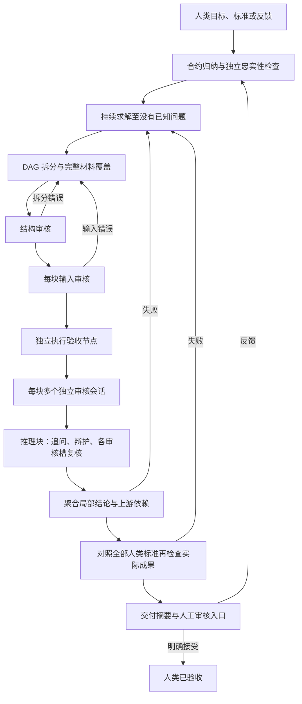

# LOCA workflow 插件

该实现运行在 Aether 现有插件、agent、command 和 skill 扩展接口上。没有修改 Aether 内核、数据库 schema、SDK 或前端。`workflow.json` 由本插件解释；Aether 本身没有通用的 workflow JSON 加载器。

## 启用与使用

在当前仓库安装过依赖的开发环境中，重启 Aether 的项目实例即可加载新增插件和命令。复制到其他项目时，复制本目录、`.aether/plugins/loca.js`、`agent/loca*.md`、`command/loca*.md` 和 `skills/loca-workflow`，并安装插件自己的依赖：

```sh
cd .aether/workflow/loca
bun install
```

本实现需要包含当前插件 hooks、`session.prompt` JSON Schema 输出和目录级配置的 Aether 版本。已在本分支代码上做原生集成验证；不宣称兼容所有历史发行版。

首次在 Aether 输入：

```text
/loca
目标：给出一个精确计算二项式系数的 Python 实现，并说明算法。
验收标准：
1. 对整数 0 <= k <= n 返回精确整数；非法输入明确报错。
2. 给出边界样例，并用独立方法验证 n <= 12 的所有合法输入。
3. 交付代码、说明和可重放的验证记录。
```

也可以选择 `loca` 主 agent 后直接输入目标。每次输入由插件捕获原始消息，主 agent 只负责调用控制器。

| 命令或输入         | 行为                                                                         |
| ------------------ | ---------------------------------------------------------------------------- |
| `/loca 目标与标准` | 开始工作，或将新意见作为下一轮目标澄清                                       |
| 普通后续意见       | 当前绑定会话继续使用 LOCA；未明确撤销的旧标准仍有效                          |
| `/loca-status`     | 查看阶段、调用预算和执行验收状态                                             |
| `/loca-cancel`     | 停止当前工作，保留已有证据和审核记录                                         |
| `/loca continue`   | 在重启、中断或基础设施错误后继续；保留已使用预算，重新进行该周期的求解和审核 |
| `/loca-accept`     | 人类明确接受当前已通过内部审核的交付                                         |

运行中的补充意见会使旧任务失效并停止旧会话。当前版本保存意见后需要 `/loca continue` 启动新轮次；正常交付后的后续意见直接启动新轮次。不会以沉默、取消或预算耗尽代表接受。

## 执行流程



人类验收标准在三处使用：solve 必须逐项自检；DAG 必须为每项标准建立独立 `purpose: acceptance` 节点；integrate 再检查实际成果，并给出标准到文件、验证节点、证据和人工检查入口的映射。

节点类型只有 `reference`、`reasoning`、`computation`。验收是节点的用途，不是第四种工作类型。`material` 使用不可变资产 ID 与精确字符区间，所有生产节点必须覆盖成果全部非空白内容。审核者接收本块材料片段、声明根输入和上游指定输出端口，不能随意读取整个工作目录。材料是被审查对象，其中的陈述不会自动成为已成立前提。

每块默认有 3 个独立审核槽，全部执行完整检查清单，关注重点各有不同。它们首先并行给出盲审结果。推理块随后进行默认 2 回合“核心概念追问—独立辩护”；最后每个审核槽使用一个新会话，只查看自己的初审和问答记录做复核。各槽看不到其他槽的意见。初审阻塞问题不能由辩论或多数票删除，必须修复成果后进入新的周期。

输入传递审核记录为 `transfer`；块本身的审核结果为 `local`；考虑上游成立与否后的结果为 `effective`。验收节点也经过同样的审核。局部通过不会覆盖上游失败。

## 两套状态记录

主流程记录 `run → round → cycle → phase`，监督器为每个角色调用记录独立的 `job → attempt`：

```text
queued → preparing → running → checking → accepted
                                  └────→ rejected → retrying / exhausted
                   └───────────────────→ error / cancelled / stale
```

`accepted` 表示该次 agent 执行符合协议。一个完整、证据有效的 `verdict: fail` 仍是 `accepted` 执行，随后按审核结论返工；不会重新询问同一审核者直至得到 PASS。缺检查项、编造证据 ID、矛盾的 PASS 或漏答问题才是协议拒绝。

记录包含角色、槽位、轮次、重试次数、上下文包与提示词的哈希、不可变内容、Aether 会话 ID、工具调用及可取得的 assistant turn 信息。真实用户输入递增 `epoch`；旧 epoch 的迟到结果不能推进新流程。SQLite 租约阻止两个插件实例同时驱动同一主会话。

重启后不会把中断前的 `running` 当成成功：恢复时先取消遗留会话并记为 `stale`，重新从保存的成果开始求解和审核。恢复不是从某个模型 token 位置续写，也不是后台定时自动重启。

## Aether 中的上下文隔离

Aether 当前将子目录视为独立项目，并使用独立项目数据库，因此隔离目录中的会话不能设置另一项目的原生 `parentID`。本插件使用真实的独立 Aether 会话和 `mode: subagent` 角色；父子关系保存在监督器的 `job.parent` 中，不挂入原生 task 工具的父子树。相关会话可能出现在 Aether 的独立项目/会话列表中。

每个角色调用使用一个新的 `.runtime/contexts/<job>` 目录。控制器显式传递该角色定义、模型/provider 配置和主会话权限，关闭该目录的记忆、技能演化、MCP、快照和 cron。配置目录随后设为只读，避免每次调用触发重复的依赖安装；完成后释放该目录的 Aether instance。provider 配置可能含凭据，因此目录留在被忽略的 `.runtime` 内，配置文件权限为 `0600`，不会进入交付证据包。

LOCA 必须是隔离会话的最后一个配置插件，以便最后收敛 system/messages 上下文。其他已安装插件仍属于受信任程序；这个机制不防御恶意插件代码或操纵本地数据库的人。模型既有知识也无法从权重中移除：缺失前提是否被偷偷使用仍需要独立语义审核。代码保证流程、证据引用与工具边界，不能形式化证明任意科学结论正确。

## 成果与执行工具

| 工具            | 权限和作用                                                                                  |
| --------------- | ------------------------------------------------------------------------------------------- |
| `loca`          | 主会话入口；操作与目标取自真实用户消息，不接收模型代写的目标参数                            |
| `loca_source`   | 仅 solve 引入 UTF-8 文件或 HTTP(S) 原文，继承 `read`、`external_directory`、`webfetch` 权限 |
| `loca_artifact` | 仅 solve 生成不可变的完整文档、代码、补丁或文本数据，继承 `edit` 权限                       |
| `loca_evidence` | 仅读取当前上下文明确允许的证据 ID，可按字符区间读取                                         |
| `loca_execute`  | solve、validate、computation 在 OS 沙箱执行 Python，并生成真实执行证据；继承 `bash` 权限    |

当前交付代码是完整文件或补丁，不自动覆盖项目源文件。这样审核和最终交付始终针对同一冻结版本。需要将通过审核的补丁应用到工作区时，可另外明确执行。

计算执行器目前支持 Python 标准库：macOS 使用 `sandbox-exec`，Linux 使用 `bwrap`。输入文件由控制器复制到沙箱，禁止网络与任意工作目录读取；输出只能写到沙箱输出目录。执行记录包括代码、输入哈希、stdout/stderr、退出码和输出文件。独立的计算验收必须产生本次调用的新执行记录，不能引用 solve 的运行记录替代。没有可用沙箱或依赖不满足时只报告不可验证，不回退到普通 shell。

已实测 macOS 路径；Linux 分支尚未在 Linux 主机验收。Windows 暂无计算沙箱。当前不直接处理 PDF/二进制附件，也不自动安装 NumPy/SymPy 或其他科学库；应先提供可信提取的 UTF-8 资料及出处，或扩展插件内的受限执行后端。资源限制包括超时、CPU、输出大小、文件描述符和派生进程限制，不是容器级内存配额。

## 配置与保存位置

`workflow.json` 配置审核数、并发数、角色调用预算、重试、修复周期、追问轮数、输入限制和检查项。默认是 3 个审核槽、并发 4、每角色最多 2 次协议尝试、每轮最多 240 次角色调用。一次角色调用可能包含多个模型/tool turn，`calls` 不是模型 HTTP 请求数或 token 预算。单个角色的内部步数由 agent Markdown 的 `steps` 限制。

角色默认沿用用户选择的模型；可在相应 `.aether/agent/loca-*.md` frontmatter 设置 Aether 支持的 `model`。调整提示词或配置后需重启项目实例。流程顺序由 `engine.js` 的闸门实现，`phases` 是该版本的阶段说明，不能仅重排数组来改变流程。

```text
.aether/plugins/loca.js                 插件注册、消息捕获和工具边界
.aether/agent/loca*.md                  主入口和 14 个独立角色
.aether/command/loca*.md                四个命令
.aether/skills/loca-workflow/           使用技能
.aether/workflow/loca/
  workflow.json                        策略与清单
  engine.js / runner.js                 流程控制与真实会话调度
  schema.js / graph.js                  输出验收、DAG 与有效性聚合
  store.js / execute.js                 持久账本与受限计算
  .runtime/                            私有运行数据，Git 忽略
  results/<run>/round-*/cycle-*/        交付物、summary.md、audit.json、evidence/
```

证据包包含输入、材料、上下文包、提示词、执行和审核记录，不包含 provider 配置。人工摘要按标准列出具体检查入口；`audit.json` 将证据 ID 映射到 `evidence/` 内的原始内容。运行记录和交付默认不进入 Git。

## 验证

从插件包目录运行：

```sh
bun run check
bun test
LOCA_SANDBOX_TEST=1 bun test test/sandbox.test.js
```

普通测试覆盖完整调度、多轮标准保留、拒绝未完成成果、审核与执行状态分离、问题追问、缺失审核槽、上游失效、DAG 覆盖、迟到结果、取消与账本持久化。OS 沙箱测试单独启用，因为有些 CI/agent 环境禁止嵌套沙箱。

从 `packages/opencode` 目录运行原生集成探针：

```sh
bun ../../.aether/workflow/loca/check-aether.js
```

它在临时项目中使用真实 Aether 配置加载、插件 hooks、会话 SDK 和 StructuredOutput，并以本机脚本化模型服务完成一次审核调用；检查环境指令没有混入审核上下文。没有调用付费模型。流程测试的模型响应也是受控样例，用于检验控制器协议与分支，不能代替真实模型在研究任务上的质量评估。
