# OpenCode 架构设计文档

## 1. 系统总体架构

OpenCode 采用客户端/服务端（C/S）架构。服务端运行在本地或远程，负责 Agent 执行、LLM 交互、数据持久化；客户端提供用户交互界面（TUI / Web / 桌面应用），通过 HTTP API 和 SSE 与服务端通信。

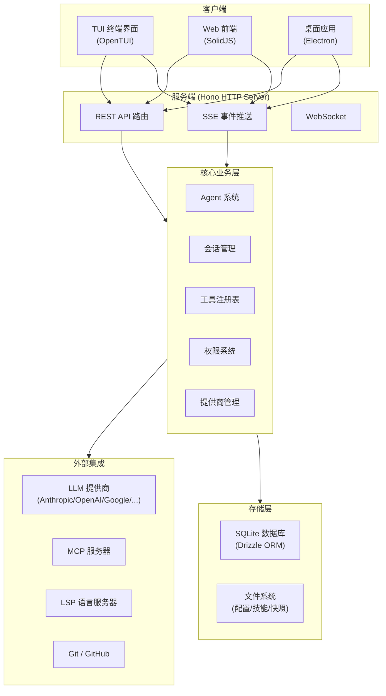

### 核心包关系

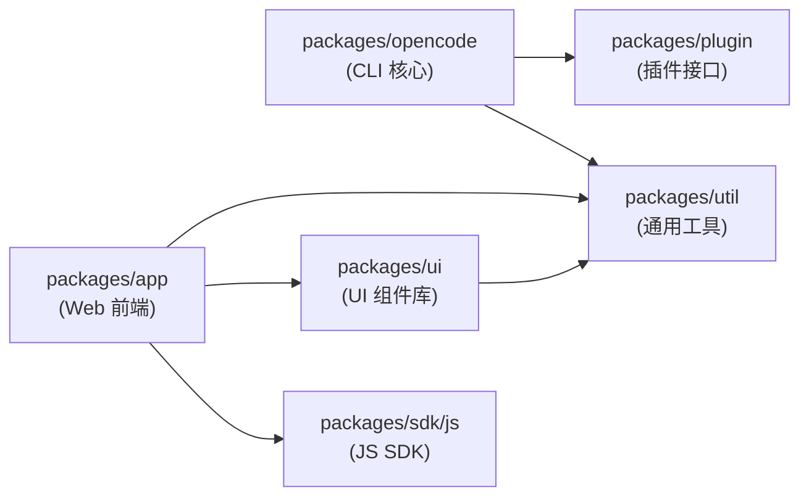

---

## 2. 技术栈

| 层级 | 技术 |
|------|------|
| 运行时 | Bun 1.3+ / Node.js 22+ |
| 语言 | TypeScript 5.8 |
| 后端框架 | Hono（HTTP 服务） |
| 实时通信 | SSE (Server-Sent Events)、WebSocket |
| AI 集成 | Vercel AI SDK (`ai` 5.x)、`@ai-sdk/*` 提供商适配器 |
| 数据库 | SQLite (bun:sqlite) + Drizzle ORM |
| MCP | `@modelcontextprotocol/sdk` |
| TUI | OpenTUI |
| 前端框架 | SolidJS 1.9 |
| 代码编辑器 | CodeMirror 6 |
| UI 组件 | Kobalte Core (无头组件) |
| 样式 | Tailwind CSS 4 |
| Diff 展示 | `@pierre/diffs` |
| 语法高亮 | Shiki |
| 代码解析 | Tree-sitter (AST) |
| Schema 验证 | Zod 4 |
| 构建工具 | Vite 7、Turbo (monorepo) |
| 桌面 | Electron |

---

## 3. 核心包架构 (`packages/opencode`)

### 3.1 模块结构

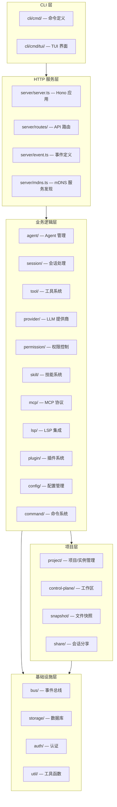

各模块代码路径及职责：

| 模块 | 路径 | 职责 |
|------|------|------|
| CLI 命令 | `packages/opencode/src/cli/cmd/` | Yargs 命令注册（run、serve、pr、mcp、export 等） |
| TUI 界面 | `packages/opencode/src/cli/cmd/tui/` | 终端交互 UI（attach、thread） |
| HTTP 服务 | `packages/opencode/src/server/server.ts` | Hono 应用创建、中间件、路由挂载 |
| API 路由 | `packages/opencode/src/server/routes/` | 各资源的 REST API 端点 |
| Agent | `packages/opencode/src/agent/agent.ts` | Agent 定义（build/plan/general/explore/compaction/title/summary）、配置合并 |
| 会话管理 | `packages/opencode/src/session/` | 会话 CRUD、消息处理、LLM 流式调用 |
| 会话处理器 | `packages/opencode/src/session/processor.ts` | 流式响应处理、工具调用编排 |
| LLM 调用 | `packages/opencode/src/session/llm.ts` | 封装 Vercel AI SDK 的 `streamText` |
| 会话压缩 | `packages/opencode/src/session/compaction.ts` | 长对话压缩以节省 token |
| 系统提示词 | `packages/opencode/src/session/system.ts` | 系统提示词构建 |
| 消息模型 | `packages/opencode/src/session/message-v2.ts` | 消息和 Part 的类型定义 |
| 会话回退 | `packages/opencode/src/session/revert.ts` | 文件变更回退 |
| Todo | `packages/opencode/src/session/todo.ts` | 待办事项管理 |
| 工具系统 | `packages/opencode/src/tool/` | 所有内置工具实现 |
| 工具注册表 | `packages/opencode/src/tool/registry.ts` | 工具发现与注册 |
| 提供商 | `packages/opencode/src/provider/provider.ts` | 多 LLM 提供商适配 |
| 模型快照 | `packages/opencode/src/provider/models-snapshot.ts` | 模型信息缓存 |
| 提供商转换 | `packages/opencode/src/provider/transform.ts` | 请求/响应转换层 |
| 权限系统 | `packages/opencode/src/permission/next.ts` | 权限规则匹配与决策 |
| MCP | `packages/opencode/src/mcp/` | MCP 服务器连接与工具桥接 |
| LSP | `packages/opencode/src/lsp/` | 语言服务器协议集成 |
| 技能 | `packages/opencode/src/skill/` | 技能发现与加载 |
| 插件 | `packages/opencode/src/plugin/` | 插件加载与钩子注册 |
| 配置 | `packages/opencode/src/config/config.ts` | 多级 JSONC 配置解析 |
| 事件总线 | `packages/opencode/src/bus/index.ts` | 发布/订阅事件系统 |
| 事件定义 | `packages/opencode/src/bus/bus-event.ts` | 类型化事件定义工厂 |
| 数据库 | `packages/opencode/src/storage/db.ts` | SQLite 连接与事务管理 |
| 存储层 | `packages/opencode/src/storage/storage.ts` | 通用存储操作 |
| 数据迁移 | `packages/opencode/src/storage/json-migration.ts` | 数据库 schema 迁移 |
| 项目实例 | `packages/opencode/src/project/instance.ts` | 按目录管理单例实例 |
| 项目引导 | `packages/opencode/src/project/bootstrap.ts` | 项目初始化流程 |
| 版本控制 | `packages/opencode/src/project/vcs.ts` | Git 集成 |
| 工作区 | `packages/opencode/src/control-plane/` | 工作区路由与上下文 |
| 快照 | `packages/opencode/src/snapshot/` | 文件变更快照 |
| 会话分享 | `packages/opencode/src/share/` | 分享 URL 生成 |
| 认证 | `packages/opencode/src/auth/` | 提供商认证（API Key / OAuth） |
| 全局配置 | `packages/opencode/src/global.ts` | 全局路径与常量 |
| 安装信息 | `packages/opencode/src/installation.ts` | 版本号与安装路径 |

### 3.2 Agent 执行流程

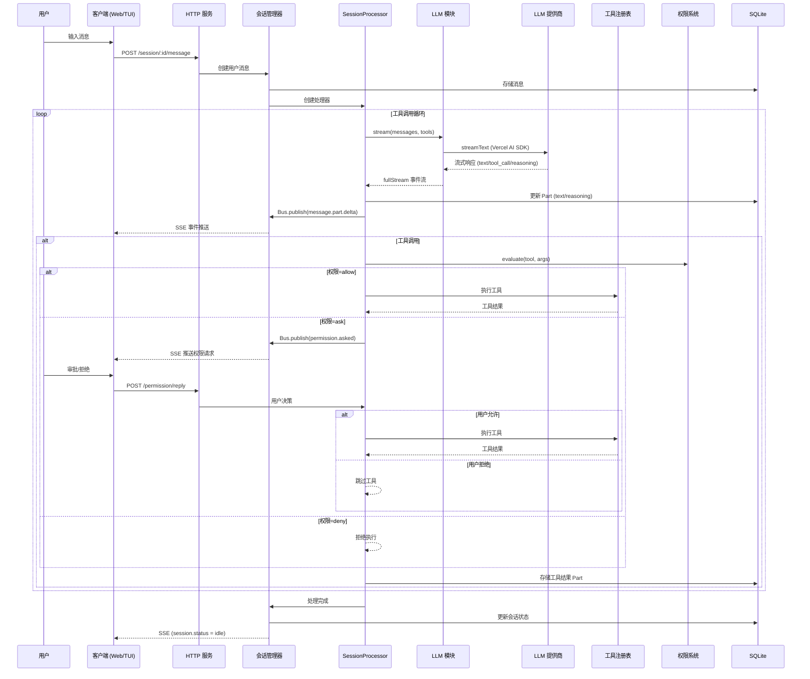

### 3.3 事件系统

事件总线是服务端模块间以及服务端到客户端通信的核心机制。

**架构设计：**

```mermaid
graph LR
    subgraph Publisher["事件发布者"]
        SessionMod["会话模块"]
        PermMod["权限模块"]
        ToolMod["工具模块"]
    end

    subgraph EventBus["事件总线 (Bus)"]
        InMemory["内存订阅<br/>(Map<type, callback[]>)"]
        GlobalBus["GlobalBus<br/>(跨实例广播)"]
    end

    subgraph Consumer["事件消费者"]
        SSE_EP["SSE 端点 (/event)"]
        Internal["内部订阅者"]
    end

    subgraph Client_Side["客户端"]
        SDK["GlobalSDK<br/>(EventSource)"]
        Store["GlobalSync Store"]
    end

    Publisher -->|Bus.publish| InMemory
    InMemory -->|GlobalBus.emit| GlobalBus
    GlobalBus --> SSE_EP
    InMemory --> Internal
    SSE_EP -->|Server-Sent Events| SDK
    SDK -->|事件合并 (16ms)| Store
```

**事件类型定义方式：**

使用 `BusEvent.define()` 工厂方法创建类型安全的事件，基于 Zod 的 discriminatedUnion 实现编译期类型检查。完整事件类型列表如下：

**会话事件：**

| 事件 | 源文件 | 说明 |
|------|--------|------|
| `session.status` | `session/status.ts` | 会话状态变更（idle/busy/error） |
| `session.idle` | `session/status.ts` | 会话进入空闲状态 |
| `session.created` | `session/index.ts` | 会话创建 |
| `session.updated` | `session/index.ts` | 会话更新 |
| `session.deleted` | `session/index.ts` | 会话删除 |
| `session.diff` | `session/index.ts` | 会话文件变更 diff |
| `session.error` | `session/index.ts` | 会话处理错误 |
| `session.compacted` | `session/compaction.ts` | 会话压缩完成 |

**消息事件：**

| 事件 | 源文件 | 说明 |
|------|--------|------|
| `message.updated` | `session/message-v2.ts` | 消息完整更新 |
| `message.removed` | `session/message-v2.ts` | 消息删除 |
| `message.part.updated` | `session/message-v2.ts` | 消息部分完整更新 |
| `message.part.delta` | `session/message-v2.ts` | 消息部分增量更新（流式） |
| `message.part.removed` | `session/message-v2.ts` | 消息部分删除 |

**权限事件：**

| 事件 | 源文件 | 说明 |
|------|--------|------|
| `permission.asked` | `permission/next.ts` | 请求用户权限授权 |
| `permission.replied` | `permission/next.ts`、`permission/index.ts` | 用户回复权限请求 |
| `permission.updated` | `permission/index.ts` | 权限规则更新 |

**问答事件：**

| 事件 | 源文件 | 说明 |
|------|--------|------|
| `question.asked` | `question/index.ts` | Agent 向用户提问 |
| `question.replied` | `question/index.ts` | 用户回复问题 |
| `question.rejected` | `question/index.ts` | 问题被拒绝 |

**项目与工作区事件：**

| 事件 | 源文件 | 说明 |
|------|--------|------|
| `project.updated` | `project/project.ts` | 项目信息更新 |
| `vcs.branch.updated` | `project/vcs.ts` | Git 分支变更 |
| `workspace.ready` | `control-plane/workspace.ts` | 工作区就绪 |
| `workspace.failed` | `control-plane/workspace.ts` | 工作区初始化失败 |
| `worktree.ready` | `worktree/index.ts` | Git worktree 就绪 |
| `worktree.failed` | `worktree/index.ts` | Git worktree 失败 |

**基础设施事件：**

| 事件 | 源文件 | 说明 |
|------|--------|------|
| `server.connected` | `server/event.ts` | 服务器连接建立 |
| `global.disposed` | `server/event.ts` | 全局实例销毁 |
| `server.instance.disposed` | `bus/index.ts` | 服务实例销毁 |
| `installation.updated` | `installation/index.ts` | 安装信息更新 |
| `installation.update.available` | `installation/index.ts` | 有新版本可用 |

**文件与编辑器事件：**

| 事件 | 源文件 | 说明 |
|------|--------|------|
| `file.edited` | `file/index.ts` | 文件被编辑 |
| `file.watcher.updated` | `file/watcher.ts` | 文件系统变更监听 |
| `lsp.updated` | `lsp/index.ts` | LSP 状态变更 |
| `lsp.diagnostics` | `lsp/client.ts` | LSP 诊断信息 |
| `ide.installed` | `ide/index.ts` | IDE 扩展安装 |

**终端事件：**

| 事件 | 源文件 | 说明 |
|------|--------|------|
| `pty.created` | `pty/index.ts` | 伪终端创建 |
| `pty.updated` | `pty/index.ts` | 伪终端输出更新 |
| `pty.exited` | `pty/index.ts` | 伪终端退出 |
| `pty.deleted` | `pty/index.ts` | 伪终端删除 |

**MCP 事件：**

| 事件 | 源文件 | 说明 |
|------|--------|------|
| `mcp.tools.changed` | `mcp/index.ts` | MCP 工具列表变更 |
| `mcp.browser.open.failed` | `mcp/index.ts` | MCP 浏览器打开失败 |

**其他事件：**

| 事件 | 源文件 | 说明 |
|------|--------|------|
| `command.executed` | `command/index.ts` | 命令执行 |
| `todo.updated` | `session/todo.ts` | 待办事项更新 |

**TUI 专用事件**（仅 TUI 客户端内部使用）：

| 事件 | 源文件 | 说明 |
|------|--------|------|
| `tui.prompt.append` | `cli/cmd/tui/event.ts` | TUI 输入框追加文本 |
| `tui.command.execute` | `cli/cmd/tui/event.ts` | TUI 命令执行 |
| `tui.toast.show` | `cli/cmd/tui/event.ts` | TUI Toast 通知 |
| `tui.session.select` | `cli/cmd/tui/event.ts` | TUI 会话选择 |

**关键代码路径：**
- 事件总线：`packages/opencode/src/bus/index.ts`
- 事件定义工厂：`packages/opencode/src/bus/bus-event.ts`
- 全局广播：`packages/opencode/src/bus/global.ts`
- 服务端事件：`packages/opencode/src/server/event.ts`

### 3.4 上下文与依赖注入

项目使用自定义的 Context 模式实现依赖注入，替代全局单例：

- **WorkspaceContext**：标识当前请求所属的工作区
- **Instance.provide()**：按目录缓存的单例状态管理，每个项目目录拥有独立的 Agent、Skill、Tool、Config 等实例
- **Instance.state()**：声明式的实例级状态定义，支持懒初始化和销毁回调
- **Database 事务上下文**：通过 `Database.use()` / `Database.transaction()` 实现隐式事务传播

代码路径：
- 上下文工具：`packages/opencode/src/util/context.ts`
- 实例管理：`packages/opencode/src/project/instance.ts`
- 工作区上下文：`packages/opencode/src/control-plane/workspace-context.ts`
- 数据库上下文：`packages/opencode/src/storage/db.ts`

---

## 4. Web 前端架构 (`packages/app`)

### 4.1 模块结构

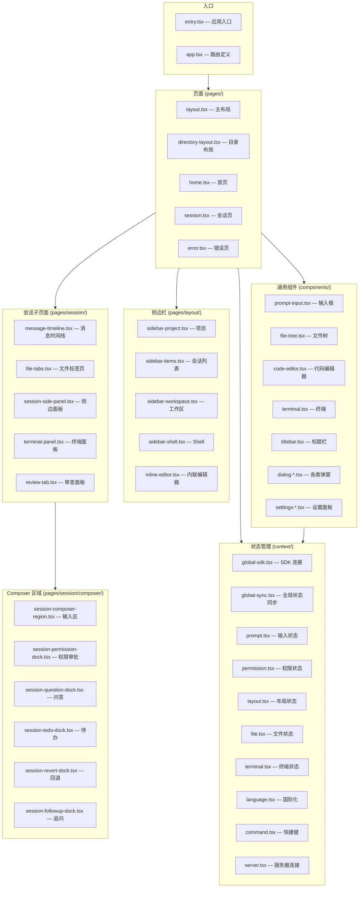

代码路径：

| 模块 | 路径 |
|------|------|
| 应用入口 | `packages/app/src/entry.tsx` |
| 路由定义 | `packages/app/src/app.tsx` |
| 页面 | `packages/app/src/pages/` |
| 会话页 | `packages/app/src/pages/session.tsx` |
| 会话子页面 | `packages/app/src/pages/session/` |
| 输入区 | `packages/app/src/pages/session/composer/` |
| 侧边栏 | `packages/app/src/pages/layout/` |
| 通用组件 | `packages/app/src/components/` |
| 输入框 | `packages/app/src/components/prompt-input.tsx` |
| 文件树 | `packages/app/src/components/file-tree.tsx` |
| 代码编辑器 | `packages/app/src/components/code-editor.tsx` |
| 终端 | `packages/app/src/components/terminal.tsx` |
| 弹窗 | `packages/app/src/components/dialog-*.tsx` |
| 设置面板 | `packages/app/src/components/settings-*.tsx` |
| 状态管理 | `packages/app/src/context/` |

### 4.2 状态管理架构

前端采用 SolidJS 的 `createStore` + Context 模式进行状态管理，结合 SSE 实现与服务端的实时同步。

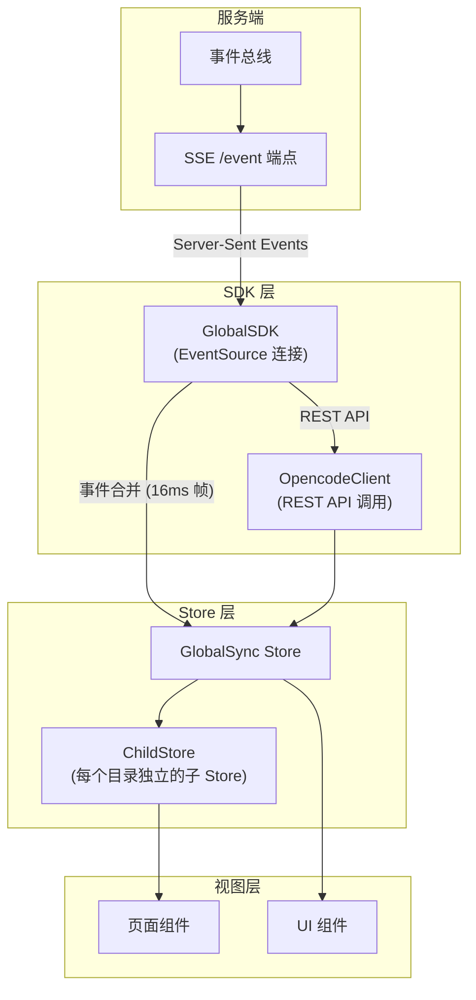

**GlobalSync** (`packages/app/src/context/global-sync.tsx`) 是全局状态容器，管理：
- `project` — 项目列表
- `session_todo` — 待办事项
- `provider` / `provider_auth` — 提供商与认证状态
- `config` — 应用配置
- `path` — 路径信息

**GlobalSDK** (`packages/app/src/context/global-sdk.tsx`) 负责：
- 建立 SSE 连接，订阅服务端事件
- 事件合并（16ms 帧率），批量更新 Store 以减少 UI 重绘
- 心跳检测（15s 超时），断线自动重连
- 管理每个目录的 SDK 客户端实例

**ChildStore** (`packages/app/src/context/global-sync/child-store.ts`) 负责：
- 为每个项目目录维护独立的会话、消息等子状态
- 实现按需加载和缓存清理

### 4.3 页面布局结构

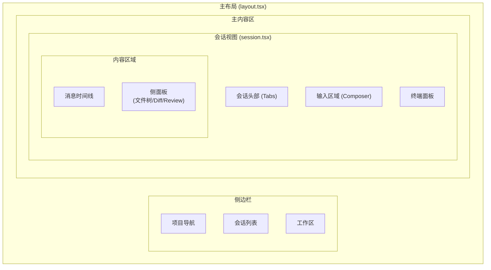

---

## 5. 数据库设计

### 5.1 本地数据库（SQLite）

数据库文件遵循 XDG Base Directory 规范，位于 `$XDG_DATA_HOME/opencode/opencode.db`（Linux 默认为 `~/.local/share/opencode/opencode.db`）。频道为 `latest` 或 `beta` 时使用 `opencode.db`，其他频道使用 `opencode-<channel>.db`。使用 Drizzle ORM 管理 Schema，启动时自动迁移。

#### ER 图

```mermaid
erDiagram
    Project ||--o{ Workspace : "has"
    Project ||--o{ Session : "has"
    Project ||--o| Permission : "has"
    Session ||--o{ Message : "has"
    Session ||--o{ Todo : "has"
    Session o|--o| SessionShare : "may have"
    Session o|--o| Session : "parent"
    Message ||--o{ Part : "has"
    Account o|--o| AccountState : "active"

    Project {
        text id PK
        text worktree
        text vcs
        text name
        text icon_url
        text icon_color
        integer time_created
        integer time_updated
        integer time_initialized
        json sandboxes
        json commands
    }

    Workspace {
        text id PK
        text type
        text branch
        text name
        text directory
        json extra
        text project_id FK
    }

    Session {
        text id PK
        text project_id FK
        text workspace_id FK
        text parent_id FK
        text slug
        text directory
        text title
        text version
        text share_url
        integer summary_additions
        integer summary_deletions
        integer summary_files
        json summary_diffs
        json revert
        json permission
        integer time_created
        integer time_updated
        integer time_compacting
        integer time_archived
    }

    Message {
        text id PK
        text session_id FK
        json data
        integer time_created
        integer time_updated
    }

    Part {
        text id PK
        text message_id FK
        text session_id
        json data
        integer time_created
        integer time_updated
    }

    Todo {
        text session_id FK
        text content
        text status
        text priority
        integer position
        integer time_created
        integer time_updated
    }

    Permission {
        text project_id PK_FK
        json data
        integer time_created
        integer time_updated
    }

    Account {
        text id PK
        text email
        text url
        text access_token
        text refresh_token
        integer token_expiry
        integer time_created
        integer time_updated
    }

    AccountState {
        integer id PK
        text active_account_id FK
        text active_org_id
    }

    SessionShare {
        text session_id PK_FK
        text id
        text secret
        text url
        integer time_created
        integer time_updated
    }
```

#### 表结构说明

| 表名 | 用途 | Schema 路径 |
|------|------|-------------|
| `project` | 项目信息，每个代码仓库目录对应一条记录 | `packages/opencode/src/project/project.sql.ts` |
| `workspace` | 工作区，与项目关联，可绑定 Git 分支 | `packages/opencode/src/control-plane/workspace.sql.ts` |
| `session` | 会话记录，存储对话元数据、变更摘要、权限快照 | `packages/opencode/src/session/session.sql.ts` |
| `message` | 消息记录，关联到 session，data 字段存储消息元信息 | `packages/opencode/src/session/session.sql.ts` |
| `part` | 消息部分，一条消息由多个 Part 组成（见下方 Part 类型说明） | `packages/opencode/src/session/session.sql.ts` |
| `todo` | 待办事项，关联到 session，按 position 排序 | `packages/opencode/src/session/session.sql.ts` |
| `permission` | 项目级权限规则持久化 | `packages/opencode/src/session/session.sql.ts` |
| `account` | 用户账户（远程认证信息） | `packages/opencode/src/account/account.sql.ts` |
| `account_state` | 活跃账户状态（当前选中的账户和组织） | `packages/opencode/src/account/account.sql.ts` |
| `session_share` | 会话分享信息（ID、密钥、URL） | `packages/opencode/src/share/share.sql.ts` |

#### 公共字段

所有表通过 `Timestamps` mixin 包含 `time_created` 和 `time_updated` 两个整型时间戳字段。

代码路径：`packages/opencode/src/storage/schema.sql.ts`

#### Part 类型说明

`part` 表的 `data` 字段存储 `MessageV2.Part` 类型（定义于 `packages/opencode/src/session/message-v2.ts`），共 12 种 Part 类型：

| Part 类型 | 说明 | 关键字段 |
|-----------|------|----------|
| `text` | 文本内容（AI 回复文本、用户输入） | `text`、`synthetic`、`ignored`、`time` |
| `tool` | 工具调用及结果 | `callID`、`tool`、`state`（pending/running/completed/error） |
| `reasoning` | 推理过程（thinking） | `text`、`time` |
| `file` | 文件附件（图片、PDF 等） | `mime`、`filename`、`url`、`source` |
| `step-start` | LLM 调用步骤开始 | `snapshot` |
| `step-finish` | LLM 调用步骤结束 | `reason`、`cost`、`tokens`（input/output/reasoning/cache） |
| `snapshot` | 文件快照 | `snapshot` |
| `patch` | 补丁信息 | `hash`、`files` |
| `agent` | Agent 切换信息 | `name`、`source` |
| `subtask` | 子任务信息 | `prompt`、`description`、`agent`、`model` |
| `retry` | 重试记录 | `attempt`、`error`、`time` |
| `compaction` | 压缩标记 | `auto`、`overflow` |

其中 `tool` 类型的 `state` 字段有四种状态：

| 状态 | 说明 |
|------|------|
| `pending` | 工具调用已生成，等待执行 |
| `running` | 工具正在执行中 |
| `completed` | 工具执行完成，包含输入、输出、耗时、附件等 |
| `error` | 工具执行出错，包含错误信息 |

`message` 表的 `data` 字段存储 `MessageV2.Info` 类型，分两种角色：

| 角色 | 说明 | 关键字段 |
|------|------|----------|
| `user` | 用户消息 | `agent`、`model`、`system`、`tools`、`format` |
| `assistant` | AI 回复 | `parentID`、`modelID`、`providerID`、`cost`、`tokens`、`error`、`finish` |

### 5.2 数据库访问层

数据库访问层封装在 `Database` 命名空间中，提供：
- `Database.Client()` — 获取 SQLite 连接实例
- `Database.use(callback)` — 在事务上下文中执行操作
- 基于 AsyncLocalStorage 的隐式事务传播

代码路径：`packages/opencode/src/storage/db.ts`

---

## 6. API 设计

### 6.1 服务器架构

HTTP 服务基于 Hono 框架构建，支持：
- OpenAPI 3.1 自动生成（`/doc` 端点）
- Zod 参数校验（`hono-openapi` + `@hono/zod-validator`）
- Basic Auth 可选保护
- CORS（localhost、opencode.ai、Tauri）
- 基于 `x-opencode-directory` / `x-opencode-workspace` 头的请求路由

代码路径：`packages/opencode/src/server/server.ts`

### 6.2 API 路由概览

| 路由前缀 | 路由文件 | 功能 |
|----------|----------|------|
| `/global` | `routes/global.ts` | 全局操作（无需目录上下文） |
| `/project` | `routes/project.ts` | 项目 CRUD、初始化 |
| `/session` | `routes/session.ts` | 会话管理、消息发送、Fork、归档 |
| `/permission` | `routes/permission.ts` | 权限规则管理与审批回复 |
| `/question` | `routes/question.ts` | 用户问答交互 |
| `/provider` | `routes/provider.ts` | 提供商列表、认证状态、模型信息 |
| `/config` | `routes/config.ts` | 配置读取与更新 |
| `/mcp` | `routes/mcp.ts` | MCP 服务器管理 |
| `/pty` | `routes/pty.ts` | 伪终端 WebSocket |
| `/tui` | `routes/tui.ts` | TUI 专用接口 |
| `/knowledge` | `routes/knowledge.ts` | 知识库管理 |
| `/` (file) | `routes/file.ts` | 文件操作（读取、Diff 等） |
| `/experimental` | `routes/experimental.ts` | 实验性功能 |
| `/auth/:providerID` | 内联于 server.ts | 认证凭据设置/删除 |
| `/doc` | 内联于 server.ts | OpenAPI 规范文档 |

### 6.3 实时通信

**SSE（Server-Sent Events）**：客户端通过 `GET /event` 订阅服务端事件流，事件以 JSON 格式推送。

示例事件格式：
```json
{
  "type": "message.part.delta",
  "properties": {
    "sessionID": "sess_abc123",
    "messageID": "msg_def456",
    "partID": "part_ghi789",
    "delta": { "text": "Hello " }
  }
}
```

**WebSocket**：用于伪终端（PTY）通信，通过 `/pty` 路由建立双向连接。

---

## 7. 关键流程图

### 7.1 权限审批流程

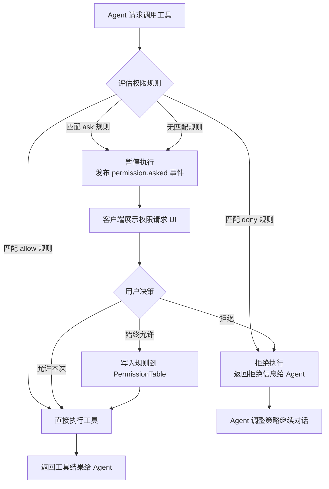

权限规则匹配按照 `permission`（工具名）+ `pattern`（路径/参数通配符）进行，支持 `*`、`~/` 等通配符展开。

代码路径：`packages/opencode/src/permission/next.ts`

### 7.2 前后端通信流程

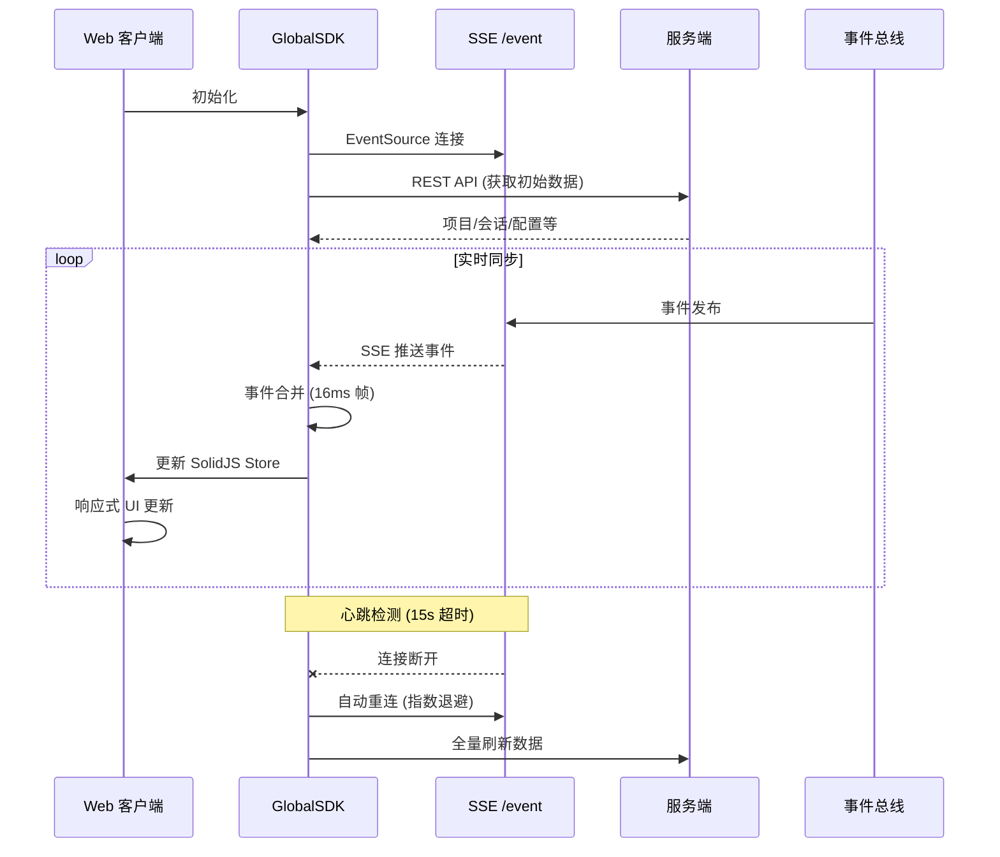

### 7.3 会话生命周期

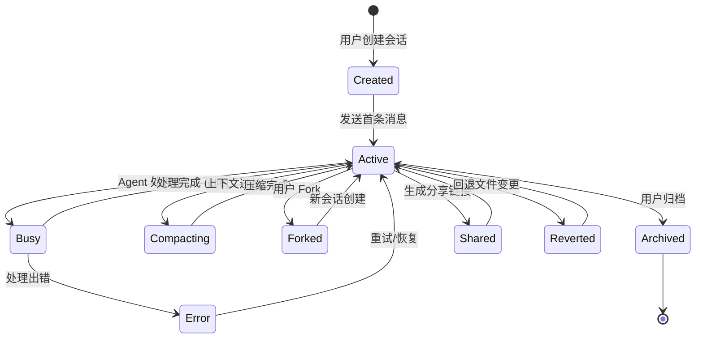

### 7.4 工具执行流程

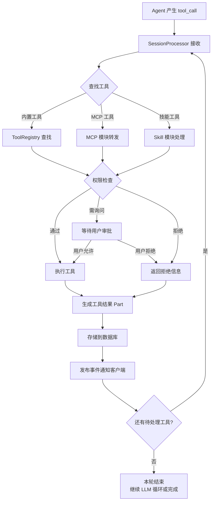
