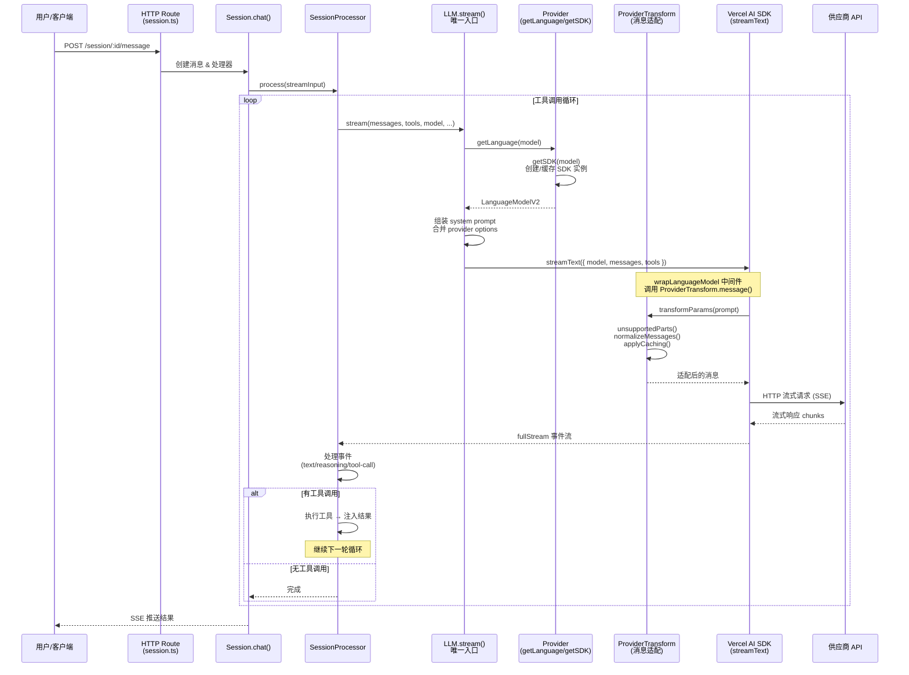
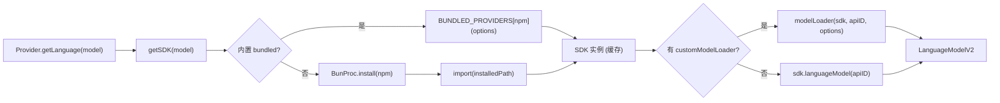
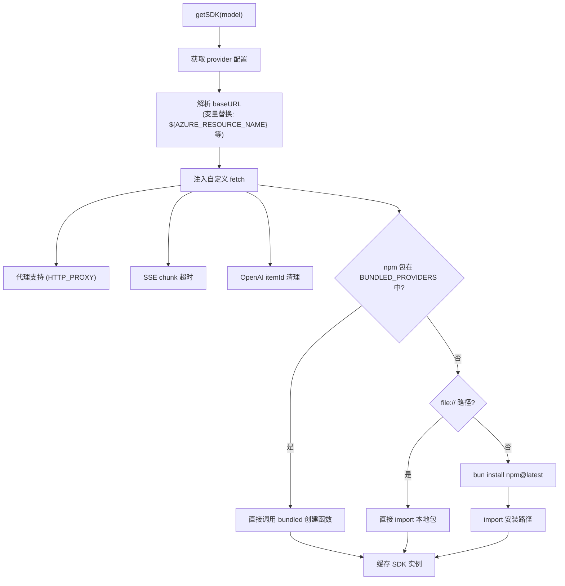
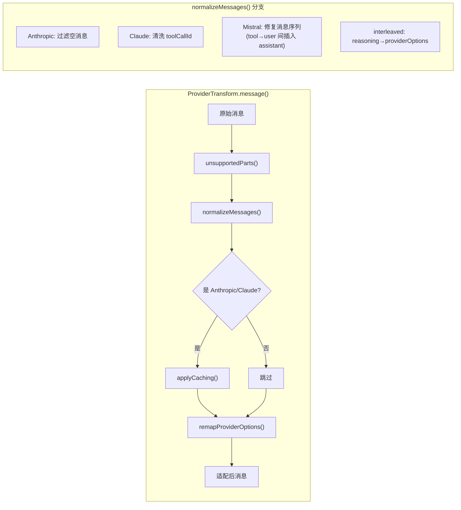
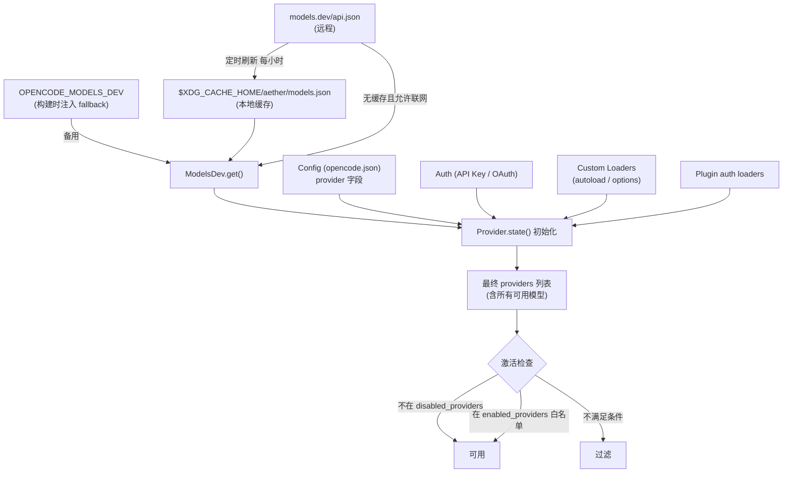
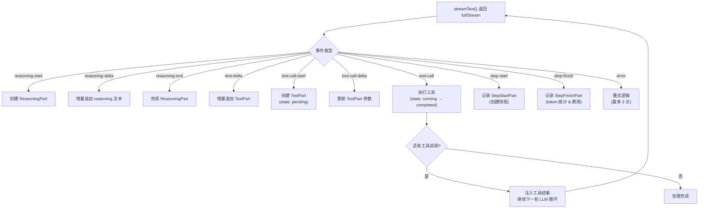

# Aether LLM 调用链路文档

## 概览

Aether 通过 **Vercel AI SDK (`ai` 5.x)** 统一抽象层与 20+ 家大模型供应商对话。核心设计思路：模型元数据来自 `models.dev`，SDK 适配器按 npm 包名动态加载，所有请求最终汇聚到 `streamText()` 一个调用点。

## 调用链路全景

## 关键断点详解

### 1. `LLM.stream()` — 唯一 LLM 调用入口

**文件**: `packages/opencode/src/session/llm.ts`

所有 Agent（general/plan/explore/build/compaction/title/summary）最终都通过此函数发起 LLM 调用。它负责：

- 组装 system prompt（Agent prompt + Provider prompt + 用户自定义 prompt）
- 获取 `LanguageModelV2` 实例（`Provider.getLanguage()`）
- 合并 provider options（基础选项 + 模型选项 + Agent 选项 + variant 选项）
- 调用 Vercel AI SDK 的 `streamText()` 发起流式请求
- 应用 `wrapLanguageModel` 中间件，在发送前通过 `ProviderTransform.message()` 转换消息格式

### 2. `Provider.getLanguage()` — SDK 实例化 & 模型获取

**文件**: `packages/opencode/src/provider/provider.ts`

### 3. `getSDK()` — 供应商 SDK 实例创建

**文件**: `packages/opencode/src/provider/provider.ts`

### 4. `ProviderTransform` — 请求/响应适配层

**文件**: `packages/opencode/src/provider/transform.ts`

| 转换函数 | 说明 |
|----------|------|
| `unsupportedParts()` | 将模型不支持的 modality（图片/音频/PDF）替换为错误文本 |
| `normalizeMessages()` | Anthropic 过滤空消息；Claude 清洗 toolCallId；Mistral 修复消息序列 |
| `applyCaching()` | 为 Anthropic/Bedrock/OpenRouter 等添加 cache control 标记 |
| `options()` | 按供应商设置 thinking/reasoning config、store、promptCacheKey 等 |
| `variants()` | 为 reasoning 模型生成 effort 级别选项（low/medium/high/max） |
| `providerOptions()` | 将选项映射到 AI SDK 期望的 namespace key |

## 支持的供应商 & 适配方式

### 内置 Bundled Providers（直接打包）

| 供应商 | npm 包 | SDK 创建函数 | 模型获取方式 |
|--------|--------|-------------|-------------|
| Anthropic | `@ai-sdk/anthropic` | `createAnthropic` | `sdk.languageModel(id)` |
| OpenAI | `@ai-sdk/openai` | `createOpenAI` | `sdk.responses(id)` |
| Google | `@ai-sdk/google` | `createGoogleGenerativeAI` | `sdk.languageModel(id)` |
| Google Vertex | `@ai-sdk/google-vertex` | `createVertex` | `sdk.languageModel(id)` |
| Google Vertex Anthropic | `@ai-sdk/google-vertex/anthropic` | `createVertexAnthropic` | `sdk.languageModel(id)` |
| Azure | `@ai-sdk/azure` | `createAzure` | `sdk.responses(id)` / `sdk.chat(id)` |
| Amazon Bedrock | `@ai-sdk/amazon-bedrock` | `createAmazonBedrock` | `sdk.languageModel(id)` + 区域前缀 |
| OpenRouter | `@openrouter/ai-sdk-provider` | `createOpenRouter` | `sdk.languageModel(id)` |
| xAI | `@ai-sdk/xai` | `createXai` | `sdk.responses(id)` |
| Mistral | `@ai-sdk/mistral` | `createMistral` | `sdk.languageModel(id)` |
| Groq | `@ai-sdk/groq` | `createGroq` | `sdk.languageModel(id)` |
| DeepInfra | `@ai-sdk/deepinfra` | `createDeepInfra` | `sdk.languageModel(id)` |
| Cerebras | `@ai-sdk/cerebras` | `createCerebras` | `sdk.languageModel(id)` |
| Cohere | `@ai-sdk/cohere` | `createCohere` | `sdk.languageModel(id)` |
| TogetherAI | `@ai-sdk/togetherai` | `createTogetherAI` | `sdk.languageModel(id)` |
| Perplexity | `@ai-sdk/perplexity` | `createPerplexity` | `sdk.languageModel(id)` |
| Vercel | `@ai-sdk/vercel` | `createVercel` | `sdk.languageModel(id)` |
| AI Gateway | `@ai-sdk/gateway` | `createGateway` | `sdk.languageModel(id)` |
| GitLab | `gitlab-ai-provider` | `createGitLab` | `sdk.agenticChat(id)` / `sdk.workflowChat(id)` |
| GitHub Copilot | 自定义 copilot SDK | `createGitHubCopilotOpenAICompatible` | `sdk.responses(id)` / `sdk.chat(id)` |
| OpenAI Compatible | `@ai-sdk/openai-compatible` | `createOpenAICompatible` | `sdk.languageModel(id)` (兜底) |

### 动态安装 Providers

不在内置列表中的 npm 包会通过 `BunProc.install(npm, "latest")` 动态安装后加载（如 `venice-ai-sdk-provider`、`@jerome-benoit/sap-ai-provider-v2` 等）。也支持 `file://` 本地路径加载自定义 provider。

### 特殊 Custom Loaders

部分供应商需要额外逻辑，通过 `CUSTOM_LOADERS` 注册（`packages/opencode/src/provider/provider.ts`）：

| 供应商 | 特殊处理 |
|--------|---------|
| `anthropic` | 注入 `anthropic-beta` header（interleaved-thinking、fine-grained-tool-streaming） |
| `opencode` | 无 API Key 时过滤付费模型，允许 `apiKey: "public"` 免费使用 |
| `openai` / `xai` | 使用 `sdk.responses()` 而非 `sdk.languageModel()` |
| `github-copilot` | GPT-5+ 使用 `sdk.responses()`，其余用 `sdk.chat()` |
| `azure` | 支持 `resourceName` 配置，completionUrls 模式切换 |
| `amazon-bedrock` | AWS 凭证链（profile/accessKey/bearerToken/webIdentity）、跨区域推理前缀 |
| `google-vertex` | GCP OAuth token 注入、project/location 配置 |
| `gitlab` | OAuth/PAT 认证、workflow model 发现、agentic chat |
| `cloudflare-workers-ai` | accountId + apiKey 认证 |
| `cloudflare-ai-gateway` | Unified API 格式（`provider/model`） |
| `sap-ai-core` | AICORE_SERVICE_KEY 认证 |

## 模型元数据来源

## Provider 激活条件

一个供应商被激活需满足以下任一条件：

1. **环境变量**: provider 定义的 `env` 字段对应的环境变量存在（如 `ANTHROPIC_API_KEY`）
2. **API Key 认证**: 通过 `opencode auth <provider>` 设置了 API Key
3. **配置文件**: `opencode.json` 中 `provider` 字段配置了该供应商
4. **Custom Loader autoload**: loader 返回 `autoload: true`（如 Bedrock 检测到 AWS 凭证）
5. **Plugin 认证**: 插件提供的 auth loader 返回了有效配置

同时不能在 `disabled_providers` 列表中，且若配置了 `enabled_providers` 白名单则必须在其中。

## 流式响应处理

`SessionProcessor` 消费 `streamText` 返回的 `fullStream`，逐事件处理并通过事件总线推送到客户端：

| 事件类型 | 处理 |
|----------|------|
| `reasoning-start/delta/end` | 创建/更新/完成 ReasoningPart |
| `text-delta` | 增量追加 TextPart |
| `tool-call-start/delta` | 创建 ToolPart (pending → running) |
| `step-start/finish` | 记录 StepStart/StepFinish Part（含 token 统计和费用） |
| `error` | 重试逻辑（最多 3 次自动重试） |

工具调用完成后，processor 将结果注入消息，继续下一轮 LLM 循环，直到模型不再请求工具调用。
