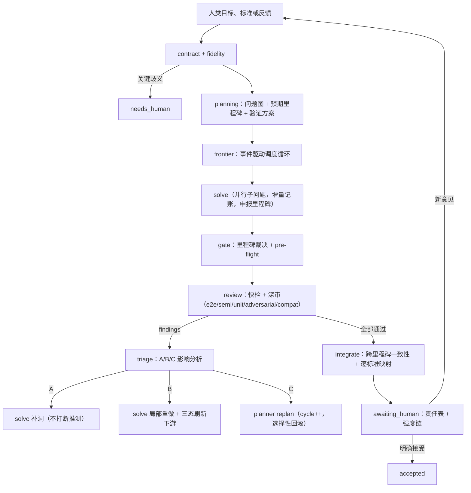

# Aether LOCA v3 设计：里程碑门控增量审核工作流

状态：第三版设计，2026-09-18。替代第二版（`archive/loca-v2/`，设计文档 `docs/loca-workflow-design.zh-CN.md` 保留为历史基线）。已实现于 `.aether/workflow/loca/` 等目录。

## 0. 动机与核心转变

第二版直接移植 LOCA 论文的 produce-then-review 批处理模型：先完整求解，再拆分 DAG，再逐块并行审核。这对解答短、思路确定的竞赛级问题是合适的；对科研问题不合适：

1. **探索性强，思路不固定**。开局给出完整解答通常不可靠，方向可能多次调整；等全部完成再审核，错误前提下的大量工作已经沉没。
2. **问题复杂，成果是项目而非文本**。解答由文本、程序、数值验证共同构成，事后对全部成果做细粒度拆分与全量 panel 审核的成本随规模线性爆炸。

因此 v3 将解答与审核交织：**以里程碑（逻辑封闭的可验证命题）为审核单位，以独立验证锚点（e2e）为主要信任来源，审核与求解并行推进，失败按影响分级处置而不是一律返工。**

| 维度     | v2（LOCA 移植）                        | v3（本设计）                                             |
| -------- | -------------------------------------- | -------------------------------------------------------- |
| 产审关系 | produce-then-review，批处理            | 产审交织，增量推进                                       |
| 审核单位 | 事后拆分的细粒度块（文本结构决定）     | 里程碑：逻辑封闭的可验证命题（逻辑结构决定）             |
| 信任来源 | 条件式局部审核（每块 3 席 panel 全量） | 独立验证锚点（e2e）为主，局部审核降级为按需抽查          |
| 依赖结构 | 事后全量 DAG 拆分（split 角色）        | 工作中增量维护结论级依赖账本                             |
| 审核时机 | 求解完成后一次性                       | T1 里程碑达成 / T2 高成本步骤前 / T3 replan 后 / T4 集成 |
| 失败处置 | 整轮回到 solve 重来                    | A 补洞不打断 / B 局部刷新不打断 / C 级联回滚             |
| 成本模型 | O(结点数 × 席位数) 全量 LLM 调用       | O(里程碑数) e2e（程序化部分边际≈0）+ 少量按需 unit       |

## 1. 核心决策

1. **里程碑不是进度百分比，而是逻辑封闭的可验证命题**。判定判据五条（§3）：命题可陈述、前提可封闭、验证锚点存在、有预期引用、达到规模下限。验证锚点的粒度自然界定里程碑的粒度——独立验证方案写不出来，说明结论还没逻辑封闭。
2. **里程碑有两条产生通道**。计划通道：planner 预先声明子问题的预期结论形式与验证方案（预注册，防止看到答案后发明软验证）。涌现通道：研究中出现的计划外结论提交提案，由独立上下文的 anchor 角色提出验证方案，gate 角色裁决升格/并入/继续累积。
3. **审核时机是四个触发点**，不每步审核，也不等全部完成：T1 里程碑达成（e2e 为主）；T2 高成本步骤前（pre-flight gate：昂贵工作开工前其前提里程碑必须已通过快检）；T3 replan 后新计划轻量审核；T4 集成时跨里程碑一致性。
4. **审核分三级**。e2e：验证器只消费「结论命题 + 根资产 + 已验证里程碑结论」，完全不接触推导过程。semi-e2e：里程碑内声明的独立分支，验证分支结论不看分支推导。unit：重点步骤条件式审核，触发来源是 solve 申报的高风险步骤、e2e 失败后的定位回溯、adversarial 的质疑；e2e 通过且无疑质时可为零 unit。
5. **验证器沉淀（verifier asset）**是核心成本机制。e2e 方案固化为可重跑的检查程序（Ward 恒等式、UV 有限性、量纲、守恒律、极限退化、文献数值对比），LLM 只需一次性审计该程序；此后每次修订重跑即可。成本从 O(修订次数 × LLM 调用) 降为 O(1) LLM + O(修订次数 × 程序运行)。
6. **验证器可信度由语义审计 + 阴性对照保证**。vaudit 角色核对「程序检验的命题 == 里程碑声明的命题」，并必须用 loca_execute 注入已知错误实现验证程序确实返回 fail；缺阴性对照或语义不符的验证器不得获得 trusted 状态。假 pass 比假 fail 危险得多。
7. **e2e 不可程序化时走降级链**：程序化检查 > 独立重推导（不同方法得到同一结论；同方法重走只是 replay）> 已知极限/特例对比 > semi-e2e 覆盖 + 显式 weak 标记。
8. **执行节奏分两级**。同步快检：程序化验证器重跑（秒级），作为硬门禁，不过不进入推测执行。异步深审：LLM 类审核（独立重推导、semi-e2e、unit、adversarial、验证器审计），与下游求解并行推测执行。
9. **推测执行默认开启，深度受限**（默认 1：只越过 1 个未深审里程碑继续工作；无程序锚点或历史失败率高的里程碑深度为 0）。深审失败按影响分级处置，不一律中止：A 类（结论不变，缺支撑）不打断；B 类（结论变、下游目标不变）不打断，按三态刷新下游；C 类（下游目标失效）中止推测性工作并选择性回滚。
10. **选择性回滚依赖结论级账本**：中止期间产出的结论中，凡不依赖被推翻前提的（独立子问题结论、纯方法性产出）保留，仅丢弃依赖失效前提的部分。checkpoint 提供工程级快照兜底。
11. **影响分类由 triage 角色沿账本与计划图传播判定**。B/C 之分取决于下游子问题的目标定义是否实质依赖结论内容；planner 被要求尽量把子问题目标写成结论无关（conclusion-agnostic）形式——**计划的写法决定未来返工的爆炸半径**，计划审核含目标抗失效性检查。
12. **里程碑注册表带实时相容性检查**，双层：程序层查显式矛盾模式（同量异值、命题与其显式否定、量纲冲突），agent 层（compat 角色）在里程碑升格时做语义相容审查，宁可过敏——嫌疑不裁决对错，只产生 conflict 记录并触发加急复核。
13. **weakly-verified 结论不阻塞过程，但阻塞"静默地当成已证事实交付"**。里程碑结论带证据强度（programmatic / independent / crosscheck / weak），任何结论的强度取其前提链最弱环节；交付时逐标准展示强度链（软规则，人类裁决）。
14. 沿用 v2 的：任务契约与 fidelity 检查、run/round/cycle/job/attempt 五层记录、独立 agent 执行验收状态机（协议合格与审核粒度正交）、结构化审核记录、epoch CAS 与租约、人类验收三处绑定（solve 自查 / 里程碑验证即验收验证 / 交付责任表）、"已通过本次验收 ≠ 绝对无误"。
15. **adversarial 质疑自带门槛**：每条质疑必须附「怀疑理由（具体失败模式假设）+ 目标重要性」并自评重要度；理由不充分的质疑在提交前自行丢弃。质疑清单转为 unit verify 任务。
16. 自动审核通过不等于人类接受；用户标准只能由用户修改；迟到响应不能改写终态。

## 2. 总体结构与状态机

### 2.1 主状态机（事件驱动）



frontier 是调度核心：每轮迭代计算当前可运行的任务集合（求解、裁决、验证器实现/审计、快检、深审各席、triage），受并发限额与推测深度约束并行派发；任务完成即更新状态并计算后续任务。C 类处置即时中止依赖失效前提的推测性在飞任务（按任务级 AbortController）。

### 2.2 层次与边界（沿用 v2）

run（人类父会话的持续实例）→ round（不可变契约的轮次）→ cycle（计划版本周期：一次 C 类 replan 计一个新 cycle）→ job（角色工作）→ attempt（一次调度执行）。delivery 为交付快照。编排状态与执行验收状态分离持久化，不以聊天文字作为完成凭据。

### 2.3 里程碑生命周期

```
draft（solve 声明中）
  → proposed（提案注册，含命题/输入/分支/验证方案或申请 anchor）
  → gated（gate 裁决通过；未通过则并入父级或继续累积）
  → quick_checked（程序化快检通过，或无程序锚点直接进入深审）
  → in_review（深审各席进行中）
  → verified（e2e/分支/adversarial/unit/compat 全部通过；记录证据强度）
  → 修订：version++，superseded 历史保留，触发下游三态刷新
  → unverified（深审失败且未修复）
```

### 2.4 执行验收状态机（v3.1 增补 interrupted 续传）

queued → preparing → running → checking → accepted / rejected → retrying；blocked / error / timeout / cancelled / stale / exhausted 终态。一份证据完整、schema 合格的 `verdict: fail` 是 accepted 的合法执行。

`interrupted`（v3.1）：进程/实例中断遗留的在飞 job 转入此暂存态（保留隔离子会话与上下文目录）；恢复后同 role+slot+packet 的调度命中时回到 queued→preparing 走**原会话续传**（带 resume 指令，`produced` 从落盘资产按 job 字段回填）。packet 或 epoch 已变化的候选转 stale 归档。用户 cancel、任务级 abort、watchdog 超时不进此态。

## 3. 里程碑：判据与通道

### 3.1 五条判据（gate 裁决，部分由引擎程序化预检）

| #   | 判据                                                                       | 检查方式                          |
| --- | -------------------------------------------------------------------------- | --------------------------------- |
| 1   | 命题可陈述：单一命题（或产物+行为规格），带适用域与量词                    | gate（LLM）                       |
| 2   | 前提可封闭：输入全部指向已验证里程碑 / 根资产 / 本里程碑内部               | 引擎（程序）                      |
| 3   | 验证锚点存在：至少一个独立于原推导路径的验证方案                           | 引擎查申报 + gate 判断独立性      |
| 4   | 预期引用：映射到某条用户验收标准，或被计划中任一子问题（含未落地）预期引用 | 引擎（程序）                      |
| 5   | 规模下限：包含足够非平凡内容                                               | gate（LLM），以锚点粒度为自然校准 |

判据 4 的闭合规则：涌现里程碑若既不映射标准也无预期引用，是探索副产品——登记为候选结论（入档不升格、不花审核预算），或 solve 走轻量计划增补把预期引用补进计划后再升格。**任何审核投入必须服务于计划内目标；计划外价值先入计划。**

### 3.2 计划通道与涌现通道

- **计划通道**：planner 产出问题图。每个子问题声明：目标（尽量结论无关式）、负责的验收标准、预期引用（依赖哪些其他子问题的结论）、验证方案（锚类型 + 规格，预注册）、目标抗失效性自检。预声明的验证方案在里程碑提案时由 anchor 实现为具体验证器（程序锚）或执行规格（其他锚）。
- **涌现通道**：solve 在工作中发现计划外结论时申报提案（不含验证方案），anchor 角色在独立上下文中只看命题与根资产提出验证方案，gate 一并裁决。

### 3.3 证据强度

| 强度         | 来源                               |
| ------------ | ---------------------------------- |
| programmatic | trusted 验证器实跑通过             |
| independent  | 独立重推导（不同方法）得到同一结论 |
| crosscheck   | semi-e2e 分支覆盖 + 特例/极限对比  |
| weak         | 无独立锚点，仅有条件式局部支撑     |

结论强度 = min(自身锚点强度, 全部前提链强度)。weak 前提不阻断下游条件式依赖，但最终交付的责任表强制展示（§8）。

## 4. 审核体系

### 4.1 时机

- **T1 里程碑达成**：gate → 快检 → 深审（默认与下游求解并行）。
- **T2 pre-flight gate**：调度 solve 于子问题 S 前，检查其预期引用的里程碑状态：全部 verified 或（quick_checked 且推测深度未超限）。昂贵计算（solve 申报的长任务）开工前同理。
- **T3 replan 后**：新计划版本过一次 planner 自检 + 目标抗失效性检查（planner 输出的一部分，引擎校验字段存在）。
- **T4 集成**：integrate 跨里程碑一致性 + 逐标准映射 + 强度链。

### 4.2 e2e 与验证器沉淀

- 验证器 = 冻结的代码资产 + 检验的命题模板 + 一次性 vaudit 记录。状态机：draft → auditing → trusted / rejected。
- 运行协议：引擎以受限沙箱执行，输入为里程碑冻结产物（资产 id），exit 0 = pass；stdout/stderr/产物构成执行证据。
- 阴性对照：vaudit 必须提供至少一条「注入已知错误 → 验证器必须 fail」的对照执行记录，引擎核对执行证据的退出码确实非零。
- 快检与 e2e 的关系：programmatic 锚的快检即 e2e 证据；修订后重跑即回归测试。

### 4.3 semi-e2e

里程碑提案声明内部相对独立的分支（分支结论 + 分支输入，分支输入可含本里程碑内未审中间结论）。每个分支一个独立 verify 会话：给定分支输入验证分支结论，不看分支推导。

### 4.4 unit（按需）

触发来源合并去重后派发：

1. solve 申报的高风险步骤（关键近似合法性、收敛性、符号推导关键步）；
2. e2e 失败后的定位回溯（triage 可要求对可疑步骤做条件式复核）；
3. adversarial 质疑：审阅上个已审里程碑到本里程碑之间 solve 的完整工作记录，输出质疑清单（每条含位置、类型、失败模式假设、重要性自评；理由不充分的自行丢弃）。must-address 级质疑全部派发 unit verify；spot-check 级抽样派发。

### 4.5 compat（相容性）

- 程序层（引擎，注册即查）：同一声明量的不同值、命题与其显式否定、单位/量纲冲突。
- agent 层（compat 角色，里程碑进入深审时）：新命题 + 计划图邻接的已注册命题，报告矛盾嫌疑。嫌疑 → conflict 记录 → 涉事双方加急复核，不自动裁决。

## 5. 执行节奏：推测执行与分级失败处置

### 5.1 两级节奏

同步快检不过 → 里程碑不允许被下游推测引用。深审异步进行；快检通过的里程碑即可作为下游推测依赖（受深度限制）。

### 5.2 推测深度

`depth(milestone) = cfg.depth`（默认 1）减去其未深审前提数；无程序锚点或本类历史失败率高时可配置为 0。深审通过率统计作为调参依据。

### 5.3 分级处置

| 类         | 定义                                       | 处置                                                                  |
| ---------- | ------------------------------------------ | --------------------------------------------------------------------- |
| A 补洞     | 命题仍成立，缺支撑/缺验证                  | solve 原地补证（refine），重跑快检与受影响 e2e；不打断推测            |
| B 局部重做 | 命题改变，下游目标定义不变（只引用槽位）   | 重做受影响部分 → 里程碑 version++ → 下游三态刷新                      |
| C 级联     | 下游某些子问题目标定义/方法路线/优先级失效 | planner replan（cycle++）；中止依赖失效前提的在飞推测任务；选择性回滚 |

B 类下游三态：

| 下游状态                  | 动作                                                                                      |
| ------------------------- | ----------------------------------------------------------------------------------------- |
| 未开工                    | 计划边标 stale；调度时 pre-flight 强制消费最新版本，天然无需重做                          |
| 已开工、无 trusted 验证器 | 消费旧值的已产出结论标 stale，solve refine 检查引用点选择性重做                           |
| 已开工、有 trusted 验证器 | 重跑其验证器；通过且前提无版本漂移/状态退化才止住传播（否则 failed→triage→refine 重申报） |

B/C 判据：下游子问题目标定义是否实质依赖结论的具体内容（值、符号、定性结论）而非其存在性/槽位。若方法选择依赖值的量级/符号（如微扰参数大小决定方法适用性），判 C。

### 5.4 选择性回滚

C 类中止后：沿计划图与账本找出传递依赖失效里程碑的全部在飞任务与已产出结论；仅丢弃依赖失效前提者；独立子问题结论与方法性产出保留为历史证据（superseded 而非删除）。

## 6. 角色总表

| 角色                | 来源                              | 职责与要点                                                                                                |
| ------------------- | --------------------------------- | --------------------------------------------------------------------------------------------------------- |
| contract / fidelity | v2 保留                           | 契约归纳与忠实性复核                                                                                      |
| planner             | 新（替代 explore/split 的规划面） | 问题图、预期里程碑与验证方案预注册、目标抗失效性、replan                                                  |
| solve               | v2 改造                           | 按计划执行子问题；增量记账（每固定一个结论登记消费边）；申报里程碑提案与高风险步骤；patch/refine 模式复用 |
| gate                | 新                                | 里程碑五判据裁决；升格/并入/继续累积                                                                      |
| anchor              | 新                                | 独立上下文为提案实现/提出验证方案（计划锚的验证器实现 + 涌现锚的方案提出）                                |
| vaudit              | 新                                | 验证器一次性审计：语义符合 + 阴性对照                                                                     |
| verify              | v2 validate 演化                  | e2e 执行者（独立重推导、极限/特例、文献数值对比）与 semi-e2e 分支验证、unit 条件式复核                    |
| adversarial         | 新（吸收 questioner 精神）        | 过程质疑，自带门槛                                                                                        |
| compat              | 新                                | 里程碑相容性语义审查                                                                                      |
| triage              | 新                                | 影响分析：A/B/C 判定 + 受影响集合（沿账本与计划图）                                                       |
| integrate           | v2 保留                           | 跨里程碑一致性、逐标准映射、强度链、责任表                                                                |
| present             | 并入 integrate                    | 摘要与人工复核入口（v2 语义）                                                                             |
| supervisor          | 引擎内置（v2 沿用）               | job/attempt 执行验收                                                                                      |

消退：split（被 planner + 增量记账 + gate 吸收）、inputs/replay 细粒度端口审核（被账本 + e2e 独立性替代）、3 席全量 panel、questioner/defender（adversarial + verify 按需覆盖）。

## 7. 数据契约（摘要）

- **MilestoneRecord**：`id, kind(planned/emergent), subproblem, version, statement, scope, inputs[], branches[], verification{anchor, spec, verifier?, anchorReport?}, status, strength, review{quick, e2e, branches[], units[], adversarial, compat}, findings[], history[]`
- **PlanVersion**：`version, cycle, strategy, subproblems[{id, goal, criteria, expectedRefs[], depends[], verification{anchor, spec}, robustness, state}]`
- **LedgerEntry**：`{consumer, consumed, version, use}`（consumer/consumed 为里程碑或子问题 id；结论级，非步骤级）
- **VerifierAsset**：代码资产 id + 检验命题 + `{status, audit{semantic, controls[]}}`
- **Finding**（v2 issue 扩展）：`+ impact{class, affected[], goalChange?}`（triage 填写）
- **审核记录**：v2 envelope/body 结构沿用；checks 按 role 配置。

## 8. 交付与人类验收

integrate 输出逐标准责任表：标准 ID/原文 → 负责里程碑（含版本与命题）→ 验证证据（验证器执行记录 / 重推导报告 / 分支验证）→ 覆盖范围 → **前提链强度（取最弱环节，weak 必须显式标注）** → 人工复核入口。weak 链不阻止"已通过本次验收"的表述，但禁止省略标注（软规则）。沿用 awaiting_human → accepted 流转与 /loca-accept。

## 9. 与 v2 的实现边界

- 旧实现整体归档于 `archive/loca-v2/`（插件、角色、命令、skill、workflow、安装脚本与设计文档对应关系见该目录 README）。
- 新实现完全独立：`.aether/plugins/loca.js`、`.aether/agent/loca-*.md`、`.aether/command/loca*.md`、`.aether/skills/loca-workflow/`、`.aether/workflow/loca/`、运行数据 `<项目根>/loca/`。
- 仅按"copy 后改造"复用：受限沙箱执行（execute.js）、资产冻结与哈希账本（store 骨架）、结构化输出校验与 id 自愈（schema 骨架）、隔离会话调度（runner 骨架）、UI 持续输出模式（plugin 骨架）。engine 的固定 phase 闸门全部重写为事件驱动的 frontier 调度器。
- 任务级 AbortController：推测性任务可被单独中止（v2 只有整 run 级）。

## 10. 配置（workflow.json 摘要）

`concurrency`（4）、`attempts`（3）、`cycles`（16，计划版本数）、`calls`（360）、`depth`（推测深度默认 1）、`questions`（每里程碑 adversarial 追问上限）、`timeout`（按角色 wall-clock 上限，v3.1 软化：不杀活跃任务，仅停滞时生效；活跃超 `timeout×4` 绝对上限才强杀）、`packet`/`bytes`/`idle`（watchdog 停滞判定，活动语义）、`execution`、`checks`（gate/verify/unit/adversarial/compat/vaudit/triage/integrate 各自的必需检查项）。

## 11. 开放问题与评估计划

1. **规模下限校准**（判据 5）：先以锚点粒度自然界定，看实际运行中 gate 的误判率与碎片化程度再调。
2. **纯定性里程碑**（文献综述、否定性命题）锚点天花板低：当前按 weak 强度走软规则；若实践中成为主要瓶颈，考虑引入检索路径多样化的 crosscheck 锚。
3. **推测深度调参**：统计各锚类型的深审失败率；adversarial 命中率高的类别回退串行（depth 0）。
4. **验证器 bug 的假 pass**：阴性对照是当前手段；多席 vaudit 作为可选加强。
5. **并行里程碑矛盾**：程序层 + compat 双层已覆盖注册时点；集成期一致性检查兜底。
6. **评估指标**：每轮 LLM 调用数对比 v2 同任务、里程碑一次通过率、B/C 类比例（计划抗失效性的直接度量）、推测浪费率（被中止任务消耗 / 总消耗）。

## 12. 结论

v3 把审核从"收割"改为"伴随"：里程碑提供审核的自然切口，验证器沉淀把信任的边际成本压向程序重跑，推测执行让深审与探索并行，影响分级让失败处置与失败的真实半径相等。旧实现保留为对照组，用于在相同任务上度量新架构的成本与可靠性差异。
