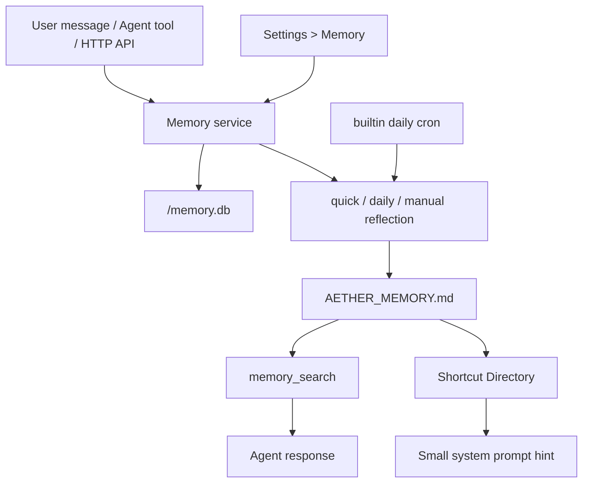
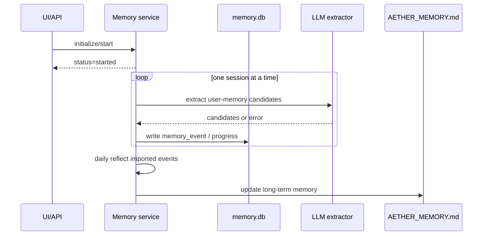

# Aether Memory System

This document describes the currently implemented Aether memory system. The system is designed as a low-coupling long-term memory module: normal chat does not read old session transcripts, long-term memory is accessed through explicit tools or APIs, and Markdown remains the inspectable source of truth.

Main code areas:

- `packages/opencode/src/memory/`
- `packages/opencode/src/tool/memory.ts`
- `packages/opencode/src/server/routes/memory.ts`
- `packages/app/src/components/settings-memory.tsx`

## 1. Feature Summary

Implemented today:

- Long-term memory file: `AETHER_MEMORY.md`
- Per-channel event database: `<channel>/memory.db`
- Three memory types: `preference`, `fact`, `task`
- Two scopes: `global`, `project:<project_id>`
- Agent tools: `memory_search`, `memory_remember`, `memory_forget`, `memory_reflect`
- HTTP API: `/memory/*`
- Shortcut prompt injection that tells the agent when to call `memory_search`
- Quick, daily, and manual reflection
- Daily reflection cron direct action
- Server startup catch-up
- Service/API path for one-time historical session initialization
- Background initialization progress, cancellation, and failure reporting
- Deterministic fallback for provider/model reflection failures

Not implemented:

- Vector or embedding search
- Reading old sessions as normal chat context
- Session-level long-term memory scope
- Multiple long-term Markdown files
- Hard deletion of raw event history
- Parallel historical session scanning

## 2. Architecture

The memory system has five layers:

1. Markdown long-term memory: `AETHER_MEMORY.md`
2. SQLite event and run log: `<channel>/memory.db`
3. Memory service: remember, forget, search, reflect, initialize, startup catch-up
4. Agent/API adapters: `memory_*` tools and `/memory` routes
5. UI/Cron integration: Settings > Memory and the daily reflection cron



Core entry points:

| File | Responsibility |
| --- | --- |
| `packages/opencode/src/memory/index.ts` | Main memory service |
| `packages/opencode/src/memory/markdown.ts` | `AETHER_MEMORY.md` parsing/rendering |
| `packages/opencode/src/memory/search.ts` | Markdown memory search and ranking |
| `packages/opencode/src/memory/gate.ts` | Quick reflection gate |
| `packages/opencode/src/memory/schema.sql.ts` | SQLite schema |
| `packages/opencode/src/memory/installer.ts` | Installation, cron registration, startup catch-up |
| `packages/opencode/src/memory/plugin.ts` | Chat hook and shortcut prompt injection |
| `packages/opencode/src/tool/memory.ts` | Agent tools |
| `packages/opencode/src/server/routes/memory.ts` | HTTP API |

## 3. Storage

### 3.1 `AETHER_MEMORY.md`

The long-term source of truth lives in the global memory data directory:

```text
<global-memory-data-dir>/AETHER_MEMORY.md
```

`memory_search` only searches this file. It does not read old session files or raw events from `memory.db` as answer evidence.

File layout:

```text
# Aether Memory

<!--
schema_version: 1
updated_at: ...
source: memory.db
search_target: true
-->

## Shortcut Directory

---

## Preferences

---

## Facts

---

## Tasks
```

Example memory block:

```text
### PREF-answer-language
- type: preference
- scope: global
- memory: The user prefers Chinese replies by default.
- confidence: 0.95
- weight: 0.9
- evidence: The user explicitly requested Chinese replies by default.
- updated_at: 2026-05-13T00:00:00.000Z
- status: active
```

### 3.2 `<channel>/memory.db`

Events, reflection runs, and lightweight settings are stored under the current channel:

```text
<channel>/memory.db
```

Main tables:

| Table | Purpose |
| --- | --- |
| `memory_event` | Raw remember/forget events, source metadata, status, and reflection result |
| `reflection_run` | Quick/daily/manual reflection run log |
| `memory_setting` | Initialization state, reflection state, and other lightweight settings |

Possible `memory_event.status` values:

- `new`
- `pending_important`
- `applied`
- `ignored`
- `deleted`
- `forgot`
- `deprecated`
- `superseded`

## 4. Types and Scopes

### 4.1 Types

| type | Meaning |
| --- | --- |
| `preference` | User preferences, interaction style, durable profile information |
| `fact` | Stable user facts, project facts, environment facts |
| `task` | Long-running tasks, follow-ups, persistent constraints |

### 4.2 Scopes

| scope | Meaning |
| --- | --- |
| `global` | Applies across projects |
| `project:<project_id>` | Applies only to the specified project |

During search, the current project is a ranking signal rather than a hard filter. Relevant project-scoped memories rank above global memories, but global memories can still be recalled.

## 5. Agent Tools

### 5.1 `memory_search`

Searches long-term memory. The agent should call it before answering whenever durable user identity, preferences, project facts, prior decisions, long-running tasks, or previously stated constraints may affect the answer.

Parameters:

- `query`
- `mode?`: `search | overview`
- `types?`: `preference | fact | task`
- `limit?`
- `currentProjectID?`

Results are ranked by relevance, scope, weight, and recency, and use Markdown memory block ids as evidence identifiers.

### 5.2 `memory_remember`

Records user-requested memory. The tool writes a `memory_event`, then triggers quick reflection. `AETHER_MEMORY.md` is updated only after reflection accepts the memory.

Parameters:

- `text`
- `type?`
- `project_id?`

Agents should not edit `AETHER_MEMORY.md` directly.

### 5.3 `memory_forget`

Forgets matching long-term memories. Natural-language requests are searched first; the Memory service then deletes matching Markdown blocks.

Parameters:

- `query?`
- `ids?`
- `type?`

If nothing matches, no permanent ban is recorded. Forgetting is a one-time deletion, not a rule that similar information can never be remembered again.

### 5.4 `memory_reflect`

Runs memory reflection. It defaults to `quick`; `daily` should be used only when the user explicitly asks for global, daily, or full memory organization.

Parameters:

- `mode?`: `quick | daily | manual`
- `reason?`

## 6. Reflection and Initialization

### 6.1 Quick reflection

Quick reflection makes important explicit memories visible across sessions as soon as possible.

Triggers:

- `memory_remember`
- High-value user memory signals detected by the `chat.message` hook
- Default `memory_reflect`

To control resource usage, `shouldQuickReflect()` filters low-signal one-off messages. Events that need LLM judgment can be stored and later handled by quick or daily reflection.

### 6.2 Daily reflection

Daily reflection globally organizes long-term memory, deduplicates similar entries, handles conflicts, and updates `AETHER_MEMORY.md` plus the Shortcut Directory.

Triggers:

- Built-in cron direct action: `memory.reflect.daily`
- Startup catch-up
- Manual Settings > Memory action
- `memory_reflect` with explicit `daily` mode

Daily reflection scans discovered channel `memory.db` files sequentially and does not perform parallel scanning.

### 6.3 Provider fallback

When LLM reflection fails due to provider/model/structured-output/provider-options errors, the service:

1. Retries provider-option BadRequest failures once with safer provider options.
2. Falls back to deterministic reflection if the retry fails or the model is unavailable.
3. Marks the reflection summary with `fallback` so this is not reported as a clean LLM-only success.

Abort and cancellation errors do not use fallback; they are treated as interruptions.

### 6.4 Historical session initialization

Initialization imports possible long-term memories from old session user messages.

Behavior:

- Scans sessions one at a time to keep CPU usage low.
- Primarily analyzes user messages; assistant messages are only supporting context when needed.
- Writes candidates to `memory_event`, then lets reflection update `AETHER_MEMORY.md`.
- `/memory/initialize/start` starts a background task and is not tied to the HTTP request lifecycle.
- `/memory/initialize/cancel` aborts the current initialization task.
- Non-abort extractor errors are recorded as `error_count` and `last_error`; if no items are imported, initialization is marked `failed`.

Note: the Settings > Memory initialization button may be disabled by upstream UI policy. The service/API path remains available.



## 7. Prompt Injection

The memory system does not inject the full long-term memory file into the system prompt. It injects only a compact Shortcut Directory hint that tells the agent when it may need to call `memory_search`.

Injected content does not include:

- Full memory bodies
- `target_ids`
- Raw events
- Old session transcripts

Agents should treat shortcuts as a search index, not as facts.

## 8. Cron Integration

The memory system reuses cron direct actions.

Built-in action:

```text
memory.reflect.daily
```

Built-in job id:

```text
builtin.memory.daily_reflect
```

Default time:

```text
03:00
```

Installation syncs this built-in job and disables legacy daily reflection jobs. When memory is globally disabled, the daily cron job is synced as disabled and memory reflection itself does not run. If only the daily reflection switch is disabled, only cron-triggered daily reflection is blocked; users can still run manual daily reflection while global memory is enabled.

## 9. HTTP API

| Method | Path | Purpose |
| --- | --- | --- |
| `GET` | `/memory/status` | Read memory status, counts, and initialization state |
| `POST` | `/memory/search` | Search long-term memory |
| `POST` | `/memory/reflect` | Run quick/daily/manual reflection |
| `POST` | `/memory/initialize/start` | Start background historical session initialization |
| `POST` | `/memory/initialize/cancel` | Cancel initialization |
| `POST` | `/memory/daily-reflect/sync` | Sync the built-in daily reflect cron from config |

Agents should normally use the `memory_*` tools instead of calling these HTTP APIs directly.

## 10. Settings UI

Settings > Memory provides lightweight management:

- Global memory switch
- Daily reflection switch and time
- Status card
- Initialization status display
- Manual search
- Manual quick/daily reflection

Whether the initialization import button is clickable depends on the current upstream UI policy. The backend API and status display are independent.

## 11. Lifecycle

`installMemory()` returns:

- `service`
- `start()`
- `stop()`
- `purge()`

Semantics:

- `start()`: sync the daily reflect cron and run startup catch-up checks.
- `stop()`: abort background initialization, wait briefly for cleanup, close the memory DB, and keep data.
- `purge()`: delete `AETHER_MEMORY.md`, reflection state, and all channel `memory.db` files including WAL/SHM files.

## 12. Integration Points

The memory module avoids modifying the agent/session main loop. Current integration points are:

| File | Purpose |
| --- | --- |
| `packages/opencode/src/server/server.ts` | Mount `/memory` routes and install memory during server lifecycle |
| `packages/opencode/src/tool/registry.ts` | Register `memory_*` agent tools |
| `packages/opencode/src/plugin/index.ts` | Register the memory plugin |
| `packages/opencode/src/config/config.ts` | Add memory configuration |
| `packages/opencode/src/cron/index.ts` | Support the memory direct action |
| `packages/app/src/context/global-sdk.tsx` | Expose memory client helpers |
| `packages/app/src/utils/server.ts` | Expose memory API helpers |
| `packages/app/src/components/dialog-settings.tsx` | Add the Settings > Memory tab |

## 13. Tests

Recommended local checks:

```bash
bun run --cwd packages/opencode test test/memory/memory.test.ts --timeout 120000
bun run --cwd packages/opencode test test/cron/cron.test.ts test/memory/abort-leak.test.ts --timeout 120000
bun run --cwd packages/opencode typecheck
```

Frontend settings page checks:

```bash
bun run --cwd packages/app ./script/vitest.ts run --config ./vitest.config.ts src/components/settings-memory.vitest.tsx
bun run --cwd packages/app typecheck
```
