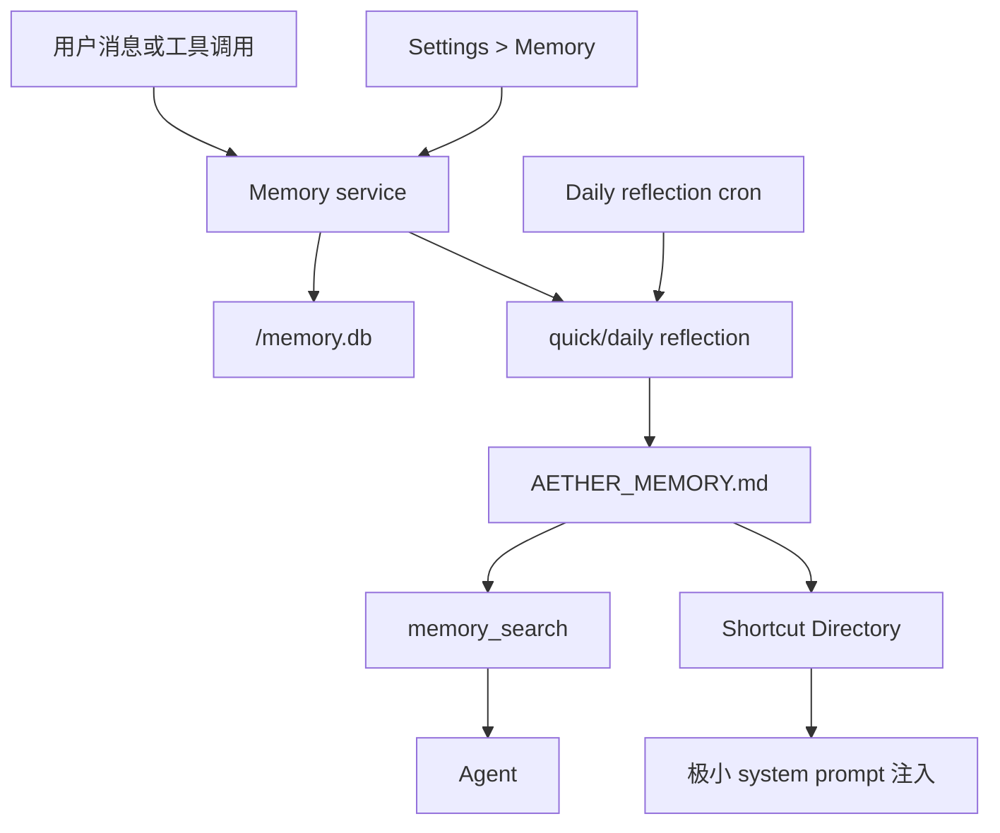

# Aether Memory 系统（当前实现）

本文描述当前代码中已经落地的 memory 基础设施实现，目标代码范围主要在：

- `packages/opencode/src/memory/`
- `packages/opencode/src/tool/memory.ts`
- `packages/opencode/src/server/routes/memory.ts`
- `packages/opencode/src/server/server.ts`
- `packages/opencode/src/cron/index.ts`
- `packages/app/src/components/settings-memory.tsx`

本文只描述**当前已经实现**的能力、接口和边界。

## 0. 当前已实现功能总览

当前已经落地的 memory 功能可以直接概括为：

- 单一长期记忆文件 `AETHER_MEMORY.md`
- 按 channel 隔离的 `memory.db` 原始事件与反思日志
- 三种长期记忆类型：
  - `preference`
  - `fact`
  - `task`
- 两种长期记忆 scope：
  - `global`
  - `project:<project_id>`
- 四个 agent 工具：
  - `memory_search`
  - `memory_remember`
  - `memory_forget`
  - `memory_reflect`
- `/memory` HTTP API
- Settings > Memory 管理页
- shortcut 目录注入
- quick reflection 与 daily reflection
- 首次初始化导入旧 session 的用户消息
- built-in daily reflection cron direct action
- `stop()` / `purge()` 生命周期接口

当前**还没有**落地的部分：

- 向量库或 embedding 检索
- 多 Markdown 长期记忆源
- 直接编辑 `AETHER_MEMORY.md` 的前端编辑器
- session 级长期记忆 scope
- hard delete 历史原始事件
- 并行扫描历史 session

## 1. 设计目标

当前 memory 系统被实现为一层**模块化长期记忆基础设施**，而不是把历史 session 当作可随时读取的记忆库。

设计目标是：

- 正常对话时不读取旧 session transcript
- Agent 只通过 `memory_search` 获取长期记忆正文
- 长期记忆最终集中到一个 Markdown 文件中，便于检查、备份和迁移
- 原始写入、forget 请求和 reflection 运行记录进入 SQLite，便于审计和补跑
- 显式记忆尽快跨 session 可见
- 低信号消息不过度触发 LLM reflection
- daily reflection 能整理重复、相似和冲突记忆
- 尽量减少对 agent/session 主链路的侵入

当前版本定位为：

- 本地单用户长期记忆系统
- Markdown 作为长期事实源
- SQLite 作为事件日志和运行日志
- Tool/API/UI 三种入口共享同一套 `Memory` service

## 2. 整体架构

当前实现可分成 5 层：

1. **Markdown 长期记忆层**
   - `AETHER_MEMORY.md`
   - 保存可搜索的长期记忆和 shortcut 目录

2. **Event / Run Log 层**
   - `<channel>/memory.db`
   - 保存 `memory_event`、`reflection_run` 和 `memory_setting`

3. **Memory Service 层**
   - 负责 remember、forget、search、reflect、initialize、startup catch-up

4. **Agent / API 适配层**
   - `memory_*` agent tools
   - `/memory` HTTP routes

5. **UI / Cron 集成层**
   - Settings > Memory
   - daily reflection cron direct action



## 2.1 核心代码入口

当前最关键的入口文件是：

- `packages/opencode/src/memory/index.ts`
  - 核心 memory service 实现
- `packages/opencode/src/memory/markdown.ts`
  - `AETHER_MEMORY.md` parse / render
- `packages/opencode/src/memory/search.ts`
  - Markdown 记忆检索
- `packages/opencode/src/memory/gate.ts`
  - quick reflection 确定性 gate
- `packages/opencode/src/memory/schema.sql.ts`
  - SQLite 表定义
- `packages/opencode/src/memory/installer.ts`
  - memory 安装、daily cron 注册、startup catch-up
- `packages/opencode/src/memory/plugin.ts`
  - shortcut prompt 注入
- `packages/opencode/src/tool/memory.ts`
  - agent tools
- `packages/opencode/src/server/routes/memory.ts`
  - `/memory` HTTP 路由
- `packages/app/src/components/settings-memory.tsx`
  - Settings > Memory UI

## 3. 持久化结构

### 3.1 `memory.db`

原始事件与 reflection 运行记录保存在当前 channel 下：

```text
<channel>/memory.db
```

`memory.db` 不是长期记忆事实源，也不是正常对话时的搜索目标。它主要用于：

- 记录 `remember` / `forget` 原始请求
- 记录 quick/daily/manual reflection 输入和结果
- 标记事件状态
- 支持 missed daily reflection 补跑
- 支持首次初始化导入旧 session 后继续走同一套 reflection 链路

核心表：

- `memory_event`
- `reflection_run`
- `memory_setting`

`memory_event.status` 当前可能值包括：

- `new`
- `pending_important`
- `applied`
- `ignored`
- `deleted`
- `forgot`
- `deprecated`
- `superseded`

### 3.2 `AETHER_MEMORY.md`

长期记忆保存在全局 memory 数据目录下：

```text
<global-memory-data-dir>/AETHER_MEMORY.md
```

它是当前唯一长期记忆事实源。`memory_search` 只搜索这个文件，不读取旧 session 文件，也不读取 `memory.db` raw event。

当前 Markdown 顶层结构固定为：

```text
# Aether Memory

<!--
schema_version: 1
updated_at: ...
source: memory.db
search_target: true
-->

## Shortcut Directory

---

## Preferences

---

## Facts

---

## Tasks
```

长期记忆 block 示例：

```text
### PREF-answer-language
- type: preference
- scope: global
- memory: 用户偏好默认用中文回答。
- confidence: 0.95
- weight: 0.9
- evidence: 用户明确要求默认中文回答。
- updated_at: 2026-05-13T00:00:00.000Z
- status: active
```

## 4. 记忆类型与 scope

### 4.1 type

当前只允许三种长期记忆类型：

- `preference`
  - 用户偏好、表达方式、工作方式、稳定画像
- `fact`
  - 较稳定的客观事实、项目事实、环境事实
- `task`
  - 持续任务、长期待办、需要后续跟进的事项

### 4.2 scope

当前只允许两类长期记忆 scope：

- `global`
  - 跨项目成立的用户偏好、事实或任务
- `project:<project_id>`
  - 只对某个 project 成立的事实、偏好或任务

`memory_search` 会把当前 project 作为排序加权信号，而不是默认硬过滤。当前 project scoped 记忆在相关查询中会优先于 global 记忆。

## 5. Agent 工具

### 5.1 `memory_search`

用途：

- 搜索长期记忆
- 只读 `AETHER_MEMORY.md`
- 返回按相关度、scope、权重和新近程度排序的结果
- 当请求可能依赖长期用户或项目上下文时，应优先调用：
  - 用户身份、画像、偏好
  - 项目事实、历史决策、既往约束
  - recurring tasks 或用户曾经要求长期遵循的规则
  - “你记得什么”“按我之前说的来”这类宽泛记忆问题

参数：

- `query`
- `types?`
- `limit?`
- `currentProjectID?`

### 5.2 `memory_remember`

用途：

- 记录用户明确要求记住的内容
- 写入当前 channel 的 `memory.db`
- 触发 quick reflection
- quick reflection 通过后才会更新 `AETHER_MEMORY.md`

参数：

- `text`
- `type?`
- `project_id?`

注意：

- `memory_remember` 不直接 raw edit Markdown。
- Agent 不能绕过 service 直接写长期记忆文件。

### 5.3 `memory_forget`

用途：

- 按自然语言 query 或 memory id 查找并删除长期记忆
- 删除通过 Memory service 完成
- 未找到匹配时不会写永久禁止项

参数：

- `query?`
- `ids?`
- `type?`

当前实现是 tombstone / service 删除语义，不做历史 raw event 的 hard delete。

### 5.4 `memory_reflect`

用途：

- 手动触发 reflection
- 默认是 quick reflection
- 用户明确要求全局/每日/完整整理时可使用 daily mode

参数：

- `mode?`
  - `quick`
  - `daily`
  - `manual`
- `reason?`

## 6. Reflection 链路

### 6.1 Quick Reflection

Quick reflection 主要处理当前 channel 中需要尽快判断的事件。

触发来源：

- `memory_remember`
- 显式或高置信用户输入
- memory 工具入口前的 pending 处理

资源控制：

- 每条用户消息可以先入库
- 但是否调用 LLM 由 `shouldQuickReflect()` gate 决定
- 低信号一次性问题不会立即触发 LLM

### 6.2 Daily Reflection

Daily reflection 用于全局整理和压缩长期记忆。

触发来源：

- built-in daily reflection cron
- Settings > Memory 手动按钮
- `memory_reflect` 明确指定 daily
- startup catch-up

Daily reflection 会顺序扫描所有发现到的 channel `memory.db`，汇总 pending event 后更新同一个 `AETHER_MEMORY.md`。

### 6.3 Startup Catch-up

server 启动安装 memory 时会调用 `Memory.startupCatchup()`。

如果当天尚未有成功 daily reflection，且 memory 与 daily reflection 都开启，会在后台触发一次 daily reflection。该补跑不阻塞 server 启动。

## 7. Daily Reflection Cron

Memory 系统复用 cron 的 direct action 能力。

内置 action：

```text
memory.reflect.daily
```

内置 job id：

```text
builtin.memory.daily_reflect
```

默认调度时间：

```text
0 3 * * *
```

Settings > Memory 中的 daily reflection 开关和时间会同步到该 cron job。若用户已经自定义过该内置 job，安装时默认保留已有定义；显式更新设置时才会重新同步。

## 8. HTTP API

当前 `/memory` 路由提供：

- `GET /memory/status`
  - 查询 memory 状态、Markdown 是否存在、条目数量、初始化状态等
- `POST /memory/search`
  - 调用 `Memory.search`
- `POST /memory/reflect`
  - 调用 `Memory.reflect`
- `POST /memory/initialize/start`
  - 启动一次性历史 session 初始化
- `POST /memory/initialize/cancel`
  - 取消初始化
- `POST /memory/daily-reflect/sync`
  - 按配置同步 built-in daily reflection cron job

这些 API 主要供 Settings UI 使用。Agent 正常应通过 `memory_*` tools 访问 memory 能力。

## 9. Settings > Memory

当前 UI 已实现：

- memory 总开关
- daily reflection 开关
- daily reflection 时间设置
- 初始化导入旧 session
- 初始化进度展示
- memory 状态卡片
- 手动 search
- 手动 quick/daily reflect

初始化导入旧 session 时：

- 逐个 session 串行扫描
- 主要分析用户消息
- 将候选内容写入 `memory.db`
- 再通过 reflection 生成长期 Markdown
- 不使用多线程并发扫描

## 10. Prompt 注入策略

当前 memory 系统不把完整长期记忆注入 system prompt。

注入内容只包含 `Shortcut Directory` 生成的精简主题目录：

- shortcut
- topics/triggers

注入时不会包含：

- `target_ids`
- `instruction`
- 具体 memory 正文

这些内容只用于提醒 Agent 判断是否应该调用 `memory_search`。Agent 不应把 shortcut 当作完整事实使用。

触发原则：

- 不要求 topic 精确匹配；只要问题可能因为长期记忆而改变答案，就应先调用 `memory_search`
- 对宽泛画像问题使用简短的概览式关键词查询，例如 `user profile preference project constraints`
- 对普通无上下文问题不需要调用，例如纯算术或完全自包含的问题

Shortcut topic 的生成会优先保留用户原始表达中的主题词，再补充 reflection 后的 memory 文本。这样可以避免 LLM 在整理记忆时改写措辞后，把原始可召回主题丢掉。

## 11. 生命周期接口

`installMemory()` 返回：

- `service`
- `start()`
- `stop()`
- `purge()`

语义：

- `start()`
  - 同步 daily reflection job
  - 执行 startup catch-up 检查
- `stop()`
  - 停止 memory 侧后台状态
  - 不删除数据
- `purge()`
  - 删除全局 `AETHER_MEMORY.md`
  - 删除 reflection state
  - 删除各 channel 下的 `memory.db` 及 WAL/SHM 文件

## 12. 当前侵入式修改

除新增 memory 模块、文档和测试外，当前实现对主干文件有以下接入点：

- `packages/opencode/src/server/server.ts`
  - 挂载 `/memory` route
  - server 启动时安装 memory

- `packages/opencode/src/tool/registry.ts`
  - 注册 `memory_search`、`memory_remember`、`memory_forget`、`memory_reflect`

- `packages/opencode/src/plugin/index.ts`
  - 注册 memory plugin，注入 shortcut prompt

- `packages/opencode/src/config/config.ts`
  - 增加 memory 配置项

- `packages/opencode/src/cron/index.ts`
  - 支持 memory direct action 所需的 direct handler 机制

- `packages/app/src/context/global-sdk.tsx`
  - 注册 memory client helper

- `packages/app/src/utils/server.ts`
  - 增加 memory API client helper

- `packages/app/src/components/dialog-settings.tsx`
  - 增加 Settings > Memory tab

这些修改的目的都是把 memory 作为可安装模块暴露给 server、agent tools、settings UI 和 cron direct action，而不是改写 SessionPrompt 主循环。

## 13. 测试

当前 memory 相关测试主要在：

- `packages/opencode/test/memory/memory.test.ts`
- `packages/app/src/components/settings-memory.vitest.tsx`

建议本地验证命令：

```bash
bun run --cwd packages/opencode test test/memory/memory.test.ts test/cron/cron.test.ts --timeout 60000
bun run --cwd packages/opencode typecheck
bun run --cwd packages/app ./script/vitest.ts run --config ./vitest.config.ts src/components/settings-memory.vitest.tsx
bun run --cwd packages/app typecheck
```
