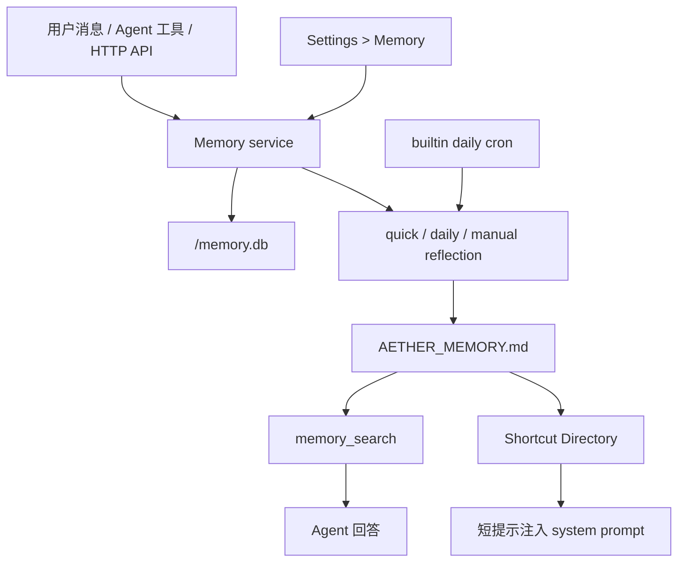
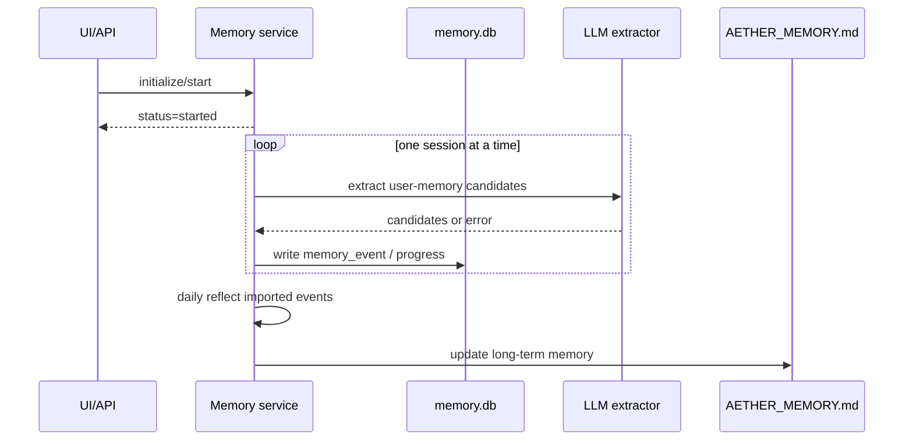

# Aether Memory 系统

本文描述当前已经落地的 Aether memory 系统。它的定位是一个低耦合的长期记忆模块：正常对话不读取旧 session transcript，长期记忆通过工具/API 显式访问，并以 Markdown 作为可检查的事实源。

主要代码范围：

- `packages/opencode/src/memory/`
- `packages/opencode/src/tool/memory.ts`
- `packages/opencode/src/server/routes/memory.ts`
- `packages/app/src/components/settings-memory.tsx`

## 1. 功能概览

当前已经实现：

- 长期记忆文件：`AETHER_MEMORY.md`
- 按 channel 隔离的事件库：`<channel>/memory.db`
- 三种长期记忆类型：`preference`、`fact`、`task`
- 两种作用范围：`global`、`project:<project_id>`
- Agent 工具：`memory_search`、`memory_remember`、`memory_forget`、`memory_reflect`
- HTTP API：`/memory/*`
- Shortcut prompt 注入，用于提示 agent 何时调用 `memory_search`
- quick reflection、daily reflection、manual reflection
- daily reflection cron direct action
- server startup catch-up
- 历史 session 初始化导入的 service/API 通路
- 后台初始化进度、取消、失败记录
- provider/model 类 reflection 失败的确定性 fallback

当前不包含：

- 向量库或 embedding 检索
- 读取旧 session 作为普通对话上下文
- session 级长期记忆 scope
- 多个长期 Markdown 文件
- hard delete 原始事件历史
- 并行扫描历史 session

## 2. 架构

Memory 系统分为五层：

1. Markdown 长期记忆层：`AETHER_MEMORY.md`
2. SQLite 事件与运行日志层：`<channel>/memory.db`
3. Memory service：remember、forget、search、reflect、initialize、startup catch-up
4. Agent/API 适配层：`memory_*` tools 与 `/memory` routes
5. UI/Cron 集成层：Settings > Memory 与 daily reflection cron



核心入口：

| 文件 | 职责 |
| --- | --- |
| `packages/opencode/src/memory/index.ts` | Memory service 主实现 |
| `packages/opencode/src/memory/markdown.ts` | `AETHER_MEMORY.md` parse/render |
| `packages/opencode/src/memory/search.ts` | Markdown 记忆检索与排序 |
| `packages/opencode/src/memory/gate.ts` | quick reflection gate |
| `packages/opencode/src/memory/schema.sql.ts` | SQLite 表定义 |
| `packages/opencode/src/memory/installer.ts` | 安装、cron 注册、startup catch-up |
| `packages/opencode/src/memory/plugin.ts` | chat hook 与 shortcut prompt 注入 |
| `packages/opencode/src/tool/memory.ts` | Agent 工具 |
| `packages/opencode/src/server/routes/memory.ts` | HTTP API |

## 3. 存储结构

### 3.1 `AETHER_MEMORY.md`

长期记忆事实源保存在全局 memory 数据目录：

```text
<global-memory-data-dir>/AETHER_MEMORY.md
```

`memory_search` 只搜索该文件，不读取旧 session 文件，也不读取 raw event 作为答案证据。

文件结构：

```text
# Aether Memory

<!--
schema_version: 1
updated_at: ...
source: memory.db
search_target: true
-->

## Shortcut Directory

---

## Preferences

---

## Facts

---

## Tasks
```

记忆条目示例：

```text
### PREF-answer-language
- type: preference
- scope: global
- memory: 用户偏好默认用中文回答。
- confidence: 0.95
- weight: 0.9
- evidence: 用户明确要求默认中文回答。
- updated_at: 2026-05-13T00:00:00.000Z
- status: active
```

### 3.2 `<channel>/memory.db`

事件、反思运行记录和设置保存在当前 channel 目录：

```text
<channel>/memory.db
```

核心表：

| 表 | 用途 |
| --- | --- |
| `memory_event` | 记录 remember/forget 原始事件、source、状态和 reflection 结果 |
| `reflection_run` | 记录 quick/daily/manual reflection 运行日志 |
| `memory_setting` | 保存初始化状态、reflection 状态等轻量设置 |

`memory_event.status` 可能值：

- `new`
- `pending_important`
- `applied`
- `ignored`
- `deleted`
- `forgot`
- `deprecated`
- `superseded`

## 4. 作用范围与类型

### 4.1 类型

| type | 语义 |
| --- | --- |
| `preference` | 用户偏好、交互风格、稳定画像 |
| `fact` | 稳定事实、项目事实、环境事实 |
| `task` | 长期任务、待跟进事项、持续约束 |

### 4.2 Scope

| scope | 语义 |
| --- | --- |
| `global` | 跨项目成立 |
| `project:<project_id>` | 仅对指定 project 成立 |

搜索时，当前 project 是排序加权信号，不是硬过滤。相关的 project memory 会优先于 global memory，但 global memory 仍可被召回。

## 5. Agent 工具

### 5.1 `memory_search`

搜索长期记忆。Agent 在回答可能依赖用户身份、偏好、项目事实、历史决策、长期任务或“之前说过的约束”时应主动调用。

参数：

- `query`
- `mode?`: `search | overview`
- `types?`: `preference | fact | task`
- `limit?`
- `currentProjectID?`

返回结果按相关度、scope、weight、recency 排序，并以 Markdown memory block id 标识证据。

### 5.2 `memory_remember`

记录用户明确要求记住的内容。该工具写入 `memory_event`，再触发 quick reflection；只有 reflection 接受后才会更新 `AETHER_MEMORY.md`。

参数：

- `text`
- `type?`
- `project_id?`

Agent 不应直接编辑 `AETHER_MEMORY.md`。

### 5.3 `memory_forget`

忘记匹配的长期记忆。自然语言请求会先搜索候选，再由 Memory service 删除匹配的 Markdown block。

参数：

- `query?`
- `ids?`
- `type?`

未找到匹配时不会记录永久禁止项。忘记是一次性删除，不代表以后永远不能重新记住类似内容。

### 5.4 `memory_reflect`

手动触发 reflection。默认 `quick`，只有用户明确要求全局/每日/完整整理时才使用 `daily`。

参数：

- `mode?`: `quick | daily | manual`
- `reason?`

## 6. Reflection 与初始化链路

### 6.1 Quick reflection

quick reflection 用于尽快把重要的显式记忆跨 session 可见。

触发来源：

- `memory_remember`
- `chat.message` hook 识别到的高价值用户记忆信号
- `memory_reflect` 默认模式

为控制资源消耗，`shouldQuickReflect()` 会过滤低信号的一次性消息；需要 LLM 判断的事件会入库并等待 quick/daily reflection。

### 6.2 Daily reflection

daily reflection 用于全局整理、去重、合并相似项、处理冲突，并更新 `AETHER_MEMORY.md` 和 Shortcut Directory。

触发来源：

- built-in cron direct action：`memory.reflect.daily`
- startup catch-up
- Settings > Memory 手动触发
- `memory_reflect` 显式指定 `daily`

daily reflection 会顺序扫描可发现 channel 的 `memory.db`，不会并行扫描。

### 6.3 Provider fallback

当 LLM reflection 因 provider/model/structured-output/provider-options 类错误失败时，service 会：

1. 对 provider option BadRequest 类错误先用更保守 provider options 重试一次。
2. 仍失败或模型不可用时，使用 deterministic fallback 处理候选事件。
3. 在 reflection summary 中标记 `fallback`，避免表现成完全成功的 LLM 整理。

Abort/cancel 类错误不会 fallback，会按中断处理。

### 6.4 历史 session 初始化

初始化导入用于从旧 session 的用户消息中提取可能的长期记忆。

行为：

- 逐个 session 串行扫描，避免高 CPU 占用。
- 主要分析用户消息；assistant 消息只作为必要上下文。
- 候选内容先写入 `memory_event`，再通过 reflection 进入 `AETHER_MEMORY.md`。
- `/memory/initialize/start` 现在只启动后台任务，不绑定 HTTP request 生命周期。
- `/memory/initialize/cancel` 会中断当前初始化任务。
- extractor 非中断错误会记录 `error_count` 和 `last_error`；如果没有导入任何条目则标记 `failed`。

注意：当前 Settings > Memory 中的初始化导入按钮可能按上游要求处于禁用状态；service/API 通路仍保留。



## 7. Prompt 注入策略

Memory 系统不把完整长期记忆注入 system prompt。注入内容只包含 Shortcut Directory 的精简主题提示，用来提醒 agent 何时调用 `memory_search`。

注入内容不包含：

- memory 正文
- `target_ids`
- raw event
- 旧 session transcript

Agent 不应把 shortcut 当作事实，只能把它当成“可能需要搜索记忆”的索引。

## 8. Cron 集成

Memory 系统复用 cron 的 direct action。

内置 action：

```text
memory.reflect.daily
```

内置 job id：

```text
builtin.memory.daily_reflect
```

默认时间：

```text
03:00
```

安装时会同步该内置 job，并禁用旧版 legacy daily reflect job。memory 总开关关闭时，daily cron 会被同步为 disabled，且 memory reflection 本身不会执行。若只是 daily reflection 开关关闭，则只影响 cron 触发；在 memory 总开关开启时，用户仍可手动执行 daily reflection。

## 9. HTTP API

| 方法 | 路径 | 用途 |
| --- | --- | --- |
| `GET` | `/memory/status` | 查询 memory 状态、条目数、初始化状态 |
| `POST` | `/memory/search` | 搜索长期记忆 |
| `POST` | `/memory/reflect` | 执行 quick/daily/manual reflection |
| `POST` | `/memory/initialize/start` | 后台启动历史 session 初始化 |
| `POST` | `/memory/initialize/cancel` | 取消初始化 |
| `POST` | `/memory/daily-reflect/sync` | 按配置同步 built-in daily reflect cron |

Agent 正常应使用 `memory_*` tools，而不是直接调用 HTTP API。

## 10. Settings UI

Settings > Memory 当前承担轻量管理职责：

- memory 总开关
- daily reflection 开关和时间
- 状态卡片
- 初始化状态展示
- 手动 search
- 手动 quick/daily reflect

初始化导入按钮是否可点击取决于当前上游 UI 策略；后端接口和状态展示独立存在。

## 11. 生命周期

`installMemory()` 返回：

- `service`
- `start()`
- `stop()`
- `purge()`

语义：

- `start()`：同步 daily reflect cron，并执行 startup catch-up 检查。
- `stop()`：中断后台初始化任务，等待短暂收尾，关闭 memory DB，不删除数据。
- `purge()`：删除 `AETHER_MEMORY.md`、reflection state、各 channel `memory.db` 及 WAL/SHM 文件。

## 12. 主干接入点

Memory 模块尽量不改 agent/session 主循环。当前主干接入点如下：

| 文件 | 目的 |
| --- | --- |
| `packages/opencode/src/server/server.ts` | 挂载 `/memory` routes，server 生命周期安装 memory |
| `packages/opencode/src/tool/registry.ts` | 注册 `memory_*` agent tools |
| `packages/opencode/src/plugin/index.ts` | 注册 memory plugin |
| `packages/opencode/src/config/config.ts` | 增加 memory 配置项 |
| `packages/opencode/src/cron/index.ts` | 支持 memory direct action |
| `packages/app/src/context/global-sdk.tsx` | 暴露 memory client helper |
| `packages/app/src/utils/server.ts` | 暴露 memory API helper |
| `packages/app/src/components/dialog-settings.tsx` | 增加 Settings > Memory tab |

## 13. 测试

推荐本地验证：

```bash
bun run --cwd packages/opencode test test/memory/memory.test.ts --timeout 120000
bun run --cwd packages/opencode test test/cron/cron.test.ts test/memory/abort-leak.test.ts --timeout 120000
bun run --cwd packages/opencode typecheck
```

前端设置页相关测试：

```bash
bun run --cwd packages/app ./script/vitest.ts run --config ./vitest.config.ts src/components/settings-memory.vitest.tsx
bun run --cwd packages/app typecheck
```
