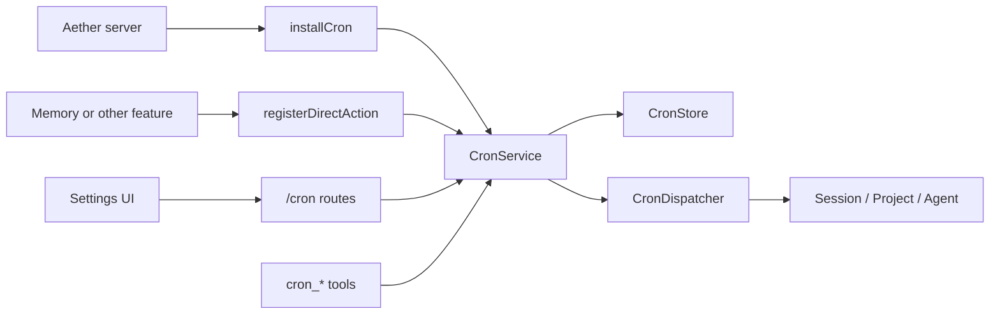
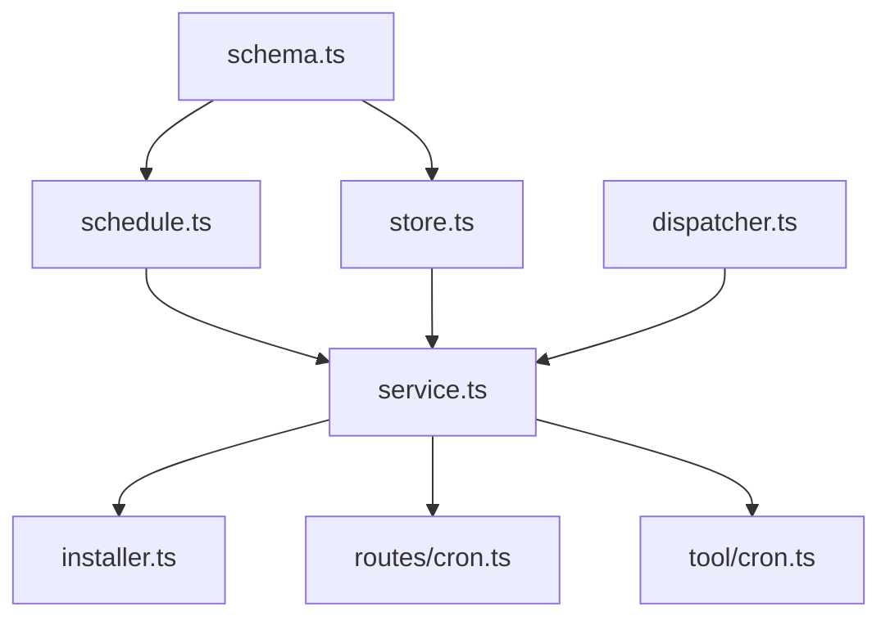
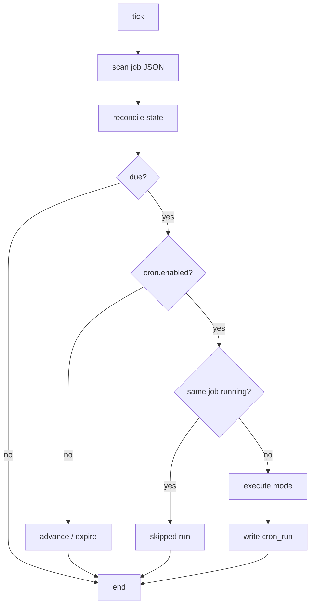

# Aether Cron 系统极简模块化设计

参考实现：`Aether-memory-backfill-init-20260506`，branch `fix/memory-reflect-cron-context`，commit `f88e2a0f1`。

本文是 cron 重构规格。目标不是“拆得越细越好”，而是在保持插件化边界的前提下，把 cron 压到最小可维护架构。

## 1. 硬约束

不允许改变：

- cron job JSON definition 格式。
- `mode`、`schedule_type`、`schedule_value`、`payload` 语义。
- HTTP API 的 job/state/run 逻辑字段。
- agent cron tools 的用户语义。
- run log 的用户可见字段。

允许改变：

- 内部模块划分。
- DB 文件位置。
- installer 方式。

## 2. 最小插件边界

cron core 不 import memory，不 import UI。

```ts
export interface CronPluginHost {
  config: CronConfigProvider
  dispatcher: CronDispatcher
  store?: CronStore
  clock?: CronClock
}

export interface InstalledCron {
  service: CronService
  start(): Promise<void>
  stop(): Promise<void>
  purge(): Promise<void>
}

export function installCron(host: CronPluginHost): InstalledCron
```

生命周期语义：

- `start()`：启动 scheduler，执行 recovery 和必要的 builtin catch-up。
- `stop()`：停止 scheduler/timer，释放运行态资源；不删除 job JSON、DB、run log，也不清除用户配置。
- `purge()`：显式清空 cron 数据；删除 job JSON、`aether-cron.db` 中的 state/run log、cron lock/cache 等 cron 私有文件。只有用户明确要求重置/卸载 cron 数据时才调用。

依赖方向：



## 3. 核心文件：只保留 6 个

| 文件 | 职责 |
| --- | --- |
| `packages/opencode/src/cron/schema.ts` | zod schema 和 public types：`Definition`、`State`、`Run`、枚举。 |
| `packages/opencode/src/cron/store.ts` | 所有持久化：job JSON 文件、`aether-cron.db`、state、run logs、locks、路径。 |
| `packages/opencode/src/cron/schedule.ts` | 纯 schedule 逻辑：校验 cron、计算 next run、reconcile state。 |
| `packages/opencode/src/cron/dispatcher.ts` | Aether adapter：`isolated_agent`、`session_agent`、`agent_message`。 |
| `packages/opencode/src/cron/service.ts` | 核心服务：create/update/delete/list/run/tick/start/stop/direct action registry。 |
| `packages/opencode/src/cron/installer.ts` | `installCron`，组合 host、默认 store、默认 dispatcher、builtin installers。 |

不要预先拆出：

- `runner.ts`
- `state.ts`
- `definition.ts`
- `paths.ts`
- `db.ts`
- `builtins.ts`
- `testing.ts`

除非单文件明显过大或测试无法隔离，再按真实压力拆。

模块图：



## 4. 外部 Adapter

| 文件 | 职责 |
| --- | --- |
| `packages/opencode/src/server/routes/cron.ts` | HTTP route，只调用 `CronService`。 |
| `packages/opencode/src/tool/cron.ts` | agent tools、权限、current project/session 解析。 |
| `packages/app/src/components/settings-cron.tsx` | Cron 设置页：job/runs、global execution switch、run/delete、自然语言创建/修改入口、打开会话链接。 |
| `packages/app/src/components/settings-cron.vitest.tsx` | UI 单测。 |
| `packages/opencode/test/cron/cron.test.ts` | 核心行为测试。 |

## 5. Definition 格式保持

```json
{
  "id": "01HX...",
  "name": "Daily maintenance",
  "enabled": true,
  "mode": "direct",
  "project_id": null,
  "session_id": null,
  "schedule_type": "cron",
  "schedule_value": "0 3 * * *",
  "timezone": "Asia/Shanghai",
  "payload": {
    "action": "example_maintenance",
    "dry_run": false
  }
}
```

校验放在 `service.ts` 或 `schema.ts` 辅助函数里，不单独拆文件：

- `id` 后端生成；文件名和 JSON 内 id 必须一致。
- `name` 非空单行。
- `enabled` 默认 `true`。
- `payload` 默认 `{}`。
- `direct` 必须有 `payload.action`。
- `isolated_agent` 必须有 `project_id`、`payload.message`。
- `session_agent` / `agent_message` 必须有 `project_id`、`session_id`、`payload.message`。

## 6. 持久化

job JSON：

```text
<Aether data dir>/cron/jobs/<job_id>.json
```

测试覆盖：

```text
OPENCODE_CRON_DIR
```

内部 DB：

```text
<Aether data dir>/aether-cron.db
```

逻辑表保持：

| 表 | 字段 |
| --- | --- |
| `cron_job_state` | `job_id`、`enabled`、`next_run_at`、`last_run_at`、`last_status`、`running`、`start_at`、`definition_snapshot`、`updated_at` |
| `cron_run` | `run_id`、`job_id`、`started_at`、`finished_at`、`status`、`output_summary`、`mode`、`project_id`、`session_id`、`created_session_id`、`payload_snapshot`、`trigger_reason` |

`store.ts` 可以内部包含 SQLite schema。只有在项目工具链强制要求集中导出 schema 时，才新增 `cron.sql.ts`。

`purge()` 的删除范围必须只限 cron 私有数据：

- `<Aether data dir>/cron/jobs`
- `<Aether data dir>/cron/*.lock`
- `<Aether data dir>/aether-cron.db`

不得删除 memory 数据、主 Aether DB、项目文件或用户配置文件。

## 7. Schedule 和执行语义

| 项 | 规则 |
| --- | --- |
| `cron` | 5 段 cron；timezone 默认系统时区；`next_run_at <= now` 即 due。 |
| `interval` | 正整数秒；`start_at` 默认创建/首次 reconcile 时间；overdue 推进到未来。 |
| `once` | 5 段 cron；只消费第一次 future match；错过且不可执行则 expired。 |
| global disabled | scheduler 继续跑；scheduled cron/interval 静默推进；once 过期；manual run_now 写 skipped。 |
| 并发 | 同 job running 则 skipped；不同 job 不限制并行。 |

tick 流程：



## 8. Execution Modes

| mode | 行为 |
| --- | --- |
| `direct` | 调 `registerDirectAction(action, handler)`。 |
| `isolated_agent` | 在 project 下新建 session，调用 `SessionPrompt.prompt`。 |
| `session_agent` | 复用 session；失效则同 project 新建 session，再调用 `SessionPrompt.prompt`。 |
| `agent_message` | 直接追加 assistant message，不触发 LLM。 |

cron metadata 不变：

```json
{ "source": "cron", "job_id": "<job_id>", "run_id": "<run_id>" }
```

可见性要求：

- `isolated_agent` 和回退新建 session 的 `session_agent` 必须在 run log 中记录 `session_id` 与 `created_session_id`。
- Settings > Cron 最近运行记录必须提供“打开会话”入口，基于 `project_id` 查找 project worktree，先加入侧边栏项目列表、预热 project child store 并加载 session 列表，再跳转到 `/<base64(worktree)>/session/<session_id>`。
- 如果前端收到 `session.created` 事件时发现该 session 的 `projectID` 不在全局 project 列表中，应根据事件里的 `projectID + directory` 自动补一个最小 project 记录，避免 cron 新建会话无法从侧边栏进入。
- 前端收到后台 `session.created` 时，即使当前还没有对应 directory 的 child store，也必须先创建并 bootstrap 该 store，再继续处理该事件，避免后续 `message.part.delta` 被丢弃。
- Layout 路由层进入 project/session URL 时必须确保对应 root project 已加入侧边栏项目列表，覆盖刷新、外部链接和非 Cron UI 入口。

## 8.1 Natural Language Assistant

Settings > Cron 可以有一个极小的自然语言入口，但它只能创建/修改 cron，不承担通用聊天。

规则：

- 未选中 job 时为创建模式；选中 job 时为修改模式。
- 普通提醒或 agent 任务默认创建 `isolated_agent`，只绑定 `project_id`，不要求 `session_id`。
- 只有用户明确说“当前会话”“继续这个 session”“在这个对话里提醒我”等会话绑定意图时，才使用 `session_agent` 或 `agent_message`。
- 如果当前 UI 没有 `session_id`，普通提醒不能 reject；应降级为 `isolated_agent`。
- 如果 LLM 产出 `session_agent` / `agent_message` 但请求没有 `session_id`，后端在有 `project_id` 时兜底改写为 `isolated_agent`。
- 如果缺少必要 `project_id`，返回 `reject`，不能编造 id。
- assistant 返回 `reject` 时 UI 必须显示“未创建任务”，并保留用户输入，不能展示成功 toast。

接口：

- `POST /cron/assistant`
- 输入：`instruction`，可选 `selected_id`、`project_id`、`session_id`
- 输出：`action: create | update | reject`、`summary`、`job`

## 9. Direct Action Extension

cron core 只负责调度，不绑定任何上层业务系统。

其他插件或业务模块如果需要使用 `direct` job，应通过 cron service 注册 action：

- `CronService.registerDirectAction("<action>", handler)`。
- 插件自己负责同步 builtin job 文件。
- 插件自己负责根据自身开关决定 job 是否 enabled。
- 插件自己负责补跑、去重、业务日志等领域逻辑。

也就是说：业务插件可以依赖 cron service，cron service 不依赖任何业务插件。

## 10. 侵入式修改清单

| 文件 | 修改 | 目的 | 侵入性 |
| --- | --- | --- | --- |
| `packages/opencode/src/server/server.ts` | 调 `installCron`，启动/停止 cron，注册 `/cron` route。 | 生命周期和 API。 | 中 |
| `packages/opencode/src/config/config.ts` | 增加/保留 `cron.enabled` 和 `permission.cron`。 | 开关和权限。 | 低 |
| `packages/opencode/src/tool/registry.ts` | 注册 cron tools。 | agent 可管理 cron。 | 低 |
| SDK / `global-sdk.tsx` | 暴露 `/cron` client。 | UI 调 API。 | 低 |
| `packages/opencode/src/storage/schema.ts` | 尽量不改；只有集中 migration 必须时才导出 cron table。 | schema 管理。 | 可避免 |

## 11. 测试要求

最低测试：

- definition parse/patch。
- cron/interval/once due 计算。
- due 后只执行一次。
- interval overdue 推进到未来。
- once missed expired。
- global disabled 的 scheduled/manual 差异。
- same-job running skip。
- job 文件删除清 state。
- startup recovery 清 running。
- memory reflection installer catch-up。
- direct / session_agent / agent_message 基础链路。
- HTTP route 和 agent tools。
- `/cron/assistant`：
  - 创建/修改成功路径。
  - 普通提醒默认 `isolated_agent`。
  - 无 `session_id` 时 session-bound 输出降级到 `isolated_agent`。
  - invalid assistant output 返回 `reject`，不 500。
- Settings > Cron：
  - 自然语言创建/修改入口。
  - reject 显示“未创建任务”。
  - 最近 run log 可打开 `session_id` / `created_session_id`。
- Global sync：
  - `session.created` 对未知 project 自动补侧边栏 project。
  - `session.created` 对后台 project 自动预热 child store，保证流式消息事件可被接收。

## 12. 典型测试场景

| 场景 | 条件 | 预期行为 |
| --- | --- | --- |
| 基础 cron due | `schedule_type=cron`，`next_run_at <= now`，全局开启。 | 执行一次；写 `cron_run.success`；推进下一次 `next_run_at`。 |
| cron 略过精确秒 | job 原本 03:00 due，tick 在 03:00:45 才运行。 | 仍然 due；不能因为错过精确秒而跳过。 |
| due 后重复 tick | job 已在上一 tick 执行并推进。 | 下一 tick 不重复执行同一个 due 点。 |
| interval 首次创建 | `schedule_type=interval`，`schedule_value=60`。 | `start_at=created_at/reconcile_at`；`next_run_at=start_at+60s`。 |
| interval 长时间离线 | 上次 next_run 在 1 小时前。 | 不补跑 60 次；只推进到未来最近一个 interval。 |
| once 正常运行 | once 表达式有 future match 且 due。 | 执行一次；运行后 state disabled，`next_run_at=null`。 |
| once 创建即无未来匹配 | 表达式没有未来时间。 | state `last_status=expired`，不执行。 |
| once 关闭时错过 | global cron disabled 时 once due。 | 不执行，不写 run log；state expired。 |
| global disabled cron due | `cron.enabled=false`，cron job due。 | 不执行，不写 skipped run；推进 next_run。 |
| global disabled interval due | `cron.enabled=false`，interval due。 | 不执行，不写 skipped run；推进 next_run 到未来。 |
| global disabled manual run | 用户 `run_now`。 | 写 `skipped` run，summary 说明 cron disabled。 |
| job disabled | definition `enabled=false`。 | scheduled tick 不执行；manual run 也 skipped。 |
| 同 job 并发 | state `running=true` 时再次 due/manual。 | 写 skipped run，summary 说明 same job running。 |
| 不同 job 并发 | 两个 job 同时 due。 | 可并行执行，不互相阻塞。 |
| direct action 缺失 | `payload.action` 未注册。 | 写 failed run，summary 包含 unknown direct action。 |
| direct action 抛错 | handler throw。 | 写 failed run，state `last_status=failed`，scheduler 不崩。 |
| run log 写入失败 | DB 写 `cron_run` 失败。 | 记录日志；不能让 scheduler 崩溃。 |
| job JSON id mismatch | 文件名 `a.json`，JSON id `b`。 | 忽略该 job，记录 warning，不生成 state。 |
| invalid job JSON | JSON 损坏或字段非法。 | 忽略该文件，记录 warning，其他 job 不受影响。 |
| job 文件删除 | state 里有 job，但 JSON 文件不存在。 | 删除该 job state；历史 run log 保留。 |
| schedule patch | 修改 cron 表达式。 | 重新计算 `next_run_at`；保留 run history。 |
| immutable id patch | update patch 包含 `id`。 | 拒绝更新；原 definition/state 不变。 |
| startup recovery | 关闭前 state `running=true`。 | `recover()` 清 running，避免永久卡住。 |
| session_agent session 失效 | session_id 不存在，但 project_id 有效。 | 同 project 新建 session；run 记录 `created_session_id`。 |
| session_agent project 失效 | project_id 不存在。 | failed run；不创建 session。 |
| isolated_agent 新建会话 | job 有 project_id 且运行成功。 | 新建正常 session；run 记录 `session_id` 和 `created_session_id`；Cron UI 提供打开会话链接。 |
| cron 新会话 project 不在侧边栏 | 前端收到 `session.created`，但 project 列表缺少 `projectID`。 | 用事件里的 `projectID + directory` 补一个最小 project，预热 child store，用户可从侧边栏进入并继续接收流式事件。 |
| agent_message | payload.message 合法。 | 追加 assistant message；不触发 LLM；part metadata `source=cron`。 |
| assistant 普通提醒无 session | UI 当前没有 session，但有 project_id。 | 创建/降级为 `isolated_agent`；不 reject。 |
| assistant reject | LLM 返回 reject 或缺少必要 project_id。 | UI 显示“未创建任务”，保留输入，不显示成功 toast。 |
| memory installer catch-up | built-in reflection job overdue，server 启动。 | memory installer 触发一次 catch-up；cron core 不 import memory。 |
| `stop()` | scheduler 正在运行。 | timer 停止；job JSON、DB、run log 不删除。 |
| `purge()` | 用户显式重置 cron。 | 只删除 cron 私有数据：jobs、locks、`aether-cron.db`；不碰 memory/主 DB/项目文件。 |

## 13. 真实用户案例

### 案例 1：用户让 agent 每天早上提醒自己检查论文

用户说：“每天早上 9 点提醒我检查 arXiv。”

预期行为：

- 自然语言 assistant 或 agent 默认创建 `isolated_agent` job，只绑定当前 `project_id`。
- 如果用户明确说“在当前会话里提醒我”或“继续这个 session”，才创建 `session_agent` / `agent_message`。
- 如果用户希望 agent 真正思考和整理内容，用 `isolated_agent` 或 `session_agent`。
- 如果只是向既有会话写一条通知且不触发 LLM，用 `agent_message`。
- job JSON 仍保存为普通 cron definition。
- Settings > Cron 能看到 next run 和 recent runs。
- 运行后 recent runs 能通过“打开会话”进入新建或复用的 session。

### 案例 2：用户关掉了全局 cron，但手动点 Run now

用户在 Settings 里关闭 cron execution，又在某个 job 上点 Run now。

预期行为：

- scheduler 不停止。
- manual run 写一条 `skipped` run log。
- summary 明确说明 `cron disabled`。
- job 的 JSON definition 不变。
- 用户重新打开全局 cron 后，该 job 后续可继续 scheduled run。

### 案例 3：用户把 job JSON 手工改坏

用户直接编辑 `<data>/cron/jobs/foo.json`，把 `schedule_type` 写成 `daily`。

预期行为：

- scan 时忽略该 job。
- 记录 warning。
- 不删除用户的坏 JSON 文件。
- 其他 job 继续运行。
- UI/API list 不应把这个 invalid job 当成可运行 job。

### 案例 4：用户删除 job 文件，以为这样就删除任务

用户手工删除 `<data>/cron/jobs/foo.json`。

预期行为：

- 下一次 scan 删除该 job runtime state。
- 历史 run log 保留，便于审计。
- 不因为 state 残留继续执行。

### 案例 5：用户的 session cron 指向了旧 session

一个 `session_agent` job 指向某个旧 session，但该 session 已不存在或 project 不匹配。

预期行为：

- 如果 project 仍存在：在同 project 新建 session。
- run log 记录 `created_session_id`。
- 如果 project 不存在：run failed，不偷偷换到别的 project。

### 案例 6：用户以为 once 会补跑

用户设了一个 once job 到昨晚 8 点，但当时 Aether 没开。

预期行为：

- once 不补跑。
- state 变 expired。
- 这是为了避免用户打开 Aether 后突然收到大量过期任务。

推荐命令：

```bash
bun run --cwd packages/opencode test test/cron/cron.test.ts --timeout 120000
bun run --cwd packages/opencode typecheck
```
