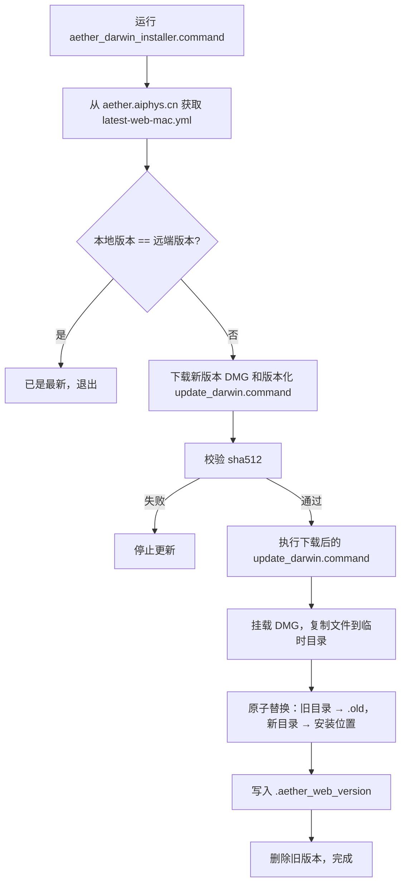

# Aether 版本管理与更新机制

## 1. 版本号体系

### 1.1 版本号来源

版本号在构建时确定，由 `@opencode-ai/script` 包（`packages/script/src/index.ts`）统一管理。Aether 发布时通过环境变量 `OPENCODE_VERSION` 直接指定版本号：

```bash
OPENCODE_VERSION=0.2.3 bun run build
```

版本号不以 `0.0.0-` 开头时，`OPENCODE_CHANNEL` 自动推断为 `latest`（正式发布频道），无需额外设置。

### 1.2 构建时注入

构建脚本（`packages/opencode/script/build.ts`）通过 Bun 的 `define` 机制将版本信息编译进二进制：

```typescript
// 全局常量（packages/opencode/src/installation/index.ts）
declare global {
  const OPENCODE_VERSION: string   // → "0.2.3"
  const OPENCODE_CHANNEL: string   // → "latest"
}

export const VERSION = typeof OPENCODE_VERSION === "string" ? OPENCODE_VERSION : "local"
export const CHANNEL = typeof OPENCODE_CHANNEL === "string" ? OPENCODE_CHANNEL : "local"
```

构建脚本在编译前端之前，会临时将 `packages/opencode/package.json` 的 `version` 字段更新为目标版本号，确保 Web 前端设置界面显示的版本与 CLI 一致，编译完成后自动恢复。

---

## 2. 构建与打包

### 2.1 背景

Aether 采用 **Web 浏览器版** 打包方案，不使用 Electron。原因：
- 未签名 exe 被 Windows Defender 拦截
- SmartScreen 安装警告
- sidecar 进程生命周期复杂，残留进程占用 sqlite 文件锁

Web 版方案：CLI 内置 `web` 命令启动本地 HTTP 服务，用系统浏览器访问界面。无 Electron、无 sidecar、无代码签名要求。

### 2.2 构建命令

```bash
cd packages/opencode

# 仅当前平台（快速测试）
OPENCODE_VERSION=0.2.3 bun run build -- --single

# 全平台交叉编译（可在 Linux/WSL 一次完成）
OPENCODE_VERSION=0.2.3 bun run build
```

构建步骤：
1. 将版本号写入 `package.json`（临时，编译后恢复）
2. 编译前端（`packages/app`）生成静态资源
3. Bun 交叉编译各平台 CLI 二进制
4. 将前端静态资源复制到各平台 `bin/web/` 目录
5. 复制平台启动器（Windows `.vbs`、macOS `.command`、Linux `.sh`）

### 2.3 产物目录结构

```
packages/opencode/dist/
  aether-windows-x64/bin/
    aether.exe              ← CLI 二进制（含内置 HTTP 服务器）
    web/                    ← 前端静态资源
    Aether.vbs              ← Windows 双击启动器（无黑窗口）

  aether-darwin-arm64/bin/
    aether
    web/
    Aether.command           ← macOS 双击启动器

  aether-linux-x64/bin/
    aether
    web/
    Aether.sh                ← Linux 启动器
```

> `aether` 二进制与 `web/` 目录必须位于同一目录，否则 CLI 找不到前端资源。

---

## 3. 分发

### 3.1 分发格式

| 平台 | 格式 | 内容 |
|------|------|------|
| macOS | `.dmg` | `aether` + `web/` + `Aether.command` + `aether_darwin_installer.command` + `README_FIRST.txt` |
| Linux | `.tar.gz` | `aether` + `web/` + `Aether.sh` + `aether_linux_installer.sh` |
| Windows | `.zip` | `aether.exe` + `web/` + `Aether.vbs` + `aether_windows_installer.bat` |

### 3.2 macOS DMG 打包

macOS 使用 DMG 格式分发，内含 installer 和说明文档。

**macOS 上打包**（使用 `hdiutil`）：

```bash
./packing_scripts/release-mac-web.sh 0.2.3
```

**Linux 上打包**（使用 `genisoimage`）：

```bash
sudo apt install genisoimage   # 首次安装
./packing_scripts/release-mac-web.sh 0.2.3
# 注：脚本需在 macOS 上运行；Linux 上可手动执行：
genisoimage -V "Aether Web" -D -R -apple -no-pad -o output.dmg <source-folder>
```

DMG 打包后同时生成 `latest-web-mac.yml` 元数据文件（含 sha512 和文件大小），供客户端更新流程校验。

### 3.3 一键构建 + 上传（macOS Web 版）

`Update/release-and-upload-mac-web.sh` 将构建、打包、上传合为一步：

```bash
./Update/release-and-upload-mac-web.sh <version> <admin-password> [release-notes-url]

# 示例
./Update/release-and-upload-mac-web.sh 0.2.3 mypassword https://aether.aiphys.cn/release-notes/0.2.3
```

流程：
1. `OPENCODE_VERSION=<version> bun run build` 全平台构建
2. 将 `dist/aether-darwin-arm64/bin/` 打包为 DMG（自动检测 `hdiutil` 或 `genisoimage`）
3. 生成 `latest-web-mac.yml` 元数据
4. `curl` 上传 DMG，并按需上传供 installer 使用的更新脚本到 `aether.aiphys.cn`

### 3.4 分发服务器

分发通过 `https://aether.aiphys.cn/download` 提供，管理员通过 API 上传：

```bash
curl -X POST https://aether.aiphys.cn/api/download/admin/upload \
  -H 'x-download-admin-password: <password>' \
  -F 'macVersion=0.2.3' \
  -F 'macos=@aether-darwin-arm64-web.dmg' \
  -F 'macInstaller=@Update/update_darwin.command' \
  -F 'macNotesUrl=https://aether.aiphys.cn/release-notes/0.2.3'
```

---

## 4. 客户端更新

### 4.1 macOS 更新流程

**入口文件**：`Update/aether_darwin_installer.command`

应用内更新会先调用 installer，再由 installer 下载版本化 `update_darwin.command` 完成安装，流程：



版本比对依据：
- **远端**：`https://aether.aiphys.cn/download/latest-web-mac.yml` 中的 `version` 字段
- **本地**：安装目录下 `.aether_web_version` 文件

更新采用原子替换策略（先 `mv` 旧目录为 `.old`，再 `mv` 新目录到位），失败可回滚。

### 4.2 上游自动更新机制（继承未启用）

上游 OpenCode 内置了基于包管理器的自动更新系统（`packages/opencode/src/cli/upgrade.ts`），支持配置 `autoupdate: true | false | "notify"`。Aether Web 版因采用压缩包分发，不走此路径，更新由上述平台脚本独立处理。

---

## 5. 关键文件索引

| 模块 | 路径 |
|------|------|
| 版本/频道计算 | `packages/script/src/index.ts` |
| 构建时版本注入 | `packages/opencode/script/build.ts` |
| 版本常量定义 | `packages/opencode/src/installation/index.ts` |
| Web 前端版本读取 | `packages/app/src/entry.tsx` |
| macOS 构建+上传脚本 | `Update/release-and-upload-mac-web.sh` |
| macOS 打包脚本 | `packing_scripts/release-mac-web.sh` |
| macOS installer | `Update/aether_darwin_installer.command` |
| Linux installer | `Update/aether_linux_installer.sh` |
| Windows installer | `Update/aether_windows_installer.bat` |
| 打包指南（详细） | `PACKAGING.md` |
| 打包指南（Web 版） | `PACKAGING-1.md` |
