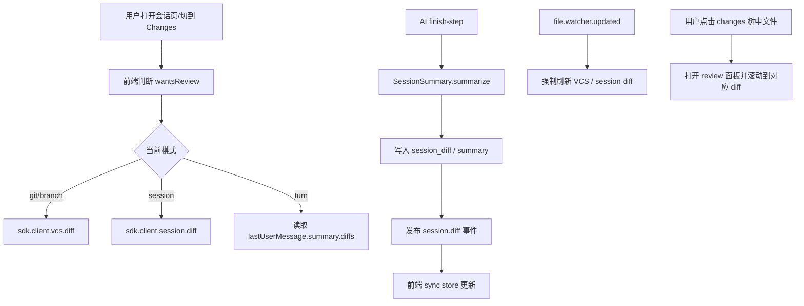

# Web UI 变更视图栏实现分析

本文基于当前仓库实现，对 Web UI 中“变更视图栏”相关能力做一次完整梳理。这里的“变更视图栏”并不是单一组件，而是会话页右侧整套“变更审查”界面，主要由以下两部分组成：

- `review` 审查面板：逐文件展示 diff 内容。
- `fileTree` 文件树面板中的 `changes` 标签：按目录树列出当前变更文件，并作为 diff 导航器。

在移动端，这套能力不会以右侧双栏出现，而是折叠进会话页顶部的 `Session / Changes` 切换里。

## 1. 先给结论

这套变更视图的核心不是“读 Git diff 文本”，而是围绕统一的数据结构 `FileDiff[]` 工作。前端会根据当前模式选择一组 `FileDiff[]`，再分别渲染成：

- 文件树中的“变更文件列表”
- 审查面板中的文件级 diff 手风琴
- 计数、空态、颜色标记、A/D/M 标记

当前实现一共支持 4 种变更来源模式：

| 模式 | 面向用户的含义 | 数据来源 |
| --- | --- | --- |
| `git` | 当前工作区相对 `HEAD` 的未提交改动 | `sdk.client.vcs.diff({ mode: "git" })` |
| `branch` | 当前分支相对默认分支的改动 | `sdk.client.vcs.diff({ mode: "branch" })` |
| `session` | 当前会话自基线快照以来累计产生的改动 | `sdk.client.session.diff({ sessionID })` |
| `turn` | 最近一个可见用户轮次带来的改动 | `lastUserMessage.summary.diffs` |

这 4 种模式共享同一套 UI，但计算基线、触发时机和用户语义完全不同。

## 2. 相关代码入口

前端主入口：

- `packages/app/src/pages/session.tsx`
- `packages/app/src/pages/session/session-side-panel.tsx`
- `packages/app/src/pages/session/review-tab.tsx`
- `packages/app/src/components/file-tree.tsx`
- `packages/ui/src/components/session-review.tsx`
- `packages/ui/src/components/diff-changes.tsx`

前端同步与布局状态：

- `packages/app/src/context/sync.tsx`
- `packages/app/src/context/global-sync/event-reducer.ts`
- `packages/app/src/context/layout.tsx`

后端 diff 计算：

- `packages/opencode/src/project/vcs.ts`
- `packages/opencode/src/git/index.ts`
- `packages/opencode/src/snapshot/index.ts`
- `packages/opencode/src/session/summary.ts`
- `packages/opencode/src/session/processor.ts`
- `packages/opencode/src/session/revert.ts`
- `packages/opencode/src/server/routes/session.ts`

## 3. UI 结构和用户看到的界面

### 3.1 桌面端结构

桌面端会话页右侧实际是一个组合侧栏：

- 左半是 `review-panel`
- 右半是 `file-tree-panel`

其中：

- `review-panel` 通过 `view().reviewPanel.opened()` 控制开关。
- `file-tree-panel` 通过 `layout.fileTree.opened()` 控制开关。
- 两者都打开时，形成“左边 diff、右边变更树”的双栏审查布局。

`file-tree-panel` 内部有两个标签：

- `changes`：只展示当前模式下有变更的文件
- `all`：展示项目全部文件，同时对有变更的节点做标记

### 3.2 移动端结构

移动端没有独立右侧双栏，而是顶部两个标签：

- `session`
- `changes`

切到 `changes` 后，主区域直接渲染审查内容。这里固定使用 `unified` diff，不提供桌面端的 `split/unified` 切换。

### 3.3 视图层级关系

可以把整套功能理解为三层：

1. 变更来源选择器：`git / branch / session / turn`
2. 变更文件导航器：`changes` 树
3. 变更内容阅读器：`review` 面板

用户通常的阅读路径应该是：

1. 先选模式
2. 看文件数和 A/D/M 标记
3. 在 `changes` 树中定位文件
4. 在 `review` 面板阅读具体 diff
5. 必要时打开 `all` 或直接打开文件标签继续查看原文件

## 4. 所有“分类”到底有哪些

### 4.1 第一层分类：变更来源模式

前端 `changesOptions()` 会动态生成可选模式：

- Git 项目下总是包含 `git`
- 只有当前分支不等于默认分支时才包含 `branch`
- 始终包含 `session`
- 始终包含 `turn`

注意两点：

1. `session` 和 `turn` 即使在非 Git 项目里也会出现在下拉里，但通常会进入空态，因为快照系统依赖 Git。
2. 会话切换时，前端先把模式重置成 `"git"`，随后再通过 `changesOptions()` 自动纠正到当前项目真正可用的第一个模式。因此非 Git 项目里最终会落到 `session`。

### 4.2 第二层分类：文件状态

所有模式最终都会产出 `FileDiff`：

```ts
{
  file: string
  before: string
  after: string
  additions: number
  deletions: number
  status?: "added" | "deleted" | "modified"
}
```

前端实际显示时会压缩成三类视觉状态：

| `FileDiff.status` | 文件节点内部标记 | 目录节点标记 |
| --- | --- | --- |
| `added` | `A` | 绿色点 |
| `deleted` | `D` | 红色点 |
| `modified` | `M` | 混合点 |

目录不是直接继承某个文件，而是做聚合：

- 子项全是新增：目录显示 `add`
- 子项全是删除：目录显示 `del`
- 只要混入修改，或新增/删除混合：目录显示 `mix`

这也是为什么目录层级不会展示精确的“modified”，而是展示“混合状态”。

### 4.3 第三层分类：内容展示状态

审查面板里每个文件还会继续分成：

- Added：`before` 为空、`after` 有内容，或 `status === "added"`
- Removed：`after` 为空、`before` 有内容，或 `status === "deleted"`
- Modified：普通文本 diff
- Media/Binary-like：按媒体路径处理，不按普通文本 diff 渲染
- Large Diff：`additions + deletions > 500` 时默认不直接渲染，要求用户点击 “Render anyway”

## 5. 四种模式分别怎么计算

### 5.1 `git` 模式

后端入口在 `packages/opencode/src/project/vcs.ts` 的 `Vcs.diff("git")`。

计算规则：

- 若仓库已有 `HEAD`：
  - 使用 `git.status(cwd)` 取当前工作区状态
  - 使用 `git.stats(cwd, "HEAD")` 取相对 `HEAD` 的增删行数
  - 对每个文件：
    - `before` 来自 `git show HEAD:file`
    - `after` 来自当前工作区文件内容
- 若仓库还没有 `HEAD`（新仓库、未提交）：
  - 仅用 `git.status(cwd)` 作为文件列表
  - `before` 为空
  - `after` 读当前文件

语义上它表示：

- 已跟踪文件的未提交修改
- 未跟踪文件
- 删除文件

它不区分 staged/unstaged，也不单独做 index 视角，而是把“当前工作区相对 HEAD 的结果”统一展示给 UI。

### 5.2 `branch` 模式

后端同样在 `packages/opencode/src/project/vcs.ts`。

这个模式只有在：

- 项目是 Git
- 当前分支存在
- 默认分支存在
- 当前分支不等于默认分支

时才会在下拉里出现。

默认分支的判定顺序来自 `packages/opencode/src/git/index.ts`：

1. 远端 `origin/HEAD`
2. 唯一远端或 `upstream`
3. `git config init.defaultBranch`
4. 本地 `main`
5. 本地 `master`

比较基线不是默认分支 tip，而是：

- 先求 `merge-base(default_branch_ref, HEAD)`
- 再比较“当前工作区”相对于这个 merge-base 的状态

实现细节：

- `git.diff(cwd, ref)` 取 merge-base 到当前工作区的文件列表
- `git.stats(cwd, ref)` 取增删行数
- 另外再把 `git.status(cwd)` 中 `??` 的未跟踪文件合并进结果

所以 `branch` 模式的用户语义是：

- “我这个分支相对默认分支引入了什么变化”
- 且它包含尚未提交的新增文件

这比“对比当前分支与默认分支 HEAD”更接近 PR 审查视角。

### 5.3 `session` 模式

这是整套系统里最特别的一种模式。它不是直接调用 Git diff，而是调用快照系统。

关键点：

- 会话创建时会记录一个基线快照 `session_diff_from`
- 之后每次 AI step 开始/结束都会继续打快照
- `session` 模式要展示的是“当前工作区相对于会话基线快照”的实时差异

#### 会话基线如何建立

在 `Session.createNext()` 中：

- 会调用 `Snapshot.track()`
- 返回的 tree hash 写入 `Storage["session_diff_from", sessionID]`

这一步很重要，因为它意味着：

- 即使 AI 还没真正执行步骤
- 只要会话已经创建
- 后续用户手动改文件，也能被纳入“本会话的累计改动”

#### AI 步骤如何产出快照

在 `packages/opencode/src/session/processor.ts`：

- `start-step` 时执行 `Snapshot.track()`，写入 `step-start` part
- `finish-step` 时再次 `Snapshot.track()`，写入 `step-finish` part

然后会触发 `SessionSummary.summarize({ sessionID, messageID })`。

#### `session` 模式如何计算

`SessionSummary.summarizeSession()` 的优先级：

1. 如果有基线快照：
   - `baseline = session_diff_from`
   - `to = Snapshot.track()` 取当前工作区最新快照
   - `Snapshot.diffFull(baseline, to)` 生成完整 `FileDiff[]`
2. 如果没有基线快照：
   - 回退到 `computeDiff(messages)`
   - 即用消息中的最早 `step-start.snapshot` 和最新 `step-finish.snapshot` 计算

生成后会：

- 写入 `Storage["session_diff", sessionID]`
- 更新 `summary.additions/deletions/files`
- 发布总线事件 `session.diff`

#### `session` 模式为什么是“实时”的

前端并不是只读取一次数据库里旧的 summary，而是调用 `/session/:id/diff`。

这个路由实际上走的是 `SessionSummary.diff()`，它会：

1. 读取 `session_diff_from`
2. 再次执行 `Snapshot.track()`
3. 用 `Snapshot.diffFull(from, to)` 重新计算当前工作区差异
4. 重写 `session_diff`
5. 发布 `session.diff`

这意味着：

- 用户手动改文件
- AI 写文件
- 文件被外部工具改动

都可以在刷新后进入 `session` 模式。

#### 一个容易误判的点

`/session/:sessionID/diff` 路由带了可选 `messageID` 参数，OpenAPI 描述也写成 “Get message diff”，但当前 `SessionSummary.diff()` 实现并没有使用这个 `messageID`。它返回的是“整场会话 diff”，不是“指定消息 diff”。

真正的“某一轮消息 diff”来自 `turn` 模式，而不是这个接口。

### 5.4 `turn` 模式

`turn` 模式前端完全不走额外接口，直接使用：

- `lastUserMessage()?.summary?.diffs ?? []`

这些 `summary.diffs` 是在 `SessionSummary.summarizeMessage()` 中计算的。

计算方式：

- 只取当前用户消息
- 以及其后挂在该用户消息上的 assistant 消息
- 在这些消息的 parts 里扫描：
  - 最早的 `step-start.snapshot` 作为 `from`
  - 最后的 `step-finish.snapshot` 作为 `to`
- 调用 `Snapshot.diffFull(from, to)`

所以 `turn` 模式的语义是：

- “最近一轮用户请求，最终带来了哪些文件变化”

它和 `session` 的区别是：

- `session` 看整个会话从基线到现在
- `turn` 只看最后一个可见用户轮次

## 6. `FileDiff` 的具体生成规则

### 6.1 文本内容

`before` / `after` 的来源有两类：

- Git/VCS 模式：
  - `before` 来自 Git 对象库
  - `after` 来自当前工作区文件
- Snapshot 模式：
  - `before` / `after` 都来自 snapshot Git 仓库中的两个 tree

### 6.2 增删行数

主要来源：

- Git/VCS 模式：`git diff --numstat`
- Snapshot 模式：snapshot 仓库的 `git diff --numstat`

对于二进制文件：

- `numstat` 会返回 `- -`
- 当前实现会把 `additions/deletions` 记为 `0`
- `before/after` 也可能是空字符串

因此“0 行变更”不一定代表没变，有时只是二进制或不可文本化内容。

### 6.3 状态判定

Git 层的归类规则：

- `??` -> `added`
- 包含 `U` -> `modified`
- 包含 `A` 且不含 `D` -> `added`
- 包含 `D` 且不含 `A` -> `deleted`
- 其他 -> `modified`

Snapshot 模式用 `git diff --name-status --no-renames` 的结果：

- `A*` -> `added`
- `D*` -> `deleted`
- 其他 -> `modified`

当前实现统一禁用了 rename 识别，所以重命名通常会表现成“一个删除 + 一个新增”，不会被当成 rename 单独显示。

## 7. 前端如何选择和维护当前模式

`session.tsx` 中的关键状态：

- `store.changes`: 当前模式
- `vcs.diff.git` / `vcs.diff.branch`: VCS diff 缓存
- `sync.data.session_diff[sessionID]`: session diff 缓存
- `turnDiffs`: 最近一轮用户消息的 diff

映射关系：

- `reviewDiffs()` 决定审查面板要渲染哪组 diff
- `reviewCount()` 决定 UI 上显示多少个变更文件
- `reviewReady()` 决定当前模式是否已可读

一个很重要的细节是 `sessionCount()`：

- `Math.max(info()?.summary?.files ?? 0, diffs().length)`

作用是：

- 当完整 `session_diff` 还没拉回来时，仍然可以先用 `summary.files` 把“有几个文件变了”显示出来
- 等实际 diff 到达后，再用真实列表替换

所以用户有时会先看到文件数量，再看到具体 diff 内容，这是设计使然，不是数据不一致。

## 8. 触发时机：什么时候会加载或刷新变更

### 8.1 首次进入或打开变更视图

`wantsReview()` 用来判断“用户现在是否真的需要变更数据”。

桌面端条件：

- 文件树打开，或
- 审查面板打开且当前激活 tab 是 `review`

移动端条件：

- 顶部 tab 切到 `changes`

只要 `wantsReview()` 为真：

- VCS 模式会调用 `loadVcs(mode)`
- 如果当前会话的 `session_diff` 缓存不存在，会调用 `sync.session.diff(sessionID)`

这意味着桌面端即使没有显式点开 review，只要把右侧文件树打开到 `changes`，也会触发变更加载。

### 8.2 切换会话

切换 `sessionKey` 时：

- 当前模式先重置为 `"git"`
- review 相关滚动与聚焦状态清空
- 若缓存已存在且用户正在看 review，会安排一次 `sync.session.diff(sessionID, { force: true })`

因此进入已有会话时，前端倾向于做一次“轻量命中缓存 + 延迟强刷”的策略。

### 8.3 AI 执行步骤结束

最核心的实时更新来自后端：

- `finish-step`
- `SessionSummary.summarize()`
- `Bus.publish(Session.Event.Diff, { sessionID, diff })`
- SSE/同步层收到 `session.diff`
- `event-reducer` 更新 `session_diff`

也就是说，`session` 模式不依赖前端定时轮询，而是靠总线事件实时推送。

### 8.4 会话状态从忙碌变回 idle

前端单独为 VCS 模式做了一个刷新：

- 如果当前模式是 `git` 或 `branch`
- 且当前会话状态从非 `idle` 变成 `idle`
- 且用户当前需要 review

则强制重新加载对应 VCS diff。

这主要服务于“AI 写完文件后，Git 视角也立刻更新”。

### 8.5 外部文件变化

前端监听 `file.watcher.updated`：

- 对 `session` diff：500ms debounce 后强刷 `sync.session.diff(sessionID, { force: true })`
- 对 VCS diff：直接 `refreshVcs()`

所以用户在外部编辑器、脚本、命令行里改文件，只要 watcher 发事件，视图会自动刷新。

### 8.6 分支信息变化

当前分支或默认分支变化时：

- 会触发 `refreshVcs()`

对应场景包括：

- `git checkout`
- 切换工作树
- 远端 HEAD 变化导致默认分支解析变化

### 8.7 手动刷新和编辑操作

会触发刷新或重算的用户操作包括：

- 右侧 `all` 标签中的“刷新项目文件列表”
- 在 `all` 标签里创建文件/文件夹
- 删除文件
- 重命名文件
- 拖拽移动文件
- 批量操作后的刷新
- 文件标签页内直接保存文件

其中：

- 文件树操作通常会同时刷新 `VCS diff + session diff`
- 文件标签页内保存当前只显式强刷 `session diff`，VCS 侧通常依赖 watcher/idle 事件补齐

### 8.8 回退与取消回退

会话回退时，后端会：

- 执行 snapshot revert
- 重算 `session_diff`
- 更新 summary
- 发布 `session.diff`

取消回退时也会同样重算并推送。

因此回退后：

- `session` 模式会立刻反映“当前剩余有效会话变更”
- `turn` 模式由于 `visibleUserMessages()` 会过滤掉回退点之后的用户消息，也会自动切到“最后一个仍然有效的轮次”

## 9. 文件树中的 `changes` 栏是如何工作的

### 9.1 它本质上是一个“过滤后的文件树”

`changes` 标签里的 `FileTree` 并不自己算 diff，它只接收：

- `allowed = diffFiles()`：允许显示的文件路径
- `kinds = kinds()`：每个文件/目录应该显示什么标记

这样做的结果是：

- 只会列出当前模式下真正有变更的文件
- 但仍保留目录树层级
- 父目录会自动展开到足以暴露这些变更文件

对于已删除文件，哪怕真实文件树里已经没有节点，也会在过滤树里“虚拟补出”目录或文件节点，让用户仍能在变更树里看到它。

### 9.2 点击行为不是“打开文件”，而是“定位 diff”

在 `changes` 标签中点击文件时：

- 不会直接打开文件 tab
- 会调用 `focusReviewDiff(path)`
- 自动打开 review 面板
- 把该文件对应 diff 折叠项加入打开状态
- 滚动到该 diff 的位置

所以 `changes` 栏更像“变更目录索引”，不是普通文件浏览器。

### 9.3 `all` 标签中的文件树又是什么

`all` 标签还是完整项目文件树，但会额外传入：

- `modified = diffFiles()`
- `kinds = kinds()`

所以用户在 `all` 里会看到：

- 整个项目文件结构
- 其中变更文件带 A/D/M 或目录颜色点

点击时则回到普通文件树语义：打开文件 tab。

## 10. 审查面板 `review` 如何工作

### 10.1 它是逐文件手风琴

每个 `FileDiff` 对应一个手风琴项，表头显示：

- 文件路径
- 文件名
- 变更类型或 `+N / -M`

显示规则：

- Added 文件：显示 `Added` + 数值
- Deleted 文件：直接显示 `Removed`
- 媒体文件：显示 `Modified`
- 普通文本：显示 `+N -M`

### 10.2 两种 diff 样式

桌面端支持：

- `unified`
- `split`

样式状态保存在 `layout.review.diffStyle()` 中，是布局级持久状态，不是单文件状态。

移动端固定为 `unified`。

### 10.3 打开状态与滚动位置会被记住

`layout.view(sessionKey).review` 会为每个会话保存：

- 当前展开了哪些 diff 文件
- review 面板的滚动位置

因此用户切到别的 tab 再回来，通常会看到原来的展开状态和滚动位置。

### 10.4 两层性能保护

第一层：分页

- `reviewBatch` 决定首次渲染多少个文件 diff
- “加载更多”也按这个批次继续展开

第二层：大 diff 保护

- 单文件 `additions + deletions > 500`
- 且不是媒体文件
- 默认不直接渲染完整 diff
- 用户需手动点击 “Render anyway”

这两个保护分别解决：

- “文件太多”
- “某一个文件改动太大”

## 11. 用户应该如何使用和阅读

### 11.1 四种模式分别适合看什么

### `git`

适合：

- 临近提交前检查工作区
- 看所有未提交改动
- 确认本地临时改动、未跟踪文件是否合理

不要误解为：

- “本会话造成的变化”

因为它也会包含你在别处手动改的文件，只要这些文件还没提交。

### `branch`

适合：

- 以 PR / feature branch 视角做整体审查
- 看“当前分支相对默认分支”的真实差异

不要误解为：

- 只看已提交内容

因为它也会把当前未跟踪文件并进来。

### `session`

适合：

- 看“这一整个 AI 会话到底留下了什么”
- 做回退、复核、阶段性总结

最需要注意：

- 它的基线是会话创建时的快照
- 不是当前 Git commit
- 不是最后一轮消息

### `turn`

适合：

- 快速回答“刚才这句提示词到底改了哪些文件”
- 在多轮对话里局部定位问题

它不是累计视角，只看最后一个仍然有效的用户轮次。

### 11.2 建议的阅读顺序

推荐用户按这个顺序阅读：

1. 先选模式，明确你要看的“基线”
2. 看顶部文件数，判断改动规模
3. 在 `changes` 树中看目录分布和 A/D/M 标记
4. 点进某个文件，在 `review` 中读具体 diff
5. 对复杂文件切 `split`，对快速浏览切 `unified`
6. 若需要上下文，点击文件名右侧按钮打开真实文件
7. 若怀疑某轮提示词导致问题，切到 `turn`
8. 若怀疑整个会话污染工作区，切到 `session`
9. 若准备提交，切到 `git`

### 11.3 如何理解计数和标记

- 文件数：当前模式下有 diff 的文件数
- `+N -M`：该文件的新增/删除行
- `A`：新增文件
- `D`：删除文件
- `M`：修改，或无法再细分为纯增/纯删
- 目录彩点：该目录下存在对应类型的改动

有两个常见误区：

1. `session` 文件数不等于 `git` 文件数
2. `0 行变化` 不一定没变，可能是二进制/媒体文件

### 11.4 与评论系统的关系

review 面板支持按行选区评论。

如果某条评论来源于 review：

- 打开评论时会自动切回 `changes`
- 自动激活 `review`
- 自动聚焦到对应文件和评论

这说明 review 不只是“看 diff”，也是会话内代码审阅的评论承载区。

## 12. 空态、加载态和边界行为

### 12.1 空态

`git` 模式空态：

- 没有未提交改动

`branch` 模式空态：

- 当前分支相对默认分支没有差异

`session` 模式空态：

- 当前会话没有变更
- 或项目不是 Git
- 或 snapshot 跟踪被配置关闭

`turn` 模式空态：

- 最近一轮没有记录到快照变更

### 12.2 非 Git 项目

在非 Git 项目下：

- `git` / `branch` 不会出现在模式下拉里
- `session` 仍会出现，但通常显示 “未检测到 Git”
- UI 还提供 “创建 Git 仓库” 的按钮

### 12.3 已删除文件

已删除文件在 `changes` 树里仍会显示，这是故意的，因为审查需要保留删除项。

### 12.4 重命名文件

由于实现使用了 `--no-renames`，重命名不会作为 rename 呈现，而会拆成：

- 一个 deleted
- 一个 added

### 12.5 媒体与大文件

媒体路径会走媒体显示逻辑，不一定显示传统文本 diff。

超大 diff 默认不渲染全文，这不是错误，而是性能保护。

## 13. 实现上的几个关键事实

以下几点对理解系统非常重要：

1. 右侧 `changes` 树本身不计算 diff，只负责导航与标记。
2. 真正的 session diff 不是简单缓存，而是会在请求时重新对“会话基线 -> 当前工作区”做快照比较。
3. `turn` diff 不走独立接口，而是挂在用户消息 summary 上。
4. `branch` 模式使用 merge-base，语义更接近 PR diff。
5. `messageID` 虽然出现在 `/session/:id/diff` 接口参数里，但当前实现并未使用。
6. summary 里实际稳定使用的是数量字段，完整 diff 列表主要存放在 `session_diff` 存储和前端同步缓存里。
7. VCS 模式前端有额外的并发保护：`vcsTask` 用来复用进行中的请求，`vcsRun` 用来丢弃过期响应，避免用户快速切换模式或连续刷新时被旧结果覆盖。

## 14. 一张总流程图



## 15. 如果要继续改这块，最应该先看哪里

若后续要继续开发或调整这块功能，建议按这个顺序读代码：

1. `packages/app/src/pages/session.tsx`
2. `packages/app/src/pages/session/session-side-panel.tsx`
3. `packages/ui/src/components/session-review.tsx`
4. `packages/opencode/src/session/summary.ts`
5. `packages/opencode/src/project/vcs.ts`
6. `packages/opencode/src/snapshot/index.ts`

这六处基本覆盖了：

- 模式选择
- UI 交互
- diff 渲染
- session diff 计算
- Git/branch diff 计算
- snapshot 底层机制
