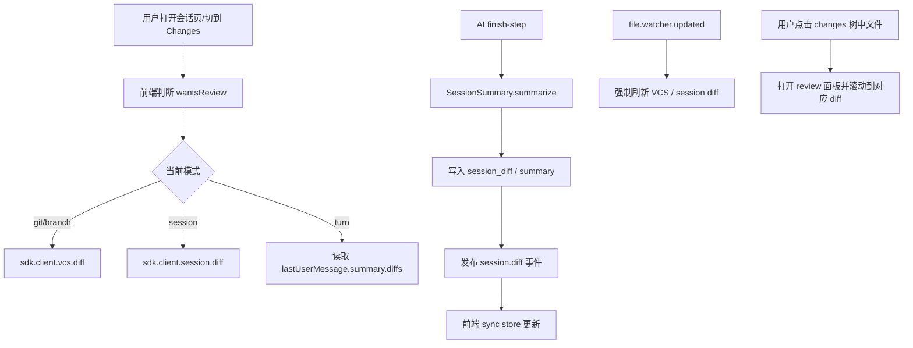

# Web UI 变更视图栏实现分析

本文基于当前仓库实现，对 Web UI 中“变更视图栏”相关能力做一次完整梳理。这里的“变更视图栏”并不是单一组件，而是会话页右侧整套“变更审查”界面，主要由以下两部分组成：

- `review` 审查面板：逐文件展示 diff 内容。
- `fileTree` 文件树面板中的 `changes` 标签：按目录树列出当前变更文件，并作为 diff 导航器。

在移动端，这套能力不会以右侧双栏出现，而是折叠进会话页顶部的 `Session / Changes` 切换里。

## 0. 两个必须了解的术语

- `vcs` 是 Version Control System 的缩写，中文通常叫“版本控制系统”。它的作用可以简单理解为：帮你记录“哪些文件被改了、改前是什么、改后是什么”。在这个仓库里，当前实际支持的 VCS 基本就是 **Git**。所以文档里提到 `VCS diff`、`VCS 模式` 时，你几乎都可以先把它理解成“Git 提供的变更对比结果”。
- `idle` 直译是“空闲”。在这个项目里，它特指**当前会话已经不在执行 AI 步骤了**，也就是没有继续生成、没有继续改文件，进入“这轮先做完了、现在停下来了”的状态。它的反面可以粗略理解成 `busy`，也就是“还在跑”。

如果只想抓住阅读重点，可以把它们临时记成：

- `vcs` = “代码版本变化记录系统（这里基本就是 Git）”
- `idle` = “AI 这轮干完了，当前会话暂时空闲”

## 1. 先给结论

这套变更视图的核心不是“读 Git diff 文本”，而是围绕统一的数据结构 `FileDiff[]` 工作。前端会根据当前模式选择一组 `FileDiff[]`，再分别渲染成：

- 文件树中的“变更文件列表”
- 审查面板中的文件级 diff 手风琴
- 计数、空态、颜色标记、A/D/M 标记

当前实现还额外做了一个防护：如果 `session diff` 在运行时不是数组，前端会把它降级成空数组继续渲染。这样 `review` 面板和 `changes` 树不会因为异常 payload 或旧缓存数据而直接崩溃。

当前实现一共支持 4 种变更来源模式：

| 模式 | 面向用户的含义 | 数据来源 |
| --- | --- | --- |
| `git` | 当前工作区相对 `HEAD` 的未提交改动 | `sdk.client.vcs.diff({ mode: "git" })` |
| `branch` | 当前分支相对默认分支的改动 | `sdk.client.vcs.diff({ mode: "branch" })` |
| `session` | 当前会话自基线快照以来累计产生的改动 | `sdk.client.session.diff({ sessionID })` |
| `turn` | 最近一个可见用户轮次带来的改动 | `lastUserMessage.summary.diffs` |

这 4 种模式共享同一套 UI，但计算基线、触发时机和用户语义完全不同。

## 2. 相关代码入口

前端主入口：

- `packages/app/src/pages/session.tsx`
- `packages/app/src/pages/session/session-side-panel.tsx`
- `packages/app/src/pages/session/review-tab.tsx`
- `packages/app/src/components/file-tree.tsx`
- `packages/ui/src/components/session-review.tsx`
- `packages/ui/src/components/diff-changes.tsx`

前端同步与布局状态：

- `packages/app/src/context/sync.tsx`
- `packages/app/src/context/global-sync/event-reducer.ts`
- `packages/app/src/context/layout.tsx`

后端 diff 计算：

- `packages/opencode/src/project/vcs.ts`
- `packages/opencode/src/git/index.ts`
- `packages/opencode/src/snapshot/index.ts`
- `packages/opencode/src/session/summary.ts`
- `packages/opencode/src/session/processor.ts`
- `packages/opencode/src/session/revert.ts`
- `packages/opencode/src/server/routes/session.ts`

## 3. UI 结构和用户看到的界面

### 3.1 桌面端结构

桌面端会话页右侧实际是一个组合侧栏：

- 左半是 `review-panel`
- 右半是 `file-tree-panel`

其中：

- `review-panel` 通过 `view().reviewPanel.opened()` 控制开关。
- `file-tree-panel` 通过 `layout.fileTree.opened()` 控制开关。
- 两者都打开时，形成“左边 diff、右边变更树”的双栏审查布局。

`file-tree-panel` 内部有两个标签：

- `changes`：只展示当前模式下有变更的文件
- `all`：展示项目全部文件，同时对有变更的节点做标记

### 3.2 移动端结构

移动端没有独立右侧双栏，而是顶部两个标签：

- `session`
- `changes`

切到 `changes` 后，主区域直接渲染审查内容。这里固定使用 `unified` diff，不提供桌面端的 `split/unified` 切换。

### 3.3 视图层级关系

可以把整套功能理解为三层：

1. 变更来源选择器：`git / branch / session / turn`
2. 变更文件导航器：`changes` 树
3. 变更内容阅读器：`review` 面板

用户通常的阅读路径应该是：

1. 先选模式
2. 看文件数和 A/D/M 标记
3. 在 `changes` 树中定位文件
4. 在 `review` 面板阅读具体 diff
5. 必要时打开 `all` 或直接打开文件标签继续查看原文件

## 4. 所有“分类”到底有哪些

### 4.1 第一层分类：变更来源模式

前端 `changesOptions()` 会动态生成可选模式：

- Git 项目下总是包含 `git`
- 只有当前分支不等于默认分支时才包含 `branch`
- 始终包含 `session`
- 始终包含 `turn`

注意两点：

1. `session` 和 `turn` 即使在非 Git 项目里也会出现在下拉里，但通常会进入空态，因为快照系统依赖 Git。
2. 会话切换时，前端先把模式重置成 `"git"`，随后再通过 `changesOptions()` 自动纠正到当前项目真正可用的第一个模式。因此非 Git 项目里最终会落到 `session`。

### 4.2 第二层分类：文件状态

所有模式最终都会产出 `FileDiff`：

```ts
{
  file: string
  before: string
  after: string
  additions: number
  deletions: number
  status?: "added" | "deleted" | "modified"
}
```

前端实际显示时会压缩成三类视觉状态：

| `FileDiff.status` | 文件节点内部标记 | 目录节点标记 |
| --- | --- | --- |
| `added` | `A` | 绿色点 |
| `deleted` | `D` | 红色点 |
| `modified` | `M` | 混合点 |

目录不是直接继承某个文件，而是做聚合：

- 子项全是新增：目录显示 `add`
- 子项全是删除：目录显示 `del`
- 只要混入修改，或新增/删除混合：目录显示 `mix`

这也是为什么目录层级不会展示精确的“modified”，而是展示“混合状态”。

### 4.3 第三层分类：内容展示状态

审查面板里每个文件还会继续分成：

- Added：`before` 为空、`after` 有内容，或 `status === "added"`
- Removed：`after` 为空、`before` 有内容，或 `status === "deleted"`
- Modified：普通文本 diff
- Media/Binary-like：按媒体路径处理，不按普通文本 diff 渲染
- Large Diff：`additions + deletions > 500` 时默认不直接渲染，要求用户点击 “Render anyway”

## 5. 四种模式分别怎么计算

### 5.1 `git` 模式

后端入口在 `packages/opencode/src/project/vcs.ts` 的 `Vcs.diff("git")`。

计算规则：

- 若仓库已有 `HEAD`：
  - 使用 `git.status(cwd)` 取当前工作区状态
  - 使用 `git.stats(cwd, "HEAD")` 取相对 `HEAD` 的增删行数
  - 对每个文件：
    - `before` 来自 `git show HEAD:file`
    - `after` 来自当前工作区文件内容
- 若仓库还没有 `HEAD`（新仓库、未提交）：
  - 仅用 `git.status(cwd)` 作为文件列表
  - `before` 为空
  - `after` 读当前文件

语义上它表示：

- 已跟踪文件的未提交修改
- 未跟踪文件
- 删除文件

它不区分 staged/unstaged，也不单独做 index 视角，而是把“当前工作区相对 HEAD 的结果”统一展示给 UI。

### 5.2 `branch` 模式

后端同样在 `packages/opencode/src/project/vcs.ts`。

这个模式只有在：

- 项目是 Git
- 当前分支存在
- 默认分支存在
- 当前分支不等于默认分支

时才会在下拉里出现。

默认分支的判定顺序来自 `packages/opencode/src/git/index.ts`：

1. 远端 `origin/HEAD`
2. 唯一远端或 `upstream`
3. `git config init.defaultBranch`
4. 本地 `main`
5. 本地 `master`

比较基线不是默认分支 tip，而是：

- 先求 `merge-base(default_branch_ref, HEAD)`
- 再比较“当前工作区”相对于这个 merge-base 的状态

实现细节：

- `git.diff(cwd, ref)` 取 merge-base 到当前工作区的文件列表
- `git.stats(cwd, ref)` 取增删行数
- 另外再把 `git.status(cwd)` 中 `??` 的未跟踪文件合并进结果

所以 `branch` 模式的用户语义是：

- “我这个分支相对默认分支引入了什么变化”
- 且它包含尚未提交的新增文件

这比“对比当前分支与默认分支 HEAD”更接近 PR 审查视角。

### 5.3 `session` 模式

这是整套系统里最特别的一种模式。它不是直接调用 Git diff，而是调用快照系统。

关键点：

- 会话创建时会记录一个基线快照 `session_diff_from`
- 之后每次 AI step 开始/结束都会继续打快照
- `session` 模式要展示的是“当前工作区相对于会话基线快照”的实时差异

#### 会话基线如何建立

在 `Session.createNext()` 中：

- 会调用 `Snapshot.track()`
- 返回的 tree hash 写入 `Storage["session_diff_from", sessionID]`

这一步很重要，因为它意味着：

- 即使 AI 还没真正执行步骤
- 只要会话已经创建
- 后续用户手动改文件，也能被纳入“本会话的累计改动”

#### AI 步骤如何产出快照

在 `packages/opencode/src/session/processor.ts`：

- `start-step` 时执行 `Snapshot.track()`，写入 `step-start` part
- `finish-step` 时再次 `Snapshot.track()`，写入 `step-finish` part

然后会触发 `SessionSummary.summarize({ sessionID, messageID })`。

#### `session` 模式如何计算

`SessionSummary.summarizeSession()` 的优先级：

1. 如果有基线快照：
   - `baseline = session_diff_from`
   - `to = Snapshot.track()` 取当前工作区最新快照
   - `Snapshot.diffFull(baseline, to)` 生成完整 `FileDiff[]`
2. 如果没有基线快照：
   - 回退到 `computeDiff(messages)`
   - 即用消息中的最早 `step-start.snapshot` 和最新 `step-finish.snapshot` 计算

生成后会：

- 写入 `Storage["session_diff", sessionID]`
- 更新 `summary.additions/deletions/files`
- 发布总线事件 `session.diff`

#### `session` 模式为什么是“实时”的

前端并不是只读取一次数据库里旧的 summary，而是调用 `/session/:id/diff`。

这个路由实际上走的是 `SessionSummary.diff()`，它会：

1. 读取 `session_diff_from`
2. 再次执行 `Snapshot.track()`
3. 用 `Snapshot.diffFull(from, to)` 重新计算当前工作区差异
4. 重写 `session_diff`
5. 发布 `session.diff`

这意味着：

- 用户手动改文件
- AI 写文件
- 文件被外部工具改动

都可以在刷新后进入 `session` 模式。

#### 一个容易误判的点

`/session/:sessionID/diff` 路由带了可选 `messageID` 参数，OpenAPI 描述也写成 “Get message diff”，但当前 `SessionSummary.diff()` 实现并没有使用这个 `messageID`。它返回的是“整场会话 diff”，不是“指定消息 diff”。

真正的“某一轮消息 diff”来自 `turn` 模式，而不是这个接口。

### 5.4 `turn` 模式

`turn` 模式前端完全不走额外接口，直接使用：

- `lastUserMessage()?.summary?.diffs ?? []`

这些 `summary.diffs` 是在 `SessionSummary.summarizeMessage()` 中计算的。

计算方式：

- 只取当前用户消息
- 以及其后挂在该用户消息上的 assistant 消息
- 在这些消息的 parts 里扫描：
  - 最早的 `step-start.snapshot` 作为 `from`
  - 最后的 `step-finish.snapshot` 作为 `to`
- 调用 `Snapshot.diffFull(from, to)`

所以 `turn` 模式的语义是：

- “最近一轮用户请求，最终带来了哪些文件变化”

它和 `session` 的区别是：

- `session` 看整个会话从基线到现在
- `turn` 只看最后一个可见用户轮次

## 6. `FileDiff` 的具体生成规则

### 6.1 文本内容

`before` / `after` 的来源有两类：

- Git/VCS 模式：
  - `before` 来自 Git 对象库
  - `after` 来自当前工作区文件
- Snapshot 模式：
  - `before` / `after` 都来自 snapshot Git 仓库中的两个 tree

### 6.2 增删行数

主要来源：

- Git/VCS 模式：`git diff --numstat`
- Snapshot 模式：snapshot 仓库的 `git diff --numstat`

对于二进制文件：

- `numstat` 会返回 `- -`
- 当前实现会把 `additions/deletions` 记为 `0`
- `before/after` 也可能是空字符串

因此“0 行变更”不一定代表没变，有时只是二进制或不可文本化内容。

### 6.3 状态判定

Git 层的归类规则：

- `??` -> `added`
- 包含 `U` -> `modified`
- 包含 `A` 且不含 `D` -> `added`
- 包含 `D` 且不含 `A` -> `deleted`
- 其他 -> `modified`

Snapshot 模式用 `git diff --name-status --no-renames` 的结果：

- `A*` -> `added`
- `D*` -> `deleted`
- 其他 -> `modified`

当前实现统一禁用了 rename 识别，所以重命名通常会表现成“一个删除 + 一个新增”，不会被当成 rename 单独显示。

## 7. 前端如何选择和维护当前模式

`session.tsx` 中的关键状态：

- `store.changes`: 当前模式
- `vcs.diff.git` / `vcs.diff.branch`: VCS diff 缓存
- `sync.data.session_diff[sessionID]`: session diff 缓存
- `turnDiffs`: 最近一轮用户消息的 diff

映射关系：

- `reviewDiffs()` 决定审查面板要渲染哪组 diff
- `reviewCount()` 决定 UI 上显示多少个变更文件
- `reviewReady()` 决定当前模式是否已可读

一个很重要的细节是 `sessionCount()`：

- 当完整 `session_diff` 还没拉回来时，先用 `summary.files`
- 一旦实际 diff 到达，就改用真实 `diffs.length`

作用是：

- 首次进入或切换会话时，UI 可以先用已保存的 summary 快速显示“有几个文件变了”
- 手动刷新或后台重算完成后，文件数会切换到真实 diff 文件数，不会继续被旧 summary 卡住

所以用户有时会先看到文件数量，再看到具体 diff 内容，这是设计使然；但在实时 diff 已加载后，计数应与当前 diff 列表保持一致。

## 8. 触发时机：什么时候会加载或刷新变更

这一节回答一个核心问题：**用户在什么时候能看到最新的变更数据？** 要理解这个问题，首先需要知道四种变更模式背后有三种完全不同的数据流动方式，然后再逐一分析各种场景下的触发逻辑。

### 8.1 总览：三种数据流动模式

虽然四种变更模式共享一套 UI，但它们获取和更新数据的方式截然不同：

| 模式 | 数据流动方式 | 更新的主要驱动者 | 是否需要前端主动请求 |
| --- | --- | --- | --- |
| `session` | **事件驱动推送**为主，按需拉取为辅 | 后端（AI 步骤完成、回退等） | 首次加载和部分场景需要 |
| `turn` | **消息内嵌** | 后端（随消息数据一起同步） | 不需要，数据已随消息到达 |
| `git` | **纯前端按需拉取** | 前端自行决定何时请求 | 每次都需要 |
| `branch` | **纯前端按需拉取** | 前端自行决定何时请求 | 每次都需要 |

逐一解释：

**Session diff = 事件驱动推送 + 按需拉取**

后端在完成关键操作（如 AI 步骤结束、回退）后，会主动计算 session diff 并通过内部总线发布事件。这个事件经由 SSE 实时推送到前端，前端的事件处理器会自动将新的 diff 数据写入缓存。因此，**大多数情况下前端不需要主动请求**——数据会自己”推”过来。

但在一些场景下（首次打开、外部文件变化、手动刷新等），前端仍然需要主动调用后端接口来拉取最新的 session diff。此时后端会重新计算（从会话基线快照到当前工作区的差异），返回结果并同时发布事件。

**Turn diff = 消息内嵌**

Turn diff 不走任何独立的加载或推送通道。后端在 AI 步骤结束时，会同时计算”该轮次的 diff”并写入对应用户消息的 summary 字段。前端读取最近一个用户消息的 summary.diffs 即可，不需要额外的 API 调用。

**VCS diff（git/branch）= 纯前端按需拉取**

后端不会主动推送 VCS diff 数据。前端需要自行判断”何时应该重新获取”，然后调用后端 VCS 接口。后端在接到请求后执行 Git 命令并返回结果。

**为什么这样设计？**

- Session diff 的变化主要由后端驱动（AI 写文件、回退操作），后端天然知道”何时变了”，所以用推送最高效。
- Turn diff 是消息的附属数据，随消息同步即可，不需要单独的通道。
- VCS diff 反映的是”当前工作区相对 Git 状态的差异”，变化来源非常多样（外部编辑器、命令行、AI、用户手动操作），后端无法穷举所有触发时机，因此由前端根据各种信号（文件变化事件、会话状态变化等）自行决定何时拉取。

### 8.2 前置条件：wantsReview 门控

在讲具体触发场景之前，需要先理解一个关键的前置条件：**并非所有时候系统都需要加载变更数据**。

前端通过一个叫 `wantsReview` 的判断来决定”当前用户是否真的在看变更视图”：

- **桌面端**：右侧文件树面板已打开，或者审查面板已打开且当前激活的标签是 `review`。换句话说，只要右侧任何一个与变更相关的面板是可见的，就认为用户需要变更数据。
- **移动端**：顶部标签切到了 `changes`。

这个判断的作用是**性能保护**：如果用户没有打开任何变更相关的界面，前端就不会发起多余的 diff 请求。所有前端主动发起的拉取请求（无论是 VCS 还是 session）都会先检查这个条件。

但有一个重要例外：**后端通过 SSE 推送的 session.diff 事件不受此门控约束**。当后端推送 session diff 更新时，前端的事件处理器会无条件地将数据写入缓存，无论用户当前是否在看变更视图。这样做的好处是：当用户稍后打开变更视图时，缓存里已经有最新数据，可以立刻展示，不需要等待额外的请求。

### 8.3 初始加载

初始加载是指用户首次打开变更视图（或切换到某种模式）时，系统如何获取第一份 diff 数据。

**VCS 模式（git / branch）**

前端有一个响应式 effect 同时监听两个条件：当前选择的模式和 `wantsReview`。当两者同时满足（用户选了 git 或 branch 模式，且正在看变更视图）时，就会发起加载请求。如果该模式的数据已经加载过并且标记为”就绪”，则跳过请求。如果此时已经有一个同模式的请求正在进行中，也不会发重复请求，而是复用正在进行的那个。

**Session 模式**

前端有另一个 effect 监听 `wantsReview`、当前会话 ID 和全局同步状态。当用户需要看变更、且当前会话的 session diff 缓存不存在时，才会发起一次拉取请求。如果缓存已存在（可能是之前通过 SSE 推送写入的），则直接使用缓存，不发请求。

**Turn 模式**

不需要任何初始加载。前端直接从最近一个用户消息的 summary 字段中读取 diffs 数据。这个数据是随着消息同步一起到达的，不需要额外的接口调用。

**一个容易忽略的细节**：桌面端即使用户没有显式点开 `review` 标签，只要右侧文件树面板是打开的（不管当前标签是 `changes` 还是 `all`），`wantsReview` 就为真，就会触发初始加载。这意味着仅仅打开文件树就足以触发变更数据的获取。

### 8.4 AI 执行完成后的刷新

这是整套系统中**最核心的刷新路径**，因为用户使用变更视图最常见的场景就是”AI 刚帮我改完代码，我要看看改了什么”。当 AI 完成一个步骤后，session、turn、VCS 三侧都会更新，但走的是不同的路径。

**Session 侧：后端推送**

AI 步骤完成时，后端的处理器会先为当前工作区拍一个快照（记录步骤结束时的文件状态），然后异步触发一次 summary 计算。”异步”意味着这个计算不会阻塞 AI 的响应流——用户可能先看到 AI 的回复，然后变更视图再更新。

summary 计算会同时做两件事：

1. **计算整场会话的 diff**：读取会话创建时的基线快照，再拍一张当前工作区的最新快照，对比两者得到完整的文件差异列表。计算完成后，结果会写入持久存储，同时通过总线发布事件。这个事件经 SSE 到达前端后，事件处理器会用智能合并（按文件路径匹配）的方式更新缓存，最终 UI 自动刷新。

2. **计算本轮次的 diff**：只取当前这轮用户消息及其 AI 回复涉及的快照范围，计算出这一轮带来的文件变化，写入该用户消息的 summary 字段。这就是 turn 模式读取的数据来源。

**Turn 侧：随 session 侧一起更新**

如上所述，turn diff 是在同一次 summary 计算中生成的。它被写入用户消息的 summary 后，前端在读取消息数据时会自然获取到最新的 turn diff，无需额外请求。

**VCS 侧：前端检测 idle（即会话从“还在跑”变成“已经停下来了”）后主动拉取**

Session diff 有后端推送机制，但 VCS diff 没有。为了让 git/branch 模式也能在 AI 完成后自动更新，前端设置了一个专门的响应式 effect：它监听当前会话的状态变化，当状态从非 idle（如”运行中”）变为 idle 时，如果用户当前正在查看 VCS 模式的变更，就会强制重新拉取对应模式的 diff。

这就是为什么用户在 git 或 branch 模式下，AI 写完文件后变更视图也会自动更新——虽然更新时机比 session 模式稍晚（要等到会话进入 idle 状态），但通常也就是几乎同时。

**时序上的微妙差异**

由于 summary 计算是异步的，session diff 的 SSE 推送可能比 AI 步骤完成的信号（即 idle 状态切换）稍晚一点到达。在极端情况下，用户可能先看到 VCS diff 更新，然后才看到 session diff 更新。这是正常现象，不是数据不一致。

### 8.5 外部文件变化

用户在外部编辑器、命令行或脚本中修改了项目文件时，后端的文件监视器会检测到变化并发送事件。前端监听这些事件来触发 diff 刷新。

**实现前提**

这里的“自动刷新”不是纯前端能力，它依赖后端成功初始化了**工作区根目录** watcher，并且该 watcher 能正常加载当前平台对应的原生绑定。只有后端真实发布了 `file.watcher.updated` 事件，前端这两条刷新链路才会生效；如果 watcher 初始化失败，界面仍可通过手动刷新按钮拉取最新 diff，但不会自动响应外部文件变化。

前端对此设置了**两个独立的监听器**，分别服务于 VCS 和 session，两者各自运作、互不影响：

**VCS 侧：立即刷新，无防抖**

收到文件变化事件后（排除 `.git/` 目录下的变化），立即重新拉取当前 VCS 模式的 diff。不做任何延迟或防抖处理。

为什么不防抖？因为 VCS diff 直接反映工作区状态，任何一个文件的变化都可能改变 diff 结果。而且 VCS 请求本身有并发保护机制（详见 8.10），即使短时间内触发多次也不会产生性能问题——旧请求的结果会被自动丢弃。

**Session 侧：500ms 防抖，仅在缓存已存在时触发**

收到文件变化事件后，会等待 500ms。如果在这 500ms 内又收到新的事件，则重新计时。直到 500ms 内没有新事件，才真正发起一次强制刷新请求。此外，只有当前会话的 session diff 缓存已经存在时才会触发——如果用户还没查看过该会话的 session diff，就不会因为文件变化去预加载。

为什么要防抖？因为外部工具（如 `git checkout`、构建系统、批量格式化工具）可能在极短时间内修改大量文件，每个文件都会产生一个独立的 watcher 事件。如果不做防抖，后端会收到大量冗余的 diff 计算请求。500ms 的窗口足以将一次批量操作合并为一次 diff 刷新。

### 8.6 会话切换

用户从一个会话切到另一个会话时，前端需要处理几件事：

**状态重置**

切换时，审查面板的滚动位置、当前聚焦的 diff 文件、待跳转的 diff 目标都会被清空。这样用户进入新会话时看到的是干净的初始状态，而不是上一个会话的残留。

变更模式本身也会经历一次自动调整：先重置为默认值，然后根据新会话的项目类型和分支状态重新计算可用的模式列表。如果默认模式不在可用列表里，会自动切换到列表中的第一个可用模式。

**Session diff 的”先展示缓存、后台刷新”策略**

如果新会话的 session diff 在缓存中已经存在（可能是之前查看过，或者后端通过 SSE 推送过），前端会先用缓存数据立刻渲染 UI，然后在后台安排一次延迟的强制刷新。

这个延迟使用了两层调度：先等一帧渲染完成，再在下一个事件循环中发起刷新请求。这样做的目的是让 UI 先用缓存数据快速呈现，避免用户看到空白或加载状态，同时确保后台刷新不会阻塞渲染。

如果新会话完全没有缓存数据，则走正常的初始加载逻辑（8.3）。

**VCS diff 的语义不受会话切换影响，但 UI 会主动重载**

VCS diff 仍然是项目级的（反映当前工作区相对 Git 的差异），不是会话级的。从“数据语义”上说，切换会话不会改变工作区文件状态。

但在实现上，为了避免用户在不同会话之间切换时看到旧缓存，只要变更视图当前可见，前端在切换会话时仍会主动重置并重新拉取当前 `git` / `branch` 模式的 VCS diff。这样做不是因为 Git 基线变了，而是为了确保界面展示的是切回该会话时的最新工作区状态。

### 8.7 分支信息变化

当前端检测到当前分支或默认分支发生变化时，会立即重新拉取 VCS diff。对应的实际场景包括：

- 用户在终端执行 `git checkout` 切换分支
- 切换 Git 工作树
- 远端 HEAD 发生变化，导致默认分支的解析结果改变

Session diff 不受分支变化影响，因为它基于快照基线而非 Git 引用。

### 8.8 用户文件操作与手动刷新

用户在 UI 中进行的文件操作和手动刷新，根据操作类型的不同，触发的刷新行为也有所区别。

#### 8.8.1 文件树中的文件操作

在右侧 `all` 标签中进行的文件操作——包括创建文件/文件夹、删除、重命名、拖拽移动、批量删除——完成后都会执行同一套刷新流程：

1. 刷新受影响目录的文件树显示
2. 强制重新拉取 VCS diff
3. 强制重新拉取 session diff

也就是说，文件树操作会**同时刷新 VCS 和 session 两侧**，确保所有变更模式都反映最新状态。

#### 8.8.2 编辑器标签页内保存文件

当用户在内置编辑器标签页中编辑文件时，前端不只是简单地把当前输入框内容暂存在内存里，而是会顺带记住一件更重要的事：

- 这份草稿最初是基于哪一版真实文件开始编辑的

可以把它理解为：系统既保存了“你改了什么”，也保存了“你是从哪一版开始改的”。

当用户点击保存时，系统会先判断这份草稿是不是仍然建立在当前真实文件之上。

如果当前真实文件自草稿创建后**没有变化**，系统会：

1. 将新内容写入文件
2. 重新加载该文件的显示内容
3. **显式强制刷新 session diff**

如果当前真实文件自草稿创建后**已经变化**，系统不会直接覆盖，而是进入冲突处理：

- `接受覆盖并保存`
  含义是：用户明确接受用当前草稿覆盖当前真实文件。
- `放弃草稿`
  含义是：丢掉这份草稿，回到当前真实文件。
- `取消`
  含义是：先不保存，也不丢草稿，继续留在保存前的编辑状态。

这套确认并不是为了实现传统意义上的多人协同编辑，而是为了防止一种非常容易误判的情况：  
用户以为自己保存的是“刚才在 review 里看到的那份当前文件”，实际保存的却是更早之前遗留的旧草稿。

还有一个兼容性细节：旧版本持久化下来的草稿，可能只保存了草稿文本，没有保存“它基于哪一版文件”的基线信息。对于这种历史草稿，系统同样不会再默认把它当作安全保存，而会在真正写入前要求用户明确确认。

注意这里只显式刷新了 session diff，没有显式刷新 VCS diff。VCS 侧的更新依赖文件监视器——保存操作修改了文件，watcher 检测到变化后会自动触发 VCS 刷新（走 8.5 的路径）。这意味着 session diff 更新是即时的，而 VCS diff 更新会略有延迟（取决于 watcher 的响应速度），但实际体验上差异很小。

#### 8.8.3 手动刷新按钮

用户点击手动刷新按钮时，行为取决于当前选择的变更模式：

- **git / branch 模式**：重新拉取对应 VCS diff。
- **session 模式**：先清除该会话的缓存数据（这样 UI 会先显示加载状态而非旧数据），然后强制拉取最新的 session diff。
- **turn 模式**：不需要特殊处理，因为 turn diff 来自消息 summary，会随消息同步自动更新。

无论当前是什么模式，刷新按钮都会同时刷新文件树的显示。

### 8.9 回退与取消回退

回退（revert）和取消回退（unrevert）操作本身都在后端执行。在文件系统层面完成快照恢复后，后端会：

1. 重新计算 session diff（从会话基线到当前工作区）
2. 更新会话的 summary 统计信息
3. 通过总线发布 session.diff 事件

前端接收这个事件的路径与 AI 步骤完成（8.4）完全一致：SSE → 事件处理器 → 缓存更新 → UI 刷新。前端不需要额外发起 diff 请求。

**Turn 模式的自动适配**：回退操作会把回退点之后的消息标记为不可见。前端在筛选”最后一个可见用户消息”时会自动跳过这些消息，因此 turn diff 会自然指向回退后的最后一个有效轮次，不需要任何特殊处理。

**VCS 侧**：回退操作会实际修改工作区中的文件（恢复到之前的快照状态），这些文件修改会被 watcher 检测到，从而触发 VCS diff 的刷新（走 8.5 的路径）。

### 8.10 防抖与去重保护

上面的各种触发场景在实际使用中经常会短时间内重叠发生——比如 AI 快速修改多个文件、用户连续切换模式、外部工具批量操作文件等。为了避免这些场景导致大量冗余请求或数据错乱，系统在多个层面设置了保护机制。

#### 8.10.1 VCS 的并发保护

VCS diff 的加载使用了”版本号 + 任务复用”的双重保护：

- **任务复用**：如果某个模式（如 git）已经有一个请求正在进行中，新的加载请求（非强制）会直接复用这个进行中的请求，而不是发起新的。
- **版本号控制**：每次发起新的请求时会递增一个计数器。当请求的响应到达时，系统会检查这个响应的版本号是否还是最新的。如果在请求进行期间又触发了更新的请求（版本号已递增），旧响应会被直接丢弃，不会写入状态。

这意味着：即使用户快速切换 git/branch 模式、或连续触发多次刷新，最终 UI 展示的始终是最新一次请求的结果，不会出现旧数据覆盖新数据的情况。

**强制刷新时的行为**：当以强制模式发起加载时，会先递增版本号（使正在进行的旧请求失效），然后清除任务缓存，再启动新请求。

#### 8.10.2 Session 的请求去重

Session diff 的加载使用了 inflight 去重机制：系统维护一个以”项目目录 + 会话 ID”为键的进行中请求表。如果对同一个会话的 diff 请求已经在进行中，新的请求（无论是否强制）会直接复用那个进行中的 promise，等它完成后共享同一个结果。只有当请求完成（成功或失败）后，该键才会从表中移除，后续请求才会真正发起新的 API 调用。

一个值得注意的细节：`force` 参数的作用是**绕过缓存检查**（即使缓存已存在也要重新拉取），但**不绕过 inflight 去重**。也就是说，如果两个地方几乎同时触发了强制刷新，实际只会发出一次请求。

#### 8.10.3 各场景的时序控制

不同触发场景采用了不同的时序策略：

| 触发场景 | Session diff | VCS diff |
| --- | --- | --- |
| AI 步骤完成 | 即时（SSE 推送） | 即时（idle 状态变化触发） |
| 外部文件变化 | 500ms 防抖 | 立即 |
| 会话切换 | 两层延迟（先渲染再刷新） | 无需刷新 |
| 文件树操作 | 即时（强制刷新） | 即时（强制刷新） |
| 编辑器保存 | 即时（强制刷新） | 依赖 watcher |
| 回退/取消回退 | 即时（SSE 推送） | 依赖 watcher |
| 手动刷新按钮 | 即时（清缓存 + 强制刷新） | 即时（强制刷新） |

### 8.11 触发关系速查表

下表汇总了各种触发事件对四种变更模式的影响：

| 触发事件 | `git` 模式 | `branch` 模式 | `session` 模式 | `turn` 模式 |
| --- | --- | --- | --- | --- |
| 首次打开变更视图 | 前端拉取 | 前端拉取 | 前端拉取（若无缓存） | 无需加载 |
| AI 步骤完成 | 前端在 idle 时拉取 | 前端在 idle 时拉取 | 后端推送 | 随消息更新 |
| 外部文件变化 | 立即拉取 | 立即拉取 | 500ms 防抖后拉取 | 不受影响 |
| 会话切换 | 不受影响 | 不受影响 | 缓存优先 + 延迟刷新 | 读新会话消息 |
| 分支变化 | 立即拉取 | 立即拉取 | 不受影响 | 不受影响 |
| 文件树操作 | 立即拉取 | 立即拉取 | 立即拉取 | 不受影响 |
| 编辑器保存 | 依赖 watcher | 依赖 watcher | 立即拉取 | 不受影响 |
| 回退/取消回退 | 依赖 watcher | 依赖 watcher | 后端推送 | 自动适配 |
| 手动刷新按钮 | 立即拉取 | 立即拉取 | 清缓存 + 拉取 | 不受影响 |

## 9. 文件树中的 `changes` 栏是如何工作的

### 9.1 它本质上是一个“过滤后的文件树”

`changes` 标签里的 `FileTree` 并不自己算 diff，它只接收：

- `allowed = diffFiles()`：允许显示的文件路径
- `kinds = kinds()`：每个文件/目录应该显示什么标记

这样做的结果是：

- 只会列出当前模式下真正有变更的文件
- 但仍保留目录树层级
- 父目录会自动展开到足以暴露这些变更文件

对于已删除文件，哪怕真实文件树里已经没有节点，也会在过滤树里“虚拟补出”目录或文件节点，让用户仍能在变更树里看到它。

### 9.2 点击行为不是“打开文件”，而是“定位 diff”

在 `changes` 标签中点击文件时：

- 不会直接打开文件 tab
- 会调用 `focusReviewDiff(path)`
- 自动打开 review 面板
- 把该文件对应 diff 折叠项加入打开状态
- 滚动到该 diff 的位置

所以 `changes` 栏更像“变更目录索引”，不是普通文件浏览器。

### 9.3 `all` 标签中的文件树又是什么

`all` 标签还是完整项目文件树，但会额外传入：

- `modified = diffFiles()`
- `kinds = kinds()`

所以用户在 `all` 里会看到：

- 整个项目文件结构
- 其中变更文件带 A/D/M 或目录颜色点

点击时则回到普通文件树语义：打开文件 tab。

## 10. 审查面板 `review` 如何工作

### 10.1 它是逐文件手风琴

每个 `FileDiff` 对应一个手风琴项，表头显示：

- 文件路径
- 文件名
- 变更类型或 `+N / -M`

显示规则：

- Added 文件：显示 `Added` + 数值
- Deleted 文件：直接显示 `Removed`
- 媒体文件：显示 `Modified`
- 普通文本：显示 `+N -M`

### 10.2 两种 diff 样式

桌面端支持：

- `unified`
- `split`

样式状态保存在 `layout.review.diffStyle()` 中，是布局级持久状态，不是单文件状态。

移动端固定为 `unified`。

### 10.3 打开状态与滚动位置会被记住

`layout.view(sessionKey).review` 会为每个会话保存：

- 当前展开了哪些 diff 文件
- review 面板的滚动位置

因此用户切到别的 tab 再回来，通常会看到原来的展开状态和滚动位置。

### 10.4 两层性能保护

第一层：分页

- `reviewBatch` 决定首次渲染多少个文件 diff
- “加载更多”也按这个批次继续展开

第二层：大 diff 保护

- 单文件 `additions + deletions > 500`
- 且不是媒体文件
- 默认不直接渲染完整 diff
- 用户需手动点击 “Render anyway”

这两个保护分别解决：

- “文件太多”
- “某一个文件改动太大”

### 10.5 从 `review` 打开文件时，默认优先真实文件而非之前未保存的草稿

`review` 面板展示的是**当前真实工作区**的 diff。  
因此，当用户从 `review` 点“打开文件”去看上下文时，默认也应该看到**当前真实文件**，而不是某份历史遗留的未保存草稿。

否则会出现一种非常别扭的错位：

1. `review` 里显示的是当前真实 diff
2. 用户点“打开文件”想看这份 diff 对应的上下文
3. 文件标签页却自动恢复出一份更早以前的旧草稿
4. 用户眼前看到的内容就和 `review` 里的 diff 对不上了

这种错位未必会立刻造成文件被覆盖，但会先破坏审查语义本身。  
用户会分不清：

- 哪个内容才是当前真实文件
- 自己正在阅读的是当前变更，还是旧草稿
- 接下来评论、复制、继续编辑时，参考的到底是哪一版

所以现在的规则是：

- 如果没有草稿，行为和普通打开文件一样
- 如果草稿仍然建立在当前真实文件上，可以恢复编辑状态
- 如果草稿已经过期，不再静默恢复它，而是先显示当前真实文件

这条规则的核心目的只有一个：  
**让 `review` 保持“当前真实变更”的事实来源地位。**

### 10.6 旧草稿现在被当作“待决定的分支”，不是隐式覆盖层

这里一个最容易出问题的地方是：旧草稿可能在用户并不知情的情况下直接盖到真实文件视图之上。

现在系统把旧草稿分成三种状态来理解：

- **没有草稿**：文件按普通方式打开
- **新鲜草稿**：草稿仍然基于当前真实文件，可以恢复编辑
- **过期草稿**：当前真实文件已经变化，旧草稿不能再自动恢复

一旦进入“过期草稿”状态，界面会把草稿当作一条需要用户显式处理的分支，而不是直接替代当前文件内容。此时文件页顶部会出现提示条，告诉用户：

- 当前文件已经变化
- `review` 中显示的是当前真实文件
- 你可以选择恢复旧草稿，或者放弃它

这意味着旧草稿仍然被保留，但它不再悄悄改变用户对当前变更的理解。

### 10.7 恢复旧草稿后，为什么保存时还可能再次确认

即使用户已经明确点击了“恢复旧草稿”，保存时仍然可能再次弹出冲突确认框。因为“恢复旧草稿”只表示用户想继续看或继续改这份旧草稿，并不等于用户已经明确同意**用它覆盖当前真实文件**。因此保存时仍要再做一次最终判断：

- 如果当前真实文件仍和草稿基线一致，可以直接保存
- 如果真实文件又变了，或本来就是无法确认基线的历史草稿，就必须再次请用户决定

## 11. 用户应该如何使用和阅读

### 11.1 四种模式分别适合看什么

### `git`

适合：

- 临近提交前检查工作区
- 看所有未提交改动
- 确认本地临时改动、未跟踪文件是否合理

不要误解为：

- “本会话造成的变化”

因为它也会包含你在别处手动改的文件，只要这些文件还没提交。

### `branch`

适合：

- 以 PR / feature branch 视角做整体审查
- 看“当前分支相对默认分支”的真实差异

不要误解为：

- 只看已提交内容

因为它也会把当前未跟踪文件并进来。

### `session`

适合：

- 看“这一整个 AI 会话到底留下了什么”
- 做回退、复核、阶段性总结

最需要注意：

- 它的基线是会话创建时的快照
- 不是当前 Git commit
- 不是最后一轮消息

### `turn`

适合：

- 快速回答“刚才这句提示词到底改了哪些文件”
- 在多轮对话里局部定位问题

它不是累计视角，只看最后一个仍然有效的用户轮次。

### 11.2 建议的阅读顺序

推荐用户按这个顺序阅读：

1. 先选模式，明确你要看的“基线”
2. 看顶部文件数，判断改动规模
3. 在 `changes` 树中看目录分布和 A/D/M 标记
4. 点进某个文件，在 `review` 中读具体 diff
5. 对复杂文件切 `split`，对快速浏览切 `unified`
6. 若需要上下文，点击文件名右侧按钮打开真实文件
   这里默认打开的是当前真实文件；如果系统发现你有一份过期草稿，会先提醒你处理草稿，而不是直接把旧草稿盖到当前内容上
7. 若怀疑某轮提示词导致问题，切到 `turn`
8. 若怀疑整个会话污染工作区，切到 `session`
9. 若准备提交，切到 `git`

### 11.3 如何理解计数和标记

- 文件数：当前模式下有 diff 的文件数
- `+N -M`：该文件的新增/删除行
- `A`：新增文件
- `D`：删除文件
- `M`：修改，或无法再细分为纯增/纯删
- 目录彩点：该目录下存在对应类型的改动

有两个常见误区：

1. `session` 文件数不等于 `git` 文件数
2. `0 行变化` 不一定没变，可能是二进制/媒体文件

### 11.4 与评论系统的关系

review 面板支持按行选区评论。

如果某条评论来源于 review：

- 打开评论时会自动切回 `changes`
- 自动激活 `review`
- 自动聚焦到对应文件和评论

这说明 review 不只是“看 diff”，也是会话内代码审阅的评论承载区。

## 12. 空态、加载态和边界行为

### 12.1 空态

`git` 模式空态：

- 没有未提交改动

`branch` 模式空态：

- 当前分支相对默认分支没有差异

`session` 模式空态：

- 当前会话没有变更
- 或项目不是 Git
- 或 snapshot 跟踪被配置关闭

`turn` 模式空态：

- 最近一轮没有记录到快照变更

### 12.2 非 Git 项目

在非 Git 项目下：

- `git` / `branch` 不会出现在模式下拉里
- `session` 仍会出现，但通常显示 “未检测到 Git”
- UI 还提供 “创建 Git 仓库” 的按钮

### 12.3 已删除文件

已删除文件在 `changes` 树里仍会显示，这是故意的，因为审查需要保留删除项。

### 12.4 重命名文件

由于实现使用了 `--no-renames`，重命名不会作为 rename 呈现，而会拆成：

- 一个 deleted
- 一个 added

### 12.5 媒体与大文件

媒体路径会走媒体显示逻辑，不一定显示传统文本 diff。

超大 diff 默认不渲染全文，这不是错误，而是性能保护。

### 12.6 旧草稿与当前真实文件冲突

这属于 change view 场景下一个非常关键的边界行为。

可能的实际过程是：

1. 用户之前打开过某个文件，进入编辑，但没有保存
2. 之后该文件又被 AI、用户自己、外部编辑器或别的操作改动了
3. 此时 `review` 已经会基于新的真实文件展示 diff
4. 用户再从 `review` 打开这个文件

现在系统不会直接恢复那份旧草稿，而是遵循以下规则：

- 默认先显示当前真实文件
- 如果检测到过期草稿，在页面顶部给出提示
- 用户可以明确选择恢复旧草稿，或者放弃草稿
- 如果恢复后尝试保存，并且存在覆盖风险，系统会再次确认

## 13. 实现上的几个关键事实

以下几点对理解系统非常重要：

1. 右侧 `changes` 树本身不计算 diff，只负责导航与标记。
2. 真正的 session diff 不是简单缓存，而是会在请求时重新对“会话基线 -> 当前工作区”做快照比较。
3. `turn` diff 不走独立接口，而是挂在用户消息 summary 上。
4. `branch` 模式使用 merge-base，语义更接近 PR diff。
5. `messageID` 虽然出现在 `/session/:id/diff` 接口参数里，但当前实现并未使用。
6. summary 里实际稳定使用的是数量字段，完整 diff 列表主要存放在 `session_diff` 存储和前端同步缓存里。
7. VCS 模式前端有额外的并发保护：`vcsTask` 用来复用进行中的请求，`vcsRun` 用来丢弃过期响应，避免用户快速切换模式或连续刷新时被旧结果覆盖。

## 14. 一张总流程图



## 15. 如果要继续改这块，最应该先看哪里

若后续要继续开发或调整这块功能，建议按这个顺序读代码：

1. `packages/app/src/pages/session.tsx`
2. `packages/app/src/pages/session/session-side-panel.tsx`
3. `packages/ui/src/components/session-review.tsx`
4. `packages/opencode/src/session/summary.ts`
5. `packages/opencode/src/project/vcs.ts`
6. `packages/opencode/src/snapshot/index.ts`

这六处基本覆盖了：

- 模式选择
- UI 交互
- diff 渲染
- session diff 计算
- Git/branch diff 计算
- snapshot 底层机制
